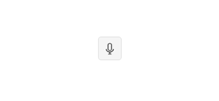

# {{ site.product }} SpeechToTextButton Overview

The SpeechToTextButton provides speech-to-text functionality. It allows users to convert spoken words into text through a button interface that activates speech recognition capabilities.

The SpeechToTextButton utilizes the [Web Speech API](https://developer.mozilla.org/en-US/docs/Web/API/Web_Speech_API) to provide real-time speech recognition functionality, making it easy to add voice input capabilities to your applications.

## Functionality and Features

* Speech Recognition—Converts user speech to text using the Web Speech API
* Continuous Recognition—Supports continuous speech recognition for longer dictation sessions
* Real-time Transcription—Provides both final and interim recognition results as the user speaks
* State Management—Visual indication of active and inactive states during recording
* Event Handling—Comprehensive event model for integrating with other components

## Browser Support

The SpeechToTextButton depends on the Web Speech API, which has varying levels of support across browsers:

* Chrome—Full support
* Edge—Full support
* Firefox—Partial support, may require user permissions
* Safari—Limited support
* Mobile Browsers—Support varies; typically requires HTTPS

>important The Web Speech API requires a secure context (HTTPS) in most browsers. Make sure your application is served over HTTPS for optimal functionality.

## Next Steps

* [Getting Started with the SpeechToTextButton]()
* [Appearance of the SpeechToTextButton]()

## See Also

* [JavaScript API Reference of the SpeechToTextButton](/api/javascript/ui/speechtotextbutton)
* [Knowledge Base Section](/knowledge-base)
