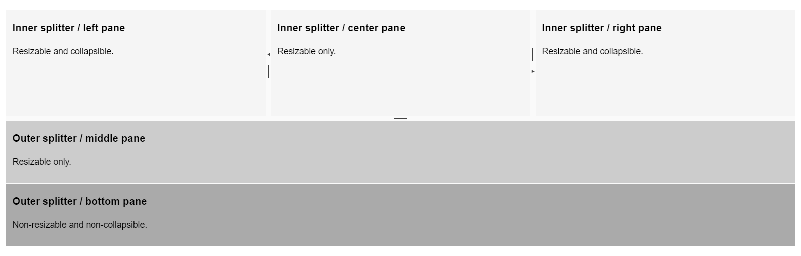

# {{ site.product }} Splitter Overview

The kendo UI for jQuery Splitter provides a dynamic layout of resizable and collapsible panes.

The component converts the children of an HTML element into an interactive layout and adds resize and collapse handles depending on its configuration. You can also combine the vertical and horizontal orientation of the Splitter to build complex layouts. The component provides default configuration options such as a maximum and minimum pane size, resizable and collapsible or expandable pane behaviors, and horizontal and vertical orientation.

## Functionality and Features

* [Content operations]()–The Splitter supports various techniques for rendering content in its panes.
* [Panes]()–The Splitter provides various pane features such as the resizable and collapsible behaviors.
* [Appearance]()–You can use the available options for configuring the layout, resizing, and overflowing features of the Splitter component.

## Next Steps

* [Getting Started with the Kendo UI Splitter for jQuery]()
* [Basic Usage of the jQuery Splitter (Demo)](https://demos.telerik.com/kendo-ui/splitter/index)
* [JavaScript API Reference of the Splitter](/api/javascript/ui/splitter)

## See Also

* [Product Page of the Kendo UI for jQuery Splitter](https://www.telerik.com/kendo-jquery-ui/splitter)
* [Demo Pages for the jQuery Splitter](https://demos.telerik.com/kendo-ui/splitter/index)
* [Knowledge Base Section](/knowledge-base)
