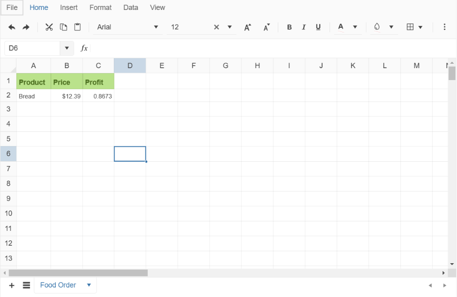

# {{ site.product }} Spreadsheet Overview

The Spreadsheet allows you to edit and visualize tabular data by using cell formatting options, styles, and themes.

The Spreadsheet supports Internet Explorer 9 and later versions. The component is primarily targeted at desktop users and, therefore, its performance and functionalities on mobile devices are limited.

## Functionality and Features

* [Images]()&mdash;The Spreadsheet allows you to place images in its sheets.
* [Comments]()&mdash;You can add comments within each of its cells.
* [Cell formatting]()&mdash;The Spreadsheet provides the possibility to format the string, dates, numbers displayed in the cells.
* [Custom editors]()&mdash;You can define a custom editor, thus the user can select the cell content through predefined values. 
* [Custom functions]()&mdash;You can create your own custom JavaScript functions.
* [Import and export of data]()&mdash;The Spreadsheet allows users to upload and download spreadsheet files. 
* [Localization]()&mdash;You can localize the messages in the Spreadsheet component.
* [End-User guide]()&mdash;Read more about the functionalities of the component for data entry and management.

## Next Steps 

* [Getting Started with the Kendo UI Spreadsheet for jQuery]()
* [Demo Page for the Spreadsheet](https://demos.telerik.com/kendo-ui/spreadsheet/index)
* [JavaScript API Reference of the Spreadsheet](/api/javascript/ui/spreadsheet)

## See Also

* [Basic Usage of the Spreadsheet (Demo)](https://demos.telerik.com/kendo-ui/spreadsheet/index)
* [Spreadsheet JavaScript API Reference](/api/javascript/ui/spreadsheet)
