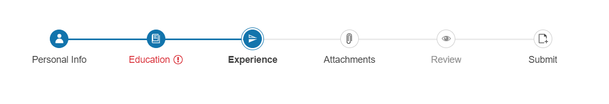

# Overview 

The Stepper is an intuitive UI component that visualizes progress by displaying a sequence of logical steps. The Stepper widget could also be used for navigational purposes.

 

## Functionality and Features

* [Icons]()&mdash;You can set icons for the component's steps.
* [Steps]()&mdash;You can configure various settings for each step.
* [Appearance]()&mdash;You can change the component's orientation.
* [Modes of operation]()&mdash;You can configure whether the users can freely move to each step or if they have to follow the step sequence.
* [Accessibility]()&mdash;The Stepper is accessible for screen readers, supports WAI-ARIA attributes, and delivers keyboard shortcuts for faster navigation.

## Next Steps 

* [Getting Started with the Kendo UI Stepper for jQuery]()
* [Overview of the Stepper (Demo)](https://demos.telerik.com/kendo-ui/stepper/index)
* [JavaScript API Reference of the Stepper](/api/javascript/ui/stepper)

## See Also

* [Basic usage of the Stepper](https://demos.telerik.com/kendo-ui/stepper/index)
* [JavaScript API Reference of the Stepper](/api/javascript/ui/stepper)
