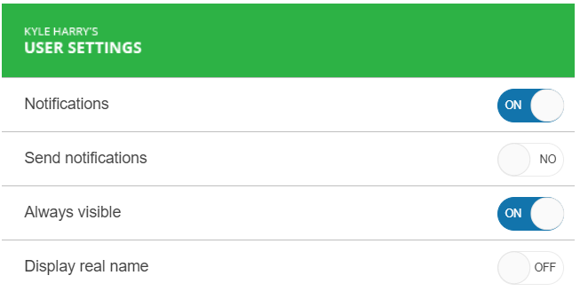

# {{ site.product }} Switch Overview

The Switch displays two exclusive choices.

When initialized, the Switch renders the currently selected value. The Switch can be created from an `input` element of type `checkbox`. The default styling of the Switch widget for each of the [Sass-based Kendo UI for jQuery themes](https://docs.telerik.com/kendo-ui/styles-and-layout/sass-themes) can be modified to match the desired custom layout. For more information and examples, refer to the article on implementing a [custom layout for the Switch](https://github.com/telerik/kendo-themes/wiki/Change-the-Switch-Layout).

## Functionality and Features

* [Appearance]()
* [Checked Switch]()
* [Disabled Switch]()
* [Read-only Switch]()
* [Custom Switch]()
* [Accessibility]()

## Next Steps 

* [Getting Started with the Kendo UI Switch for jQuery]()
* [Overview of the Switch (Demo)](https://demos.telerik.com/kendo-ui/switch/index)
* [JavaScript API Reference of the Switch](/api/javascript/ui/switch)

## See Also

* [Basic Usage of the Switch (Demo)](https://demos.telerik.com/kendo-ui/switch/index)
* [Using the API of the Switch (Demo)](https://demos.telerik.com/kendo-ui/switch/api)
* [JavaScript API Reference of the Switch](/api/javascript/ui/switch)
