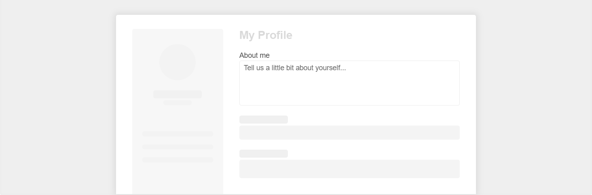

# {{ site.product }} TextArea Overview

The TextArea converts a `<textarea>` element into a styled textarea.

> The TextArea component is available as of [`Kendo UI R3 2020`](https://www.telerik.com/support/whats-new/kendo-ui/release-history/kendo-ui-r3-2020) release.

## Functionality and Features

* [Labels]()&mdash;Check the Label feature of the TextArea.
* [Appearance]()&mdash;Explore the styling options of the TextArea component.
* [Prefix and suffix]()&mdash;The TextArea component lets you add custom content as prefix and suffix adornments.

>tip To learn more about the appearance, anatomy, and accessibility of the TextArea, visit the [Progress Design System documentation](https://www.telerik.com/design-system/docs/components/textarea/)—an information portal offering rich component usage guidelines, descriptions of the available style variables, and globalization support details.

## Next Steps 

* [Getting Started with the Kendo UI TextArea for jQuery]()
* [Overview of the TextArea (Demo)](https://demos.telerik.com/kendo-ui/textarea/index)
* [JavaScript API Reference of the TextArea](/api/javascript/ui/textarea)

## See Also

* [Overview of the TextArea (Demo)](https://demos.telerik.com/kendo-ui/textarea/index)
* [Using the Basic Events of the TextArea (Demo)](https://demos.telerik.com/kendo-ui/textarea/events)
* [Binding the TextArea over MVVM (Demo)](https://demos.telerik.com/kendo-ui/textarea/mvvm)
* [Applying the TextArea API (Demo)](https://demos.telerik.com/kendo-ui/textarea/api)
* [JavaScript API Reference of the TextArea](/api/javascript/ui/textarea)
