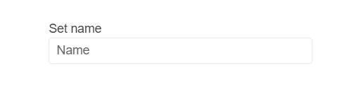

# {{ site.product }} TextBox Overview

The TextBox converts an `<input>` element into a styled textbox.

## Functionality and Features

* [Appearance]()&mdash;The TextBox provides a set of options that allow you to customize the appearance of the widget.
* [Labels]()&mdash;The Label enables you to associate the label HTML element with a TextBox.
* [Prefix and suffix]()&mdash;The TextBox component lets you add custom content as prefix and suffix adornments.

>tip To learn more about the appearance, anatomy, and accessibility of the TextBox, visit the [Progress Design System documentation](https://www.telerik.com/design-system/docs/components/textbox/)—an information portal offering rich component usage guidelines, descriptions of the available style variables, and globalization support details.

## Next Steps 

* [Getting Started with the Kendo UI TextBox for jQuery]()
* [Basic Usage of the TextBox (Demo)](https://demos.telerik.com/kendo-ui/textbox/index)
* [JavaScript API Reference of the TextBox](/api/javascript/ui/textbox)

## See Also

* [Basic Usage of the TextBox (Demo)](https://demos.telerik.com/kendo-ui/textbox/index)
* [Using the Basic Events of the TextBox (Demo)](https://demos.telerik.com/kendo-ui/textbox/events)
* [Binding the TextBox over MVVM (Demo)](https://demos.telerik.com/kendo-ui/textbox/mvvm)
* [Applying the TextBox API (Demo)](https://demos.telerik.com/kendo-ui/textbox/api)
* [JavaScript API Reference of the TextBox](/api/javascript/ui/textbox)
