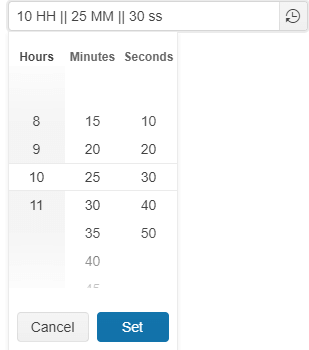

# {{ site.product }} TimeDurationPicker Overview

The TimeDurationPicker component enables the end user to select a time range stored in milliseconds.

## Functionality and Features

* [Columns]()&mdash;The TimeDurationPicker enables you to configure the displayed columns in its popup and apply formatting to the input value.
* [Shortcuts]()&mdash;You can add TimeDurationPicker buttons that hold certain timeframe values.
* [Appearance]()&mdash;You can also modify the visual appearance of the TimeDurationPicker component.

## Next Steps

* [Getting Started with the Kendo UI TimeDurationPicker for jQuery]()
* [Overview of the TimeDurationPicker (Demo)](https://demos.telerik.com/kendo-ui/timedurationpicker/index)
* [JavaScript API Reference of the TimeDurationPicker](/api/javascript/ui/timedurationpicker)

## See Also

* [Using the Basic Events of the TimeDurationPicker (Demo)](https://demos.telerik.com/kendo-ui/timedurationpicker/events)
* [Binding the TimeDurationPicker over MVVM (Demo)](https://demos.telerik.com/kendo-ui/timedurationpicker/mvvm)
* [Applying the TimeDurationPicker API (Demo)](https://demos.telerik.com/kendo-ui/timedurationpicker/api)
* [JavaScript API Reference of the TimeDurationPicker](/api/javascript/ui/timedurationpicker)
