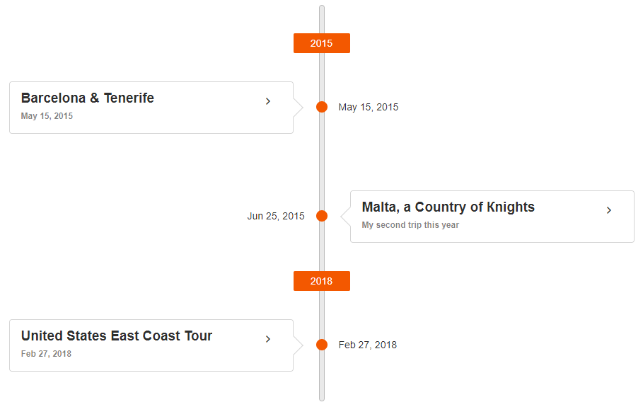

# {{ site.product }} Timeline Overview

The Kendo UI Timeline component displays a collection of events and their data in a chronological succession for each year.

You can scroll through the events and collapse/expand them. The events order can be vertical or horizontal, and you can customize their templates, as well as respond to events and use API control the component behavior. You can also control the format of the rendered date for the event. If you provide a list of actions, they will be rendered as links after the description and images.

## Functionality and Features

* [Orientation]()
* [Actions]()
* [Images]()
* [Templates]()
* [Binding to a Shared DataSource]()

## Next Steps

* [Getting Started with the Kendo UI Timeline for jQuery]()
* [Basic Usage of the Timeline (Demo)](https://demos.telerik.com/kendo-ui/timeline/index)
* [JavaScript API Reference of the Timeline](/api/javascript/ui/timeline)

## See Also

* [Basic Usage of the Timeline (Demo)](https://demos.telerik.com/kendo-ui/timeline/index)
* [Using the Basic Events of the Timeline (Demo)](https://demos.telerik.com/kendo-ui/timeline/events)
* [Binding the Timeline over MVVM (Demo)](https://demos.telerik.com/kendo-ui/timeline/mvvm)
* [Applying the Timeline API (Demo)](https://demos.telerik.com/kendo-ui/timeline/api)
* [JavaScript API Reference of the Timeline](/api/javascript/ui/timeline)
