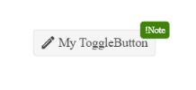

# {{ site.framework }} ToggleButton Overview

The Kendo UI for jQuery ToggleButton provides a styled clickable UI functionality with arbitrary content. Apart from consistent Kendo UI for jQuery styling, the ToggleButton enables you to indicate whether it is active or inactive, as well as group related options between various ToggleButton components. 

## Functionality and Features

* [Group ToggleButton]()&mdash;You can group the ToggleButton together.
* [Icon ToggleButton]()&mdash;The variety of icons allow you to enhance the appearance of the ToggleButton. 
* [Badge ToggleButton]()&mdash;You can add a Badge to the ToggleButton to conveniently show its status, a notification, or a short message.
* [Appearance]()&mdash;You can use the available styling options for configuring the size, theme color, and fill mode of the ToggleButton.
* [Events]()&mdash;The ToggleButton allows you to handle its toggle event and implement custom functionality.

## Next Steps

* [Getting Started with the Kendo UI ToggleButton for jQuery]()
* [Basic Usage of the ToggleButton (Demo)](https://demos.telerik.com/kendo-ui/togglebutton/index)

## See Also

* [Using the API of the Kendo UI ToggleButton for jQuery (Demo)](https://demos.telerik.com/kendo-ui/togglebutton/api)
* [JavaScript API Reference of the ToggleButton](/api/javascript/ui/togglebutton)
* [Knowledge Base Section](/knowledge-base)
