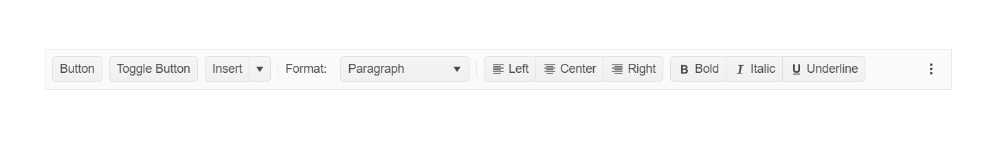
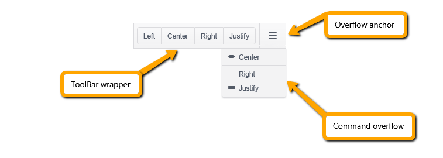

# {{ site.product }} ToolBar Overview

The ToolBar is designed to hold different types of controls such as buttons, button groups, toggle buttons, split buttons, and other customized elements.

The ToolBar consists of the ToolBar wrapper, overflow anchor, and command overflow popup main areas. The wrapper holds all commands that can be placed within the available container width. The ones that have no space to fit are moved to the command overflow popup.

## Functionality and Features

* [Command types]()&mdash;Check the possible button types supported by the ToolBar.
* [Templates]()&mdash;The ToolBar supports rendering of custom tools through templates.
* [Appearance]()&mdash;Explore the styling options of the ToolBar component.

## Next Steps 

* [Getting Started with the Kendo UI ToolBar for jQuery]()
* [Overview of the ToolBar (Demo)](https://demos.telerik.com/kendo-ui/toolbar/index)
* [JavaScript API Reference of the ToolBar](/api/javascript/ui/toolbar)

## See Also

* [Basic Usage of the ToolBar (Demo)](https://demos.telerik.com/kendo-ui/toolbar/index)
* [Using the API of the ToolBar (Demo)](https://demos.telerik.com/kendo-ui/toolbar/api)
* [JavaScript API Reference of the ToolBar](/api/javascript/ui/toolbar)
