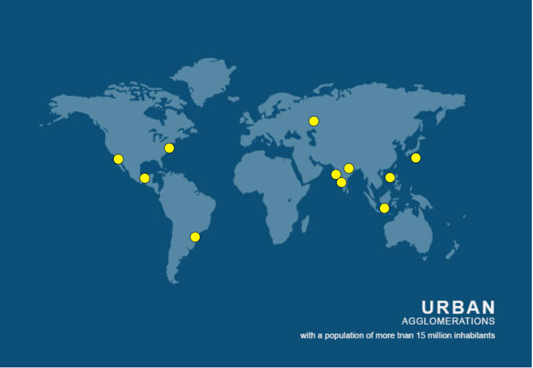

# {{ site.product }} Tooltip Overview

The Tooltip displays a popup hint for a specific HTML element. 

You can define its content either as static text or load it dynamically with AJAX. The Tooltip provides default configuration options such as relatively positioning it to the target, events for displaying the widget, auto-hiding behavior, setting its height and width.

## Functionality and Features

* [Content operations]()&mdash;The Tooltip provides built-in support for asynchronously loading its content from URLs.
* [Rendering over disabled elements]()&mdash;You can also render the Tooltip over disabled elements by initializing the widget over the parent of the disabled element. 

## Next Steps 

* [Getting Started with the Kendo UI Tooltip for jQuery]()
* [Basic Usage of the Tooltip (Demo)](https://demos.telerik.com/kendo-ui/tooltip/index)
* [JavaScript API Reference of the Tooltip](/api/javascript/ui/tooltip)

## See Also

* [Basic Usage of the Tooltip (Demo)](https://demos.telerik.com/kendo-ui/tooltip/index)
* [Using the API of the Tooltip (Demo)](https://demos.telerik.com/kendo-ui/tooltip/api)
* [JavaScript API Reference of the Tooltip](/api/javascript/ui/tooltip)
