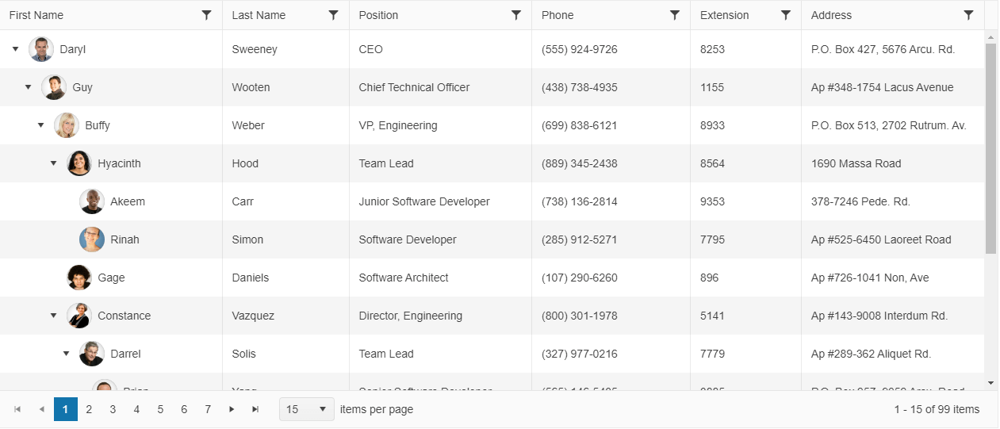

# {{ site.product }} TreeList Overview

The TreeList enables the display of self-referencing tabular data and supports local and remote hierarchical data scenarios.

## Functionality and Features

* [Data binding]()&#8212;The TreeList provides options for binding it to local arrays and remote data.
* [Editing]()&#8212;You can use the available built-in editing functionality of the TreeList.
* [Filtering]()&#8212;The TreeList supports built-in filtering for narrowing large hierarchical datasets.
* [Paging]()&#8212;The TreeList component supports client-side paging for large sets of data.
* [Scrolling]()&#8212;You can scroll through the TreeList data when using large data sets.
* [Row templates]()&#8212;You can customize the rendering of row content with templates.
* [Multi-column headers]()&#8212;The TreeList component enables you to render a tree-like structure where one or more columns can be grouped together by a common header.
* [Row selection]()&#8212;The TreeList enables you to select rows by clicking on a row or by clicking on a checkbox.
* [State persistence]()&#8212;You can store TreeList settings and restore them later for the same user workflow.
* [Excel export]()&#8212;The TreeList supports exporting hierarchical data to Excel workbooks.
* [PDF export]()&#8212;The TreeList supports exporting hierarchical data to PDF documents.
* [Accessibility]()&#8212;The TreeList is accessible by screen readers.

## Next Steps

* [Getting Started with the Kendo UI TreeList for jQuery]()
* [Basic Usage of the jQuery TreeList (Demo)](https://demos.telerik.com/kendo-ui/treelist/index)
* [JavaScript API Reference of the TreeList](/api/ui/treelist)

## See Also

* [Product Page of the Kendo UI for jQuery TreeList](https://www.telerik.com/kendo-jquery-ui/treelist)
* [Using the API of the TreeList (Demo)](https://demos.telerik.com/kendo-ui/treelist/api)
* [Knowledge Base Section](/knowledge-base)
