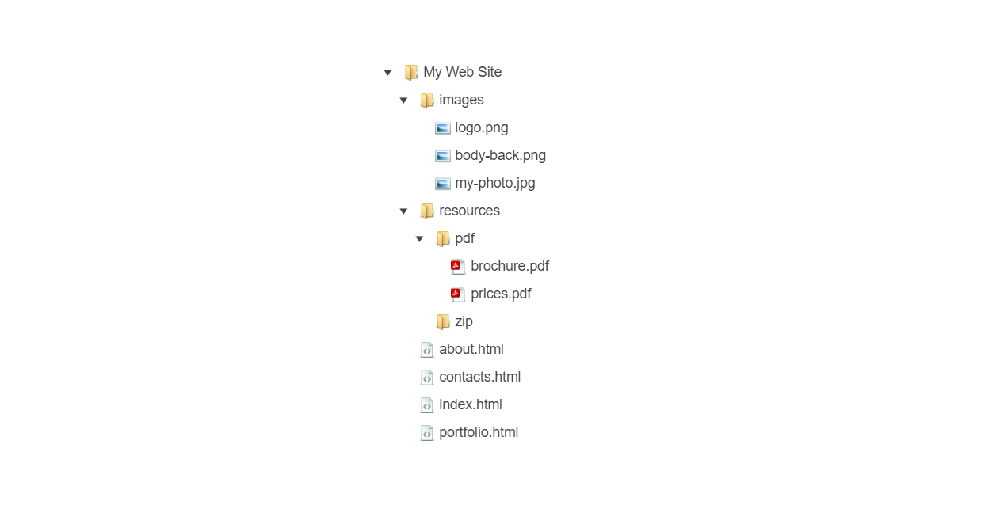

# {{ site.product }} TreeView Overview

The Kendo UI TreeView displays hierarchical data in a traditional tree structure.

You can initialize the TreeView from HTML or bind it to local or remote data. It also supports interaction through mouse, touch, and keyboard input.

## Functionality and Features

* [Data binding]()–The TreeView enables you to bind its HierarchicalDataSource either to local data arrays or to remote data.
* [Dragging and dropping]()–The TreeView enables users to move nodes within one instance or between multiple TreeView components by using drag and drop.
* [Items]()–The TreeView supports a set of configuration options for setting the specific fields of its items and their usage.
* [Appearance]()–The TreeView provides styling options for adjusting its size and rendering.
* [Accessibility]()–The TreeView supports keyboard navigation and follows WAI-ARIA, Section 508, and WCAG accessibility guidelines.

## Next Steps

* [Getting Started with the Kendo UI TreeView for jQuery]()
* [Basic Usage of the TreeView (Demo)](https://demos.telerik.com/kendo-ui/treeview/index)
* [JavaScript API Reference of the TreeView](/api/ui/treeview)

## See Also

* [Product Page of the Kendo UI for jQuery TreeView](https://www.telerik.com/kendo-jquery-ui/treeview)
* [Using the API of the TreeView (Demo)](https://demos.telerik.com/kendo-ui/treeview/api)
* [Knowledge Base Section](/knowledge-base)
