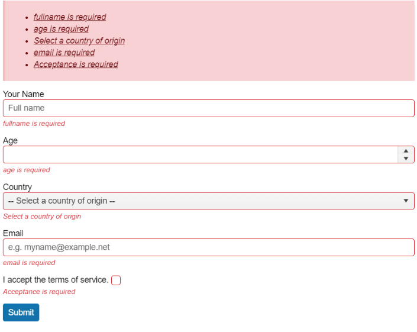

# {{ site.product }} Validator Overview

The Kendo UI Validator widget offers a simple way to do client-side form validation.

Built around the HTML5 form validation attributes, it supports a variety of built-in validation rules and provides a convenient way for setting custom-rule handling. The Validator is a powerful framework component and essential for any application that collects user input.

## Functionality and Features

* [Forms validation]()&mdash;When working with the Validator, you can use the HTML5 form validation attributes.
* [Validation rules]()&mdash;Apart from enabling you to use its default validation rules, the Validator also provides options for implementing custom validation rules and custom messages.
* [Tooltip]()&mdash;The Validator also provides setting for managing the rendering behavior of its tooltips.

## Next Steps

* [Getting Started with the Kendo UI Validator for jQuery]()
* [Basic Usage of the Validator (Demo)](https://demos.telerik.com/kendo-ui/validator/index)
* [JavaScript API Reference of the Validator](/api/javascript/ui/validator)

## See Also 

* [Validation Rules]()
* [Tooltip]()
* [HTML5 Form Constraints]()
