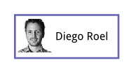

# Draw Basic Shapes

- [Our goal](#our-goal)
- [Walk-through](#walk-through)
    - [Import namespaces](#import-namespaces)
    - [Draw the path](#draw-the-path)
    - [Draw the image](#draw-the-image)
    - [Draw the text](#draw-the-text)
    - [Group the shapes](#group-the-shapes)
    - [Render the scene](#render-the-scene)

## Our goal

Scenes are constructed from a set of built-in basic shapes.
Let's take a simple, static scene and try to replicate it.

In terms of the Drawing API this scene consists of a path (the violet border),
text and an image. We'll also add an enclosing group for positioning.

This is the full code required to render this scene.
You'll notice a number of structures that define the
position, size and appearance of each element.

We'll go into detail in the following sections.

    

    

## Walk-through

### Import namespaces

We'll start by importing two name spaces:

    var geom = kendo.geometry;
    var draw = kendo.drawing;

The `kendo.geometry` namespace contains primitives such as
[Point](/api/dataviz/geometry/point),
[Rect](/api/dataviz/geometry/rect) and
[Size](/api/dataviz/geometry/size).

Drawing elements such as
[Path](/api/dataviz/drawing/path),
[Image](/api/dataviz/drawing/image) and
[Group](/api/dataviz/drawing/group)
live in the `kendo.drawing` namespace.

### Draw the path
A [Path](/api/dataviz/drawing/path) element is used to
draw straight lines, curves or a combination of both.

We'll set the stroke (line) color and width to match the picture:

    var path = new draw.Path({
        stroke: {
            color: "#9999b6",
            width: 2
        }
    });

The [configuration](/api/dataviz/drawing/path#configuration) object
can contain other appearance options as well.

We can now construct the path by issuing commands:

    path.moveTo(0, 0)
        .lineTo(150, 0).lineTo(150, 65).lineTo(0, 65)
        .close();

We set the line initial position with a
[moveTo](/api/dataviz/drawing/path#methods-moveTo) command.
The three sides are drawn using
[lineTo](/kendo-ui/api/dataviz/drawing/path#methods-lineTo) commands.
The last command
[closes](/api/dataviz/drawing/path#methods-close)
the path, drawing a straight line to the initial position.

Since this is a rectangle we can use the alternative
[fromRect](/api/dataviz/drawing/path#fromrect)
static method:

    var borderRect = new geom.Rect(
        new geom.Point(0, 0),
        new geom.Size(150, 65)
    );
    var path = draw.Path.fromRect(borderRect, {
        stroke: {
            color: "#9999b6",
            width: 2
        }
    });

### Draw the image
The [Image](/api/dataviz/drawing/image) element draws a bitmap image from a given URL.
The image position and size is defined as a [Rect](/api/dataviz/geometry/rect).

    var imageRect = new geom.Rect(
        new geom.Point(5, 5),
        new geom.Size(50, 50)
    );

This statement can be shortened to:

    var imageRect = new geom.Rect([5, 5], [50, 50]);

> Any method that expects Point and Size will also accept [x, y] and [width, height] arrays.

We can now create the image:

    var imageUrl = "http://demos.telerik.com/content/dataviz/diagram/people/diego.jpg";
    var image = new draw.Image(imageUrl, imageRect);

### Draw the text
The [Text](/api/dataviz/drawing/text) element draws a single line of text.
Appearance options, such as font are set through
[configuration](/api/dataviz/drawing/text#configuration).

        var text = new draw.Text(
            "Diego Roel",
            new geom.Point(60, 25),
            { font: "bold 15px Arial" }
        );

The point defines the position of the top left corner.

### Group the shapes
It's often convenient to treat a group of shapes as a single entity.
In this case we'll use a group to set the position of all elements at once.

Create a [Group](/api/dataviz/drawing/group) element and append the rest of the elements as children:

        var group = new draw.Group();
        group.append(path, image, text);

A transformation applies to all group children. In this case it's a fairly simple translate.
We effectively make the element coordinates relative by translating their parent group.

        group.transform(
            geom.transform().translate(50, 50)
        );

### Render the scene
All that is left is to render the scene on the screen.
The [Surface.create](/api/dataviz/drawing/surface#create) method will
choose an implementation that matches the capabilities of the browser:

        

        

The default is SVG with fallback to Canvas or VML.
See [Supported Browsers](supported-browsers).
