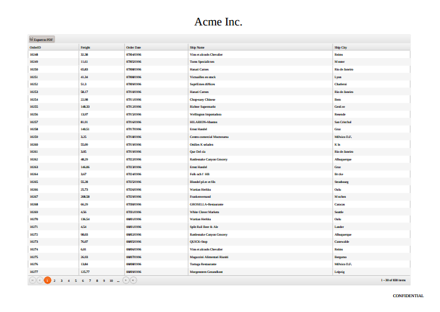

# Custom PDF page layout

This example will show how to export a Grid as a drawing and do a basic page layout.

Our goal is to fit the grid in the center of the exported page.
We'll also add a header and a footer that are not part of the original page.



The full code of the example follows with additional discussion in the comments.

## Example - page layout
```html
<div id="grid"></div>
<script>
$("#grid").kendoGrid({
    pdfExport: function (e) {
        // Stop the built-in export
        e.preventDefault();

        // Do a custom export with our own page layout
        kendo.drawing.drawDOM(this.wrapper)
        .then(function(group) {
            var page = formatPage(group);
            return kendo.drawing.exportPDF(page, {
                paperSize: "A4",
                landscape: true,
                margin: {
                    left: "1cm",
                    top: "1cm",
                    right: "1cm",
                    bottom: "1cm"
                },
                multiPage : false
            });
        })
        .done(function(data) {
            // Save the PDF file
            kendo.saveAs({
                dataURI: data,
                fileName: "Report.pdf",
                proxyURL: "http://demos.telerik.com/kendo-ui/service/export"
            });
        });
    },
    toolbar: ["pdf"],
    dataSource: {
        type: "odata",
        transport: {
            read: "http://demos.telerik.com/kendo-ui/service/Northwind.svc/Orders"
        },
        schema: {
            model: {
                fields: {
                    OrderID: { type: "number" },
                    Freight: { type: "number" },
                    ShipName: { type: "string" },
                    OrderDate: { type: "date" },
                    ShipCity: { type: "string" }
                }
            }
        },
        pageSize: 30,
        serverPaging: true,
    },
    pageable: true,
    scrollable: false,
    columns: [
        {
            field:"OrderID",
            filterable: false
        },
        "Freight",
        {
            field: "OrderDate",
            title: "Order Date",
            format: "{0:MM/dd/yyyy}"
        }, {
            field: "ShipName",
            title: "Ship Name"
        }, {
            field: "ShipCity",
            title: "Ship City"
        }
    ]
});

// Import Drawing API namespaces
var draw = kendo.drawing;
var geom = kendo.geometry;

// PDF Output is fixed at 72 DPI
// This gives us a fixed mm/px ratio
var MM_TO_PX = 2.8347;

// A4 Sheet with 1 cm borders, landscape
var PAPER_RECT = new kendo.geometry.Rect(
    [0, 0], [(297 - 20) * MM_TO_PX, (210 - 20) * MM_TO_PX]
);

// Spacing between header, content and footer
var V_SPACING = 5 * MM_TO_PX;

function formatPage(content) {
    var header = createHeader();
    var footer = createFooter();

    // Do a "dry run" on the layout to measure the available space
    var other = vStack(
        header,
        vSpacer(V_SPACING),
        // Content will go here
        vSpacer(V_SPACING),
        footer
    );

    var contentSize = PAPER_RECT.size.clone();
    contentSize.height -= other.bbox().height();

    // Fit the content in the available space
    content = fit(content, contentSize)
    content = hAlign(content, PAPER_RECT, "center")

    // Do a final layout with content
    var page = vStack(
        header,
        vSpacer(V_SPACING),
        content,
        vSpacer(V_SPACING),
        footer
    );

    return page;
}

// Transform the content to fit into the specified size
function fit(content, size) {
    var bbox = content.clippedBBox();
    var scale = Math.min(
        size.width / bbox.width(),
        size.height / bbox.height()
    );

    // We apply the actual transformation on a wrapper
    // so its applied before any existing transformations
    var wrap = new draw.Group({
        transform: geom.transform().scale(scale, scale)
    });
    wrap.append(content);

    return wrap;
}

function createHeader() {
    var text = new kendo.drawing.Text("Acme Inc.", [0, 0], {
        font: (8 * MM_TO_PX) + "px Verdana"
    });

    var wrap = hAlign(text, PAPER_RECT, "center");

    return wrap;
}

function createFooter() {
    var text = new kendo.drawing.Text("CONFIDENTIAL", [0, 0], {
        font: (3 * MM_TO_PX) + "px Verdana"
    });

    var wrap = hAlign(text, PAPER_RECT, "right");

    return wrap;
}

// Horizontally aligns an element within a rectangle
// Supported aligments are "left", "center" and "right"
function hAlign(element, rect, pos) {
    var offset = 0;
    var anchor = "topLeft";

    if (pos === "center") {
        anchor = "center";
    } else if (pos === "right") {
        anchor = "topRight";
    }

    var offset = rect[anchor]().x - element.clippedBBox()[anchor]().x;

    // We apply the actual transformation on a wrapper
    // so its applied before any existing transformations
    var wrap = new draw.Group({
        transform: geom.transform().translate(offset, 0)
    });

    wrap.append(element);

    return wrap;
}

// Stack elements on top of each other
function vStack() {
    var offset = 0;
    var group = new draw.Group();

    for (var i = 0; i < arguments.length; i++) {
        var child = arguments[i];
        var wrap = new draw.Group({
            transform: geom.transform().translate(0, offset)
        });

        offset += child.clippedBBox().height();

        wrap.append(child);
        group.append(wrap);
    }

    return group;
}

// Return a transparent spacer with the given height
function vSpacer(height) {
    var rect = new geom.Rect([0, 0], [0, height]);
    return draw.Path.fromRect(rect, { stroke: null });
}
</script>
```

## Support for Unicode

By default the generated PDF file will use a standard set of fonts.
This set does not include any Unicode characters.

The solution is to provide your own set of fonts for the export.
Only the used subset of these fonts will be embedded in the PDF file.

See [Custom fonts](/framework/drawing/pdf-output#using-custom-fonts) for instructions.

## See also

* [API Reference for kendo.drawing](/api/javascript/drawing)
* [API reference for kendo.geometry](/api/javascript/geometry)

