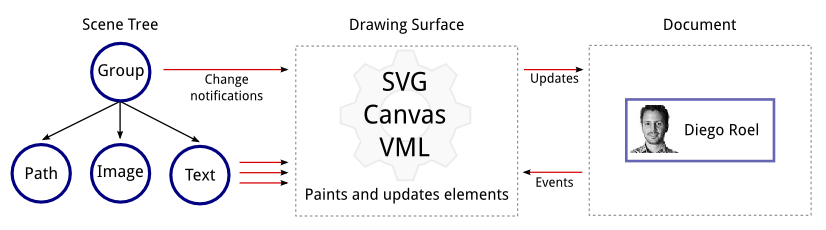

# Drawing API Overview

The [Kendo UI Drawing API](http://demos.telerik.com/kendo-ui/drawing/index) is a cross-browser vector graphics library. It offers a simple object model for building and manipulating visual scenes.

## Basic Usage

### Components

You build a scene by creating drawing elements such as curves, images, and text. Scene elements are live and respond to changes of their appearance and geometry.

A drawing surface is used to render scenes on and off screen. Surfaces encapsulate specific browser technologies such as SVG or Canvas.

**Figure 1. Drawing API components**

### Design Goals

The Kendo UI Drawing API is designed to serve as a foundation of and extension point for the Kendo UI widgets rendering data visualization, such as Charts and Diagrams.

The Drawing API is also a stand-alone component suitable for building custom visualizations.

## See Also

Other articles on Kendo UI Drawing API:

* [Drawing of Basic Shapes]()
* [Export a Drawing in PDF]()
* [Drawing of HTML Elements]()
* [Supported Browsers for Kendo UI Drawing API]()
