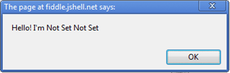
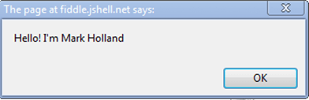
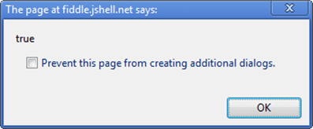
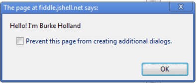
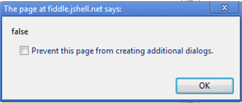

# Object-Model Architecture

If you as developer come from Object-Oriented backgrounds, you may find the JavaScript Object Model challenging because of its counter-intuitiveness.

However, you can use part of the structure and the [Don't Repeat Yourself (DRY) principles](https://en.wikipedia.org/wiki/Don%27t_repeat_yourself) from Object-Oriented languages, and use them in JavaScript development.

## Getting Started

1. [Creating new objects](#creating-new-objects)
1. [Adding constructors](#adding-contructors)
1. [Instantiating new parent objects](#instantiating-new-parent-objects)
1. [Inheriting parent properties](#inheriting-parent-properties)
1. [Understanding parent objects](#understanding-parent-objects)

### Creating New Objects

To create a new object with Kendo UI, define it by calling `kendo.Class.extend`&mdash;for example, `var person = kendo.Class.extend({});`. This approach creates a new `person` object to which you can add properties and functions. The approach uses an object literal notation so to separate them from their value, you have to declare variables with a semi-colon (`:`) instead of an equal sign (`=`). Also, the example uses the `this` keyword to reference local variables inside the object. If the context results are not specified, the variable will not be found.

    var Person = kendo.Class.extend({
        firstName: 'Not Set',
        lastName: 'Not Set',
        isAPrettyCoolPerson: false,
        sayHello: function() {
            alert("Hello! I'm " + this.firstName + " " + this.lastName);
        }
    });

    var person = new Person();
    person.sayHello();

**Figure 1: Creating a new object**



### Adding Constructors

You can also add a constructor for this object by including an `init` method. To create a new person, build up a new `person` object, such as a new [John Bristowe](http://twitter.com/johnbristowe)), and set `isAPrettyCoolPerson` to `true`.

    var Person = kendo.Class.extend({
        firstName: 'Not Set',
        lastName: 'Not Set',
        isAPrettyCoolPerson: false,
        init: function(firstName, lastName) {
            if (firstName) this.firstName = firstName;
            if (lastName) this.lastName = lastName;
        },
        sayHello: function() {
            alert("Hello! I'm " + this.firstName + " " + this.lastName);
        }
    });

    var person = new Person("John", "Bristowe");
    person.isAPrettyCoolPerson = true;
    person.sayHello();

**Figure 2: Setting the name of the new person**


### Instantiating New Parent Objects

You can instantiate a new `person` object of type parent that inherits the properties of `person` by extending the base person object and toggle the quality (cool).

    var Parent = Person.extend({
        firstName: 'Mark',
        lastName: 'Holland'
    });

    var myDad = new Parent();
    myDad.isAPrettyCoolPerson = true;
    myDad.sayHello();
    alert(myDad.isAPrettyCoolPerson);

**Figure 3: Instantiating a parent**



**Figure 4: Toggling a quality**



### Inheriting Parent Properties

A child inherits some, but not all, properties from their parents. If you inherit your father's last name, you can override the first name since you have your own. Also, if your dad is a cool person, you might inherit from him that too.

    var Child = Parent.extend({});
    var me = new Child();
    me.firstName = "Burke";
    me.sayHello();
    alert(me.isPrettyCoolPerson);

**Figure 5: Inheriting some parent properties**



**Figure 6: Trying to inherit more parent properties**



### Understanding Parent Objects

It seems the child does not inherit being cool from their parent. Actually, it inherits the trait, which the parent inherited from the `person` object. Because `isACoolPerson` was set after the dad was created, it is specific to his object instance of `parent`. And, by default, parents are not cool people.

## Sample Case

The following example demonstrates how to experiment with the inheritance concept in Kendo UI.

```dojo
<div id="content"></div>

<script>
function log(msg) {
    $("#content").append("<p>" + msg + "</p>");
}

// Create a new person class.
var Person = kendo.Class.extend({
    firstName: 'Not Set',
    lastName: 'Not Set',
    isPrettyCoolPerson: false,
    init: function(firstName, lastName) {
        if (firstName) this.firstName = firstName;
        if (lastName) this.lastName = lastName;
    },
    sayHello: function() {
        log("Hello! I'm " + this.firstName + " " + this.lastName)
    }
});

// Create a new John Bristowe of type person.
var person = new Person("John", "Bristowe");
// Say hello John
person.sayHello();

// Create a parent object of type person.
var Parent = Person.extend({
    firstName: 'Mark',
    lastName: 'Holland'
});

// Create the parent.
var myDad = new Parent();
myDad.isPrettyCoolPerson = true;

// Say hello, parent.
myDad.sayHello();
// Expose the parent's coolness factor.
    log("Cool? " + myDad.isPrettyCoolPerson);

// Create a new child object that inherits from the parent.
var Child = Parent.extend({});

// Create me.
var me = new Child();
me.firstName = "Burke";

// Hello!
me.sayHello();
// Expose my coolness.
log("Cool? " + me.isPrettyCoolPerson);
</script>
```

## See Also

* [Get Started with Kendo UI]()
* [Widget Wrapper and Element References]()
* [Data Attributes Configuration]()
* [Widget Methods and Events]()
* [Destroy Widgets]()
