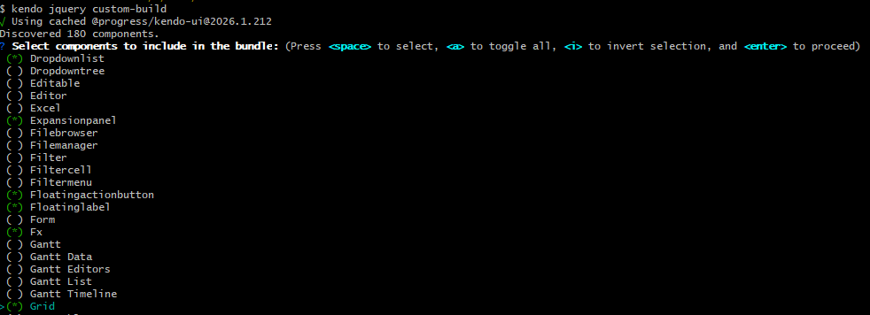
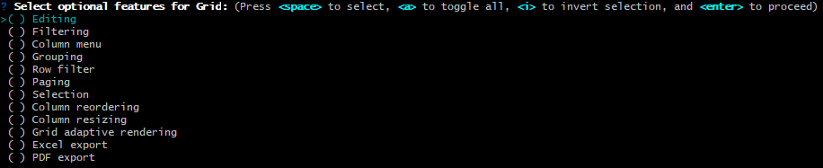

# Building Custom Kendo UI Scripts Locally

The local custom builder is a practical way to reduce script size and include only the Kendo UI for jQuery components and features your project needs.

With this approach, you can:

* Build a tailored script package on your machine.
* Select a specific product version, starting with the current `2026.1.212` release.
* Reuse a configuration file when you need to build the same selection again.
* Integrate the custom build process as part of your CI pipeline.
* Keep payloads smaller by shipping only required components.
* Control optional component-level features, such as Grid editing and export.

## Prerequisites

Ensure you have the latest Node 22 or Node 24 installed. See [Node Setup on Windows with nvm-windows]() for a quick setup guide.

Install the Kendo CLI package:

```sh
npm i -g @progress/kendo-cli
```

## Using an existing config.json from the online download builder

Creating a custom bundle from an existing `config.json` is extremely easy.

1. Find your existing `config.json` file.
2. Rename it to `kendo-config.json`.
3. Open a terminal in the folder that contains `kendo-config.json`.
4. Run the following command:

	```sh
	kendo jquery custom-build --no-interactive
	```

The command generates `kendo.custom.min.js`, containing only the components and features from your existing configuration. The build uses the latest available Kendo UI for jQuery version by default.

When a new release is published, run the same command again to produce an updated custom bundle with the latest version.

## Creating a new config or editing an existing one

If you want to create a brand new configuration, or add and remove components from an existing one, follow these steps.

## 1. Create a Working Folder

Create a dedicated folder for the custom build process, for example `custom-build`, and navigate to it.

```sh
mkdir custom-build
cd custom-build
```

If you want to create a brand new configuration file, make sure the folder does not contain an existing `kendo-config.json` file. If your goal is to edit an existing configuration, keep `kendo-config.json` in the folder and continue.

## 2. Start the Custom Build Process

Run the custom builder command:

```sh
kendo jquery custom-build
```

The CLI starts an interactive flow where you can choose the output that matches your project.

## 3. Select the Product Version

To select a specific Kendo UI for jQuery version, run the command with the `--version` flag:

```sh
kendo jquery custom-build --version 2026.1.212
```

Version selection through `--version` works for versions starting with 2026. If you run `kendo jquery custom-build` without the flag, the CLI uses the latest available version.

## 4. Select Components

Choose only the components your application requires.

For example, you can include `Grid`, `DropDownList`, `Editor`, and other components based on your scenario.



## 5. Select Optional Component Features

For selected components, the builder lets you choose optional features.

For the `Grid`, for example, you can select options like editing, filtering, grouping, paging, selection, and export features.



## 6. Work with kendo-config.json

You can drive the process with a predefined configuration file named `kendo-config.json`.

* If `kendo-config.json` already exists in the folder, the builder can use it to preselect components and options.
* If you complete the selection manually, the builder generates a `kendo-config.json` file in the same folder.
* You can keep reusing this file for future builds, including when you switch to a different product version.
* You can edit the file manually at any time, or rerun the interactive command to update selected components and feature options.

This reusable configuration makes the local custom builder a strong option for teams that need predictable outputs across multiple environments.

## Next Steps

* [Installing with NPM]()
* [Using Kendo UI for jQuery ECMAScript Modules]()

## See Also

* [Downloading the Bundles]()
* [Installing Kendo UI by Using the CDN Services]()
* [Licensing Overview]()
