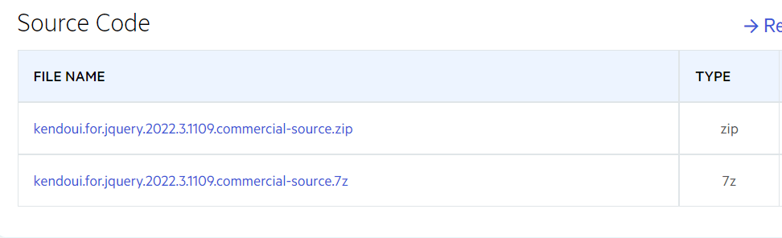

# ECMAScript Modules

As of the 2022.3.1109 version, the Kendo UI code-base is available in the form of ECMAScript modules.

## ECMAScript Modules vs. Bundled Scripts 

The new ECMAScript modules provide the following benefits as compared to the bundled scripts which have been used up to this point:

* [Loading single instead of multiple script files](#loading-single-script-files) 
* [Dynamic script loading](#dynamic-script-loading)
* [Optimized debugging](#optimized-debugging) 
* [Browser compatibility](#browser-compatibility) 

### Loading Single Script Files

ECMAScript enables you to include a single script file to load a particular component. Taking the jQuery Grid for Kendo UI as an example, previously, if you wanted to include just the Grid component instead of all available components, you had to also include every single script dependency related to it and in a specific order. 

The `<head>` element of your page would've looked similar to the following code snippet:

```html
<script src="dist/js/kendo.core.js"></script>
<script src="dist/js/kendo.data.js"></script>
<script src="dist/js/kendo.columnsorter.js"></script>
<script src="dist/js/kendo.userevents.js"></script>
<script src="dist/js/kendo.draganddrop.js"></script>
<!-- And about 80 more individual scripts for every single functionality of the Grid to work properly. -->
```

With the introduction of the ECMAScript modules, you can include just a single script file, as shown in the following example. As a result, ECMAScript will automatically load all of the required dependencies without needing any additional actions on your side, which will greatly increase productivity and decrease the chances of missing any of the script files.

```html
<script src="dist/mjs/kendo.grid.js" type="module"></script>
```


### Dynamic Script Loading

Aside from using the `script` tag, you can also use the [`import()`](https://developer.mozilla.org/en-US/docs/Web/JavaScript/Reference/Operators/import) call to load a module asynchronously into a potentially non-module environment.

The suggested approach is useful when, for example, you have a Kendo UI Grid inside a Window. The Grid component is not initialized nor needed before the Window is opened. Therefore, you don't need to import the module when the page first loads. Instead, you can load the module when the Window is opened and only then initialize the Grid component.

```javascript
(async () => {
  let shouldGridModuleBeLoaded = true;

  // Load the Grid module only if a condition is met.
  if (shouldGridModuleBeLoaded) {
    await import("/dist/mjs/kendo.grid.js");
  }
})();
```

### Optimized Debugging

Another benefit of using ECMAScript is that it enables you to debug the Kendo UI for jQuery source code much easier. When you navigate to the **Devtools** > **Sources** browser tab, you will be able to see the non-minified version of the source code exactly like it is in the development environment of the product.

Additionally, the [sourcemap](https://firefox-source-docs.mozilla.org/devtools-user/debugger/how_to/use_a_source_map/index.html) files are now downloaded only when the **Devtools** is opened.

The following image showcases the directory structure of the loaded scripts in the **Devtools** browser:


### Browser Compatibility

[ECMAScript is supported by the majority of modern browsers](https://caniuse.com/?search=es6%20modules). If a project requires older browser support, you can choose to use either of the other two available module systems&mdash;CommonJS or UMD.

## Getting the ECMAScript Files

You can obtain the ECMAScript modules in any of the following ways:

 - [Download the bundle]()
 - [Use the CDN](#ecmascript-modules)
 - [Install with NPM]()

## Manually Building the Source Code

You can manually build the source code of the components by following these steps:

1. Navigate to your [downloads](https://www.telerik.com/account/my-downloads) page.
1. Open the Kendo UI for jQuery page and scroll down to the **Source Code** section.

  

1. Once you have downloaded and extracted the source code, navigate to the `src` folder and open a terminal.
1. Run the following command to install **npm**:

  ```javascript
    npm install
  ```

1. Once the previous operation is complete, run one of the following commands to build the scripts:

  - The following command builds the traditional version of the scripts:

    ```javascript
      npm run scripts
    ```

  - The following command builds the `mjs` version of the scripts:

    ```javascript
      npm run scripts:mjs
    ```

  - The following command builds the `esm` and `cjs` versions of the scripts:

    ```javascript
      npm run scripts:modules
    ```

  - Runs all of the previous commands at once:

    ```javascript
      npm run scripts:all
    ```
  - Some bundlers such as legacy versions of Webpack and MVC's ScriptBundler are unable to process newer syntax. This is a limitation of the bundlers themselves. If you need to bundle the Kendo scripts using such a bundler, you can download the source code from your [Telerik profile](https://www.telerik.com/account/downloads/product-download?product=KENDOUICOMPLETE) and compile it manually using the command below. After the command is ran, the `dist/js` folder will contain minified Kendo scripts that can be used with the MVC ScriptBundler and legacy Webpack versions. Note that the command is an alternative of the `npm run scripts`, thus only one of the commands should be used:

    ```javascript
      npm run scripts:babel
    ```

## Next Steps

* [Create Your Own Custom Bundles]()
* [The Component DOM Element Structure]()
* [Initialize Components as jQuery Plugins]()
* [Initialize Components with MVVM]()
* [jQuery Version Support]()
* [Web Browser Support]()
* [Operation System Support]()
* [PDF and Excel Export Support]()
* [Component Script Dependencies]()
* [Create Your Own Custom Components]()

## See Also

* [Troubleshooting When Using Kendo UI CDN services]()
* [Troubleshooting When Trying to Refer Kendo UI Internal Builds from CDN]()
* [Hosting Kendo UI in Your Project]()
* [Installing Kendo UI with Bower]()
* [Installing Kendo UI with NPM]()
* [Installing Kendo UI with NuGet]()
* [Getting Up and Running with Your Kendo UI Project (Guide)]()
* [Using Script License Code]()
