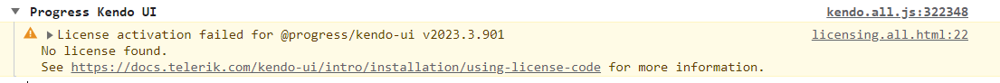

# License Activation Errors and Warnings

Using Kendo UI for jQuery without a license or with an invalid license causes specific license warnings and errors. This article defines what an invalid license is, explains what is causing it, and describes the related license warnings and errors.

## Invalid License

An invalid license can be caused by any of the following:

* Using an expired subscription license—subscription licenses expire at the end of the subscription term.
* Using a perpetual license for product versions released outside the validity period of your license.
* Using an expired trial license.
* A missing license for Kendo UI for jQuery.
* Not [installing a license key](#installing-or-updating-the-license-key) in your application.
* Not [updating the license key](#installing-or-updating-the-license-key) after renewing your Kendo UI for jQuery license.

## License Warnings

If you use Kendo UI for jQuery in a project with an invalid license, the UI components exhibit the following invalid license attributes:

* A [watermark](#watermark) appears over a number of selected components.
* A [banner](#banner) is rendered on pages that use the Kendo UI for jQuery components.
* A [warning message](#console-warning) is logged in the browser console of pages rendering the Kendo UI for jQuery components.

### Watermark

* A watermark appearing in the `Light Theme` mode:

     

* A watermark appearing in the `Dark Theme` mode:

     

### Banner

A banner appears on pages that use unlicensed Kendo UI for jQuery components:

* Clicking the ? button of the banner takes you to the Kendo UI for jQuery licensing documentation.
* Clicking the x button of the banner closes it until the page is reloaded or a license is activated.

### Console Warning

A warning message similar to the following is logged in the browser's console:

## License Activation Errors

If you use Kendo UI for jQuery in a project with an expired or missing license, [the kendo-ui-license activate command](#installing-or-updating-the-license-key) will indicate the following errors or conditions:

|Error or Condition |Message Code | Solution |
|:---          |:---|:---
|`No Telerik and Kendo UI License file found`   |TKL002 | [Install a license key]() to activate the UI components and remove the error message.|
|`Corrupted Telerik and Kendo UI License Key content`   |TKL003 | [Download a new license key]() and install it to activate the UI components and remove the error message.|
|`Unable to locate licenses for all products.`   |TKL004 | Your license is not valid for all Telerik and Kendo products added to your project. If you have already purchased the required license, then [update your license key](#installing-or-updating-the-license-key).|
|`Kendo UI for jQuery is not listed in your current license file.`   |TKL101 | Review the purchase options for the listed products. Alternatively, remove the references to the listed packages from `package.json`.|
|`Your current license has expired`   |TKL102 | You are using a product version released outside the validity period of your perpetual license. To remove the error message, do either of the following: <ul><li>Renew your license, download a new license key, and install it.</li><li>Downgrade to a product version included in your perpetual license as indicated in the message.</li></ul>|
|`Your subscription has expired.`   |TKL103; TKL104 | Renew your subscription and [download a new license key](#downloading-the-license-key).|
|`Your trial expired.`   |TKL105 | Purchase a commercial license to continue using the product.|
|`No Telerik or Kendo UI product references detected in project.`   |TKL001 | <ul><li>If you use Telerik products and see this message, update the `Telerik.Licensing` package to version 1.4.9 or later.</li><li>If you do not use Telerik products, remove the `Telerik.Licensing` NuGet reference from your project.</li></ul>|

## See Also

* [Licensing Overview]()
* [Frequently Asked Questions about Your Kendo UI for jQuery License Key]()
* [Adding the License Key to CI Services]()
* [Handling License Key File Name and Environment Variable Name Changes in the 2025 Q1 Release]()
