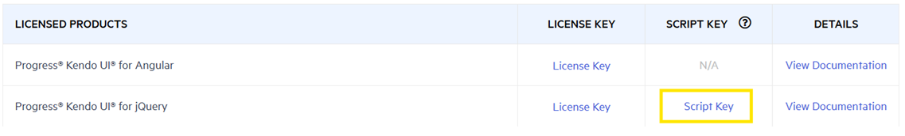

# Setting Up the License Key

Follow the steps in this article to download a license key script and add it to your application.

To add a Kendo UI license file to your application:

1. Go to the [License Keys page](https://www.telerik.com/account/your-licenses/license-keys) in your Telerik account.
2. On the `Progress® Kendo UI® for jQuery` row, click the **View key** link in the **SCRIPT KEY** column.



3.  Copy the JavaScript code snippet into a new file, for example, `telerik-license.js`.
4.  Load the script in your project, after loading the Kendo UI for jQuery scripts, but before creating any components.

You can reference the `telerik-license.js` license file by using either of the following approaches:

* [Use a script reference](#use-a-script-reference)
* [Use JS or TS Modules](#use-js-or-ts-modules)

As a result, the license key will be distributed along with the scripts and this cannot be avoided. However, Progress recommends that you do not publicly announce it.

## Use a Script Reference

Add the license as a script reference right after the `kendo.all.min.js` reference or the Kendo UI scripts you are using.

The following example shows how to use the CDN reference (`kendo.all.min.js`).

```html
<script src="https://kendo.cdn.telerik.com/***/kendo.all.min.js"></script>
<script src="./telerik-license.js"></script>

<!-- Rest of the HTML -->
```

The following example shows how to use the CDN reference by utilizing the predefined list of scripts.

```html
<script src="https://kendo.cdn.telerik.com/***/kendo.core.min.js"></script>
<script src="https://kendo.cdn.telerik.com/***/kendo.userevents.min.js"></script>
<script src="https://kendo.cdn.telerik.com/***/kendo.draganddrop.min.js"></script>
<script src="https://kendo.cdn.telerik.com/***/kendo.popup.min.js	"></script>
<script src="https://kendo.cdn.telerik.com/***/kendo.fx.min.js"></script>
<script src="https://kendo.cdn.telerik.com/***/kendo.window.min.js"></script>
<script src="./telerik-license.js"></script>

<!-- Rest of the HTML -->
```

If using ECMAScript modules to load the Kendo files, add `type='module'` in the license script reference.

```html
<script src="https://kendo.cdn.telerik.com/***/kendo.all.min.js" type="module"></script>
<script src="./telerik-license.js" type="module"></script>

<!-- Rest of the HTML -->
```

## Use JS or TS Modules

Import the `telerik-license.js` license file right after the import of the Kendo UI modules.

The following example shows how to use the ESM (ECMAScript) modules.

```js
import "@progress/kendo-ui";
import "./telerik-license.js";

$("#grid").kendoGrid();
```

The following example shows how to use the CJS (CommonJS) modules.

```js
require("@progress/kendo-ui");
require("./telerik-license.js");

$("#grid").kendoGrid();
```

Often, you will need two or more imports of the Kendo UI libraries and you will need to import the license file only in one location, which most likely will be the main script file of your application. In that case, import the `kendo.core.js` and register your license code as usual.

The following example shows how to use the ESM (ECMAScript) modules to import the license file in a single location.

```js
import '@progress/kendo-ui/js/kendo.core';
import './telerik-license.js';

// The rest of the code.
```

The following example shows how to use the CJS (CommonJS) modules to import the license files in a single location.

```js
require("@progress/kendo-ui/js/kendo.core");
require("./telerik-license.js");

// The rest of the code.
```

If you experience any issues related to the license key, contact us through the [available support channels](#support-options).

## See Also

* [License Activation Errors and Warnings]()
* [License File Frequently Asked Questions]()
* [Hosting Kendo UI in Your Project]()
* [Installing Kendo UI with Bower]()
* [Obtaining Kendo UI by Using the CDN Services]()
* [Installing Kendo UI with NPM]()
* [Installing Kendo UI with NuGet]()
* [Getting Up and Running with Your Kendo UI Project (Guide)]()