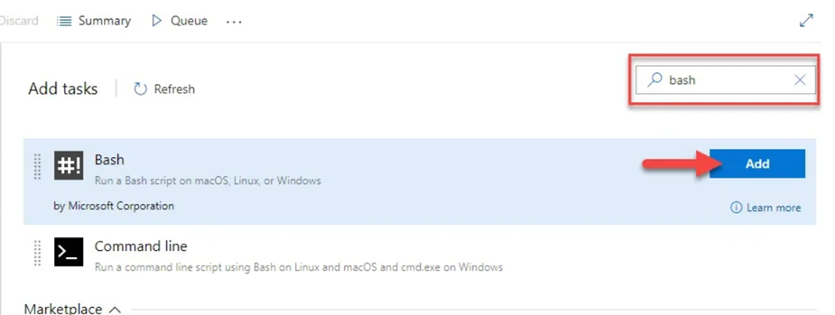
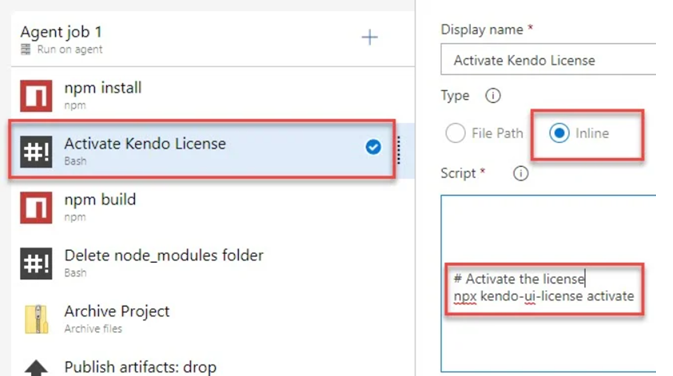
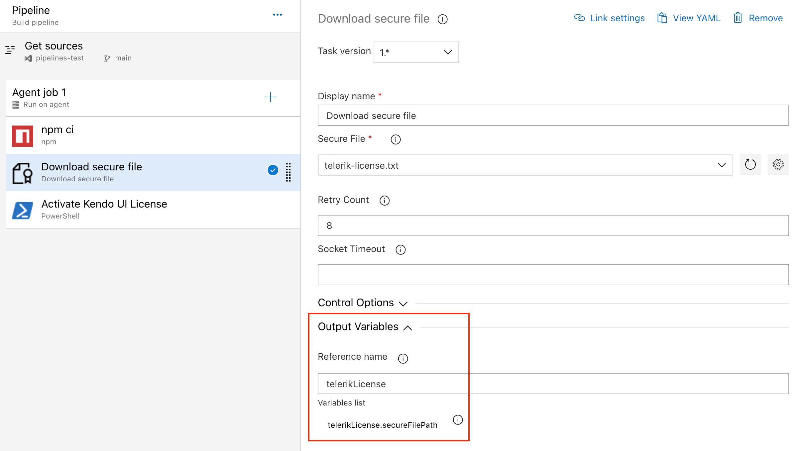
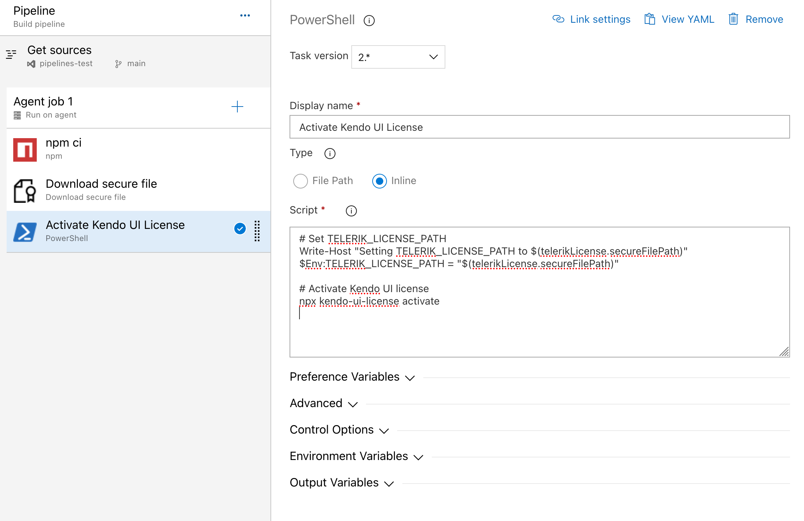

# Adding Deployment Keys to CI/CD Services

This article describes how to activate your Kendo UI for jQuery [license]() in popular CI/CD services. Use [Deployment Keys](https://www.telerik.com/account/downloads/deployment-keys) for build pipelines and provide the key through an environment variable or a secure file.

Deployment keys are dedicated license keys for build pipelines. Each deployment key is tied to one application and its selected products. You cannot use deployment keys for application development.

> Developer license keys remain valid for CI/CD deployments, so existing pipelines do not need to be updated. For new pipelines, we recommend using deployment keys. For more information, see [the differences between developer license keys and deployment keys](slug:license-code-faq#what-is-the-difference-between-developer-license-keys-and-deployment-keys).

To activate your license in a CI/CD environment:

1. Go to the [Deployment Keys](https://www.telerik.com/account/downloads/deployment-keys) page.
  * Add the application name.
  * Select the type of application - public or private.
  * Select the set of products used in the application.
1. Copy the deployment key and store it securely.
1. [Create an environment variable](#creating-an-environment-variable) named `TELERIK_LICENSE`, and set it to the deployment key value. Alternatively, store the key in a `telerik-license.txt` file, for example, through the [Azure Secure Files approach](#using-secure-files-on-azure-devops).

The following general requirements apply to all CI/CD environments:

* Regardless of the CI/CD tool you use, the step that installs the project dependencies must be executed before the step that activates the license.
* The license activation step requires the `@progress/kendo-licensing` package to be downloaded and set up in your local environment or CI/CD pipeline.
* Store the deployment key in an environment variable, secret, or secure file. Never hardcode it in a build script or workflow definition.
* The CI pipeline configurations are not executable. They merely outline the specific sequence of steps.

# Creating an Environment Variable

Set `TELERIK_LICENSE` to your deployment key. Each platform has a different process for setting environment variables. The following examples cover popular CI/CD services.

>note Starting with the 2025 Q1 release, the name of the environment variable changes from `KENDO_UI_LICENSE` to `TELERIK_LICENSE` and the downloaded file changes from `kendo-ui-license.txt` to `telerik-license.txt`. This change is required as all Telerik UI and Kendo UI products now use the same licensing mechanism with a common license key. See the [Handling License Key File Name and Environment Variable Name Changes in the 2025 Q1 Release](https://docs.telerik.com/kendo-ui/knowledge-base/license-key-file-name-and-environment-variable) knowledge base article for more details.

### GitHub Actions

1. Create a new [Repository Secret](https://docs.github.com/en/actions/reference/encrypted-secrets#creating-encrypted-secrets-for-a-repository) or an [Organization Secret](https://docs.github.com/en/actions/reference/encrypted-secrets#creating-encrypted-secrets-for-an-organization). Set the secret name to `TELERIK_LICENSE` and paste the deployment key as its value.
1. After running `npm install` or `yarn`, add a build step to activate the license.
```yaml
steps:
    - name: Install NPM modules
      run: |
        npm install
    - name: Activate Kendo UI License
      run: npx kendo-ui-license activate
      # Set a working directory if the application is not in the repository root folder:
      # working-directory: 'ClientApp'
      env:
        TELERIK_LICENSE: ${{ secrets.TELERIK_LICENSE }}
    # ... Run an application build after the activation of the license.
    - name: Build Application
      run: npm run build --configuration production
```

## GitLab CI/CD Pipelines

1. Go to `Settings > CI/CD > Variables` in your GitLab project.
2. Add a new variable named `TELERIK_LICENSE` and paste the content of the [downloaded license key file]() as a value.
3. After running `npm install` or `yarn`, add a build step to activate the license.

```yaml
# .gitlab-ci.yml file
variables:
  NODE_ENV: production
setup_dependencies:
  stage: setup
  script:
    - echo "Installing dependencies..."
    - npm install
  # ...
activate_license:
  stage: activate
  script:
    - echo "Activating Kendo UI license..."
    - npx kendo-ui-license activate
  environment:
    name: production
  variables:
    TELERIK_LICENSE: $TELERIK_LICENSE
  # ...
```

## Azure Pipelines

1. Create a new [secret variable](https://learn.microsoft.com/en-us/azure/devops/pipelines/process/variables?view=azure-devops&tabs=yaml%2Cbatch#secret-variables).
1. Paste the deployment key as the value of the secret variable.
1. Invoke `npx kendo-ui-license activate` or `yarn run kendo-ui-license` activate after installing the NPM packages. See examples below.

### Example 1 - Azure YAML pipeline on Windows

```yaml
pool:
  vmImage: 'windows-latest'

steps:

# ... Install modules before activating the license.
- script: call npm install
  displayName: 'Install NPM modules'

- script: call npx kendo-ui-license activate
  displayName: 'Activate Kendo UI License'
  # Set a working directory if the application is not in the repository root folder:
  # workingDirectory: 'ClientApp'
  env:
    TELERIK_LICENSE: $(TELERIK_LICENSE)

# ... Run an application build after the activation of the license.
- script: call npm run build --configuration production
  displayName: 'Build Application'
```

### Example 2 - Azure YAML pipeline on Linux

```yaml
pool:
  vmImage: 'ubuntu-latest'

steps:

# ... Install modules before activating the license.
- script: npm install
  displayName: 'Install NPM modules'

- script: npx kendo-ui-license activate
  displayName: 'Activate Kendo UI License'
  # Set a working directory if the application is not in the repository root folder:
  # workingDirectory: 'ClientApp'
  env:
    TELERIK_LICENSE: $(TELERIK_LICENSE)

# ... Run an application build after the activation of the license.
- script: npm run build --configuration production
  displayName: 'Build Application'

```

### Example 3 - Azure Classic Pipeline

1. Before the NPM build task, add a new Bash task to the Agent job.

1. Add a `Bash` build task as illustrated below:

 

1. Set the script field to:



```bash
# Activate the license
npx kendo-ui-license activate
```

## Using Secure Files on Azure DevOps

[Secure files](https://learn.microsoft.com/en-us/azure/devops/pipelines/library/secure-files?view=azure-devops) are an alternative approach for sharing the license key file in Azure Pipelines that does not have the size limitations of environment variables.

You have two options for a file-based approach:

* Set the `TELERIK_LICENSE_PATH` variable.
* Add a file named `telerik-license.txt` to the project directory or a parent directory.

> Make sure you reference `@progress/kendo-licensing` v1.5.0 or later.


### YAML Pipeline

With a YAML pipeline, you can use the [DownloadSecureFile@1](https://learn.microsoft.com/en-us/azure/devops/pipelines/tasks/reference/download-secure-file-v1?view=azure-pipelines) task, then use `$(name.secureFilePath)` to reference it.

```yaml
# ... Install modules before activating the license.
- script: call npm install
  displayName: 'Install NPM modules'

- task: DownloadSecureFile@1
  name: DownloadTelerikLicenseFile # defining the 'name' is important
  displayName: 'Download Telerik License Key File'
  inputs:
    secureFile: 'telerik-license.txt'
- script: call npx kendo-ui-license activate
  displayName: 'Activate Kendo UI License'
  # Set a working directory if the application is not in the repository root folder:
  # workingDirectory: 'ClientApp'
  env:
    # use the name.secureFilePath value to set TELERIK_LICENSE_PATH
    TELERIK_LICENSE_PATH: $(DownloadTelerikLicenseFile.secureFilePath) 
```

### Classic Pipeline

With a classic pipeline, use the "Download secure file" task and a PowerShell script to set `TELERIK_LICENSE_PATH` to the secure file path.

1. Add a "Download secure file" task and set the output variable's name to `telerikLicense`.

 


1. Add a PowerShell task that sets the `TELERIK_LICENSE_PATH` variable and activates the license.

 

```powershell
# Set TELERIK_LICENSE_PATH
Write-Host "Setting TELERIK_LICENSE_PATH to $(telerikLicense.secureFilePath)"
$Env:TELERIK_LICENSE_PATH = "$(telerikLicense.secureFilePath)"

# Activate Kendo UI license
npx kendo-ui-license activate
```

Alternatively, copy the `telerik-license.txt` file into the repository directory:

```powershell
# Copy telerik-license.txt from secure file
Write-Host "Copying $(telerikLicense.secureFilePath) to $(Build.Repository.LocalPath)/telerik-license.txt"
Copy-Item -Path $(telerikLicense.secureFilePath) -Destination "$(Build.Repository.LocalPath)/telerik-license.txt" -Force

# Activate Kendo UI license
npx kendo-ui-license activate
```

> If using [Task Groups](https://learn.microsoft.com/en-us/azure/devops/pipelines/release/task-groups?view=azure-devops), change the file name from `$(telerikLicense.secureFilePath)` to `$(Agent.TempDirectory)\telerik-license.txt` as output variables are not supported.

## See Also

* [Setting Up Your License Key]()
* [License Activation Errors and Warnings]()
* [Frequently Asked Questions about Your Kendo UI for jQuery License Key]()
