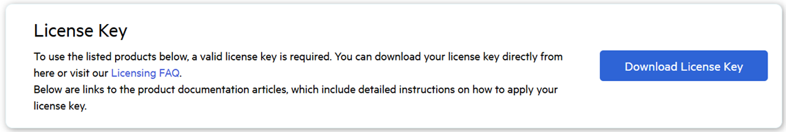

# Setting Up Your Kendo UI for jQuery License Key

This article describes how to activate the Kendo UI for jQuery components by installing a new personal license key and how to replace an already expired one.

Kendo UI for jQuery is a professionally developed library distributed under a [commercial license](https://www.telerik.com/purchase/license-agreement/kendo-ui). Using any of the UI components from the Kendo UI for jQuery library requires either a commercial license key or an active trial license key.

To activate the Kendo UI for jQuery components:

1. [Download a license key](#downloading-the-license-key).

2. [Install or update your license key file in your project](#installing-or-updating-the-license-key).

## Downloading the License Key

To download a license key for Kendo UI for jQuery, you must have either a developer license or a trial license. If you are new to Kendo UI for jQuery, sign up for a [free trial](https://www.telerik.com/try/kendo-ui) first and then follow the steps below.

1. Go to the [License Keys page](https://www.telerik.com/account/your-licenses) in your Telerik account.
2. Click the Download License Key button.

 

>note Starting with the 2025 Q1 release, the name of the downloaded file changes from `kendo-ui-license.txt` to `telerik-license.txt`. This change is required as all Telerik UI and Kendo UI products now use the same licensing mechanism with a common license key. See the [Handling License Key File Name and Environment Variable Name Changes in the 2025 Q1 Release](https://docs.telerik.com/kendo-ui/knowledge-base/license-key-file-name-and-environment-variable) KB article for more details.

## Installing or Updating the License Key

Whenever you purchase a new Kendo UI for jQuery license or renew an existing one, always [download](#downloading-the-license-key) and install a new license key. The new license key includes information about all previous license purchases. The procedure for the installation of a new license key and update of a license key is the same:

1. Copy the [downloaded](#downloading-the-license-key) `telerik-license.txt`  license key file to your home directory. This makes the license key available to all projects that you develop on your computer.

     * For Windows: `%AppData%\Telerik\telerik-license.txt`
     * For Mac/Linux: `~/.telerik/telerik-license.txt`

     Alternatively, copy the `telerik-license.txt` license key file to the root folder of your project. This is the folder that contains the `package.json` file. This makes the license key available only to this project. Do not commit the file to source control as this is your personal license key.

2. Install `@progress/kendo-licensing` as a project dependency by running:

```sh
npm install --save @progress/kendo-licensing
```
or

```sh
yarn add @progress/kendo-licensing
```

3. Activate the license by running:

```sh
npx kendo-ui-license activate
```
or
```sh
yarn run kendo-ui-license activate
```
## See Also

* [Licensing Overview]()
* [License Activation Errors and Warnings]()
* [Adding the License Key to CI Services]()
* [Frequently Asked Questions about Your Kendo UI for jQuery License Key]()
* [Handling License Key File Name and Environment Variable Name Changes in the 2025 Q1 Release]()