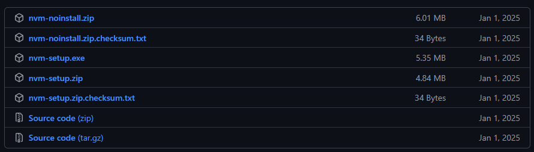

# Node Setup on Windows with nvm-windows

`nvm-windows` is a lightweight version manager for Node.js on Windows. After you install it once, you can install and switch between multiple Node versions with a few commands. Each Node installation includes npm, so you do not need to install npm separately.

## Why use nvm-windows

* Keep multiple Node versions on one machine.
* Switch versions per project without reinstalling Node.
* Upgrade safely while keeping older versions available.

## Prerequisites

* Windows machine with administrator rights for installation.
* Internet connection to download Node versions.

## 1. Download nvm-windows

Go to the official releases page:

* https://github.com/coreybutler/nvm-windows/releases

Download the latest installer (`nvm-setup.exe`).

## 2. Install nvm-windows

Run `nvm-setup.exe` and complete the installer like any standard Windows application.



After the installation finishes, open a new terminal window (Command Prompt, PowerShell, or Windows Terminal).

## 3. Verify the installation

Check that `nvm` is available:

```sh
nvm version
```

If a version number is shown, nvm-windows is installed correctly.

## 4. Install Node.js

Install Node 24 (recommended for new projects):

```sh
nvm install 24
```

Install Node 22 (LTS option):

```sh
nvm install 22
```

`nvm-windows` installs npm together with Node.js.

## 5. Select the active Node.js version

Activate Node 24:

```sh
nvm use 24
```

Confirm the active versions:

```sh
node -v
npm -v
```

## Common nvm-windows commands

List installed Node versions:

```sh
nvm list
```

List Node versions available for installation:

```sh
nvm list available
```

Install a specific exact version:

```sh
nvm install 24.3.0
```

Switch to a specific exact version:

```sh
nvm use 24.3.0
```

Remove an unused version:

```sh
nvm uninstall 22.15.0
```

## Example workflows

Use Node 24 for a new Kendo project:

```sh
nvm install 24
nvm use 24
node -v
```

Switch to Node 22 for an older project:

```sh
nvm use 22
node -v
```

## Troubleshooting

If `nvm` is not recognized:

* Close all terminals and open a new one.
* Check that nvm-windows is installed in `C:\Program Files\nvm` (default path).
* Restart Windows if PATH changes were not picked up.

If `node -v` does not change after `nvm use`:

* Run the terminal as Administrator.
* Ensure another global Node installation is not overriding your PATH.

## Next Steps

* [Building Custom Kendo UI Scripts Locally]()
* [Installing with NPM]()
