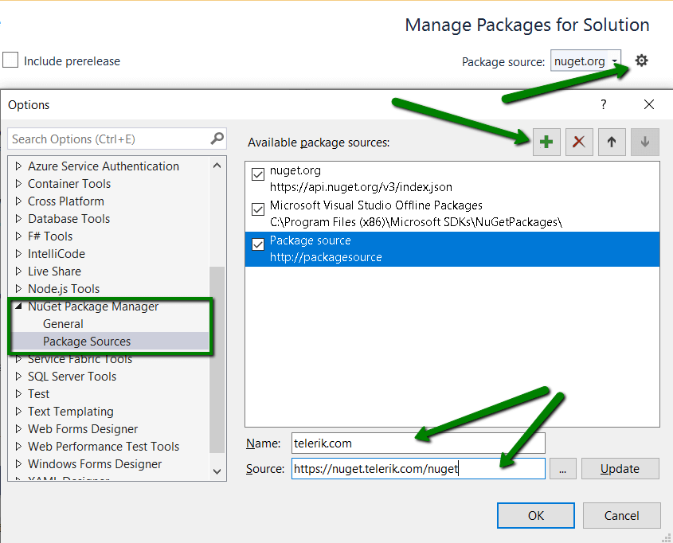
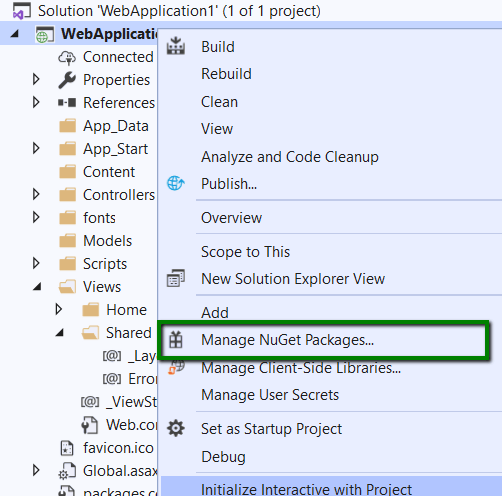
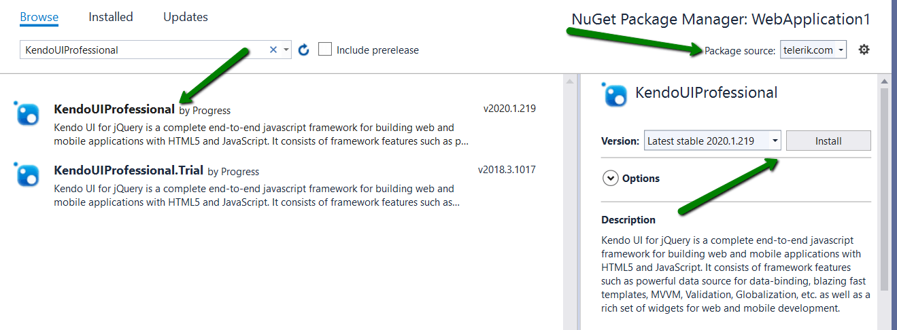
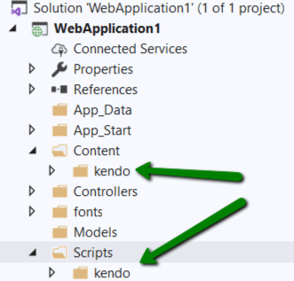

# Installing with NuGet

Telerik maintains a NuGet Feed for registered users.

[NuGet](https://www.nuget.org) is a popular .NET package manager. Official releases and service packs of Kendo UI are available for registered users.

The NuGet Feed provides the following NuGet packages:
* `KendoUIProfessional`&mdash;Kendo UI for jQuery Commercial version.
* `KendoUIProfessional.Trial`&mdash;Kendo UI for jQuery Trial version.
* `KendoUICore`&mdash;Kendo UI Core (contains only the Core widgets).

## The Telerik Private NuGet Feed

To use the Telerik NuGet Feed as a Package Source, use the [NuGet CLI](http://docs.nuget.org/consume/Command-Line-Reference). Or, use the UI provided from Visual Studio for configuring authenticated NuGet feeds.

The following video explains how you can add the Telerik NuGet feed. If you prefer to do this yourself, follow the rest of this article.

<iframe width="560" height="315" src="https://www.youtube.com/embed/c3m_BLMXNDk" frameborder="0" allow="accelerometer; autoplay; encrypted-media; gyroscope; picture-in-picture" allowfullscreen></iframe>

### Setup with NuGet CLI

1. Download the [latest NuGet executable](https://dist.nuget.org/win-x86-commandline/latest/nuget.exe).
1. Open a command prompt and change the path to where the `nuget.exe` is downloaded. 
1. The command from the example below stores a token in the `%AppData%\NuGet\NuGet.config` file. Your original credentials cannot be obtained from this token.

    ```
        NuGet Sources Add -Name "telerik.com" -Source "https://nuget.telerik.com/nuget" -UserName "your login email" -Password "your password"
    ```

    If you are unable to connect to the feed by using encrypted credentials, try the alternative approach of storing credentials in clear text.

    ```
        NuGet Sources Add -Name "telerik.com" -Source "https://nuget.telerik.com/nuget" -UserName "your login email" -Password "your password" -StorePasswordInClearText
    ```

    If you have already stored a token instead of storing the credentials as clear text, you could update the definition in the `%AppData%\NuGet\NuGet.config` file using the following command:

    ```
        NuGet Sources Update -Name "telerik.com" -Source "https://nuget.telerik.com/nuget" -UserName "your login email" -Password "your password" -StorePasswordInClearText
    ```

### Setup with NuGet Package Manager

1. Open Visual Studio.

1. Go to **Tools > NuGet Package Manager > Package Manager Settings**, select Package Manager Sources and then click the + button.

1. Choose feed Name, set the feed URL to: https://nuget.telerik.com/nuget and click OK.

    

1. Choose the `Browse` list of packages.

1. Enter your Telerik credentials in the Windows Authentication dialog.

1. All of the packages that are licensed to the user account are available in Visual Studio Package Manager.

## Installing the NuGet Packages

After setting up the source, install the packages either through the [Package Manager Dialog](#installing-with-package-manager-dialog) or through the [Package Manager Console](#installing-with-package-manager-console).

### Installing with Package Manager Dialog

1. Right click on the Solution or specific project in a Solution and navigate to `Manage NuGet Packages`.

    

1. Set the package source to `telerik.com` and install the `KendoUIProfessional` NuGet Package. 

     

### Installing with Package Manager Console

1. Open the project/solution in Visual Studio, and open the console using the **Tools > NuGet Package Manager > Package Manager Console** command.

1. Run the install command:

```
    Install-Package KendoUIProfessional -ProjectName WebApplication
```

> Substitute `WebApplication` with the name of your project.

### Resources Location

After installing the packages, the content scripts and stylesheets are copied to your application as follows:
* `/Scripts/kendo/<version>/`&mdash;Contains the minified JavaScript files.
* `/Content/kendo/<version>/`&mdash;Contains the minified CSS files and theme images.

    

## Next Steps

* [Create your own custom bundles]()
* [Learn about the widget DOM element structure]()
* [Initialize widgets as jQuery plugins]()
* [Initialize widgets with MVVM]()
* [Check out the jQuery version support]()
* [Check out the web browser support]()
* [Check out the operation system support]()
* [Check out the PDF and Excel export support]()
* [Explore the widget script dependencies]()
* [Create your own custom widgets]()

## See Also

* [Hosting Kendo UI in Your Project]()
* [Installing Kendo UI with Bower]()
* [Installing Kendo UI by Using the CDN Services]()
* [Installing Kendo UI with NPM]()
* [Getting Up and Running with Your Kendo UI Project (Guide)]()
