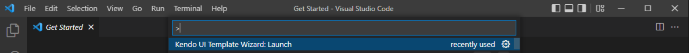
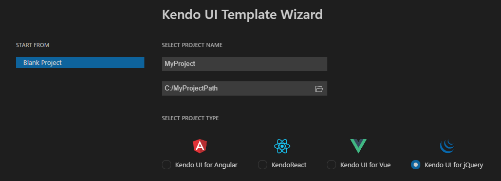
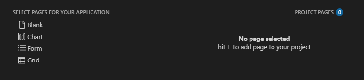
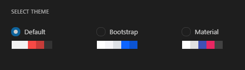

# Kendo UI Productivity Tools for Visual Studio Code

The **Kendo UI Productivity Tools for Visual Studio Code** is an extension for <a href="https://code.visualstudio.com/" target="_blank">Visual Studio Code</a> that enhances the application development experience with Kendo UI for jQuery.

As its primary advantage, the VS Code extension facilitates the creation of projects through a wizard directly in Visual Studio Code.

## Get the Extension

You can get the extension:

* from the [Visual Studio Marketplace](https://marketplace.visualstudio.com/items?itemName=KendoUI.kendotemplatewizard)

* by opening the **Extensions** tab in Visual Studio Code, then searching for **Kendo UI Productivity Tools** and clicking **Install**

## Create a Project

To create a Kendo UI for jQuery project:

1. Press `Ctrl`+`Shift`+`P` in Windows/Linux or `Cmd`+`Shift`+`P` on Mac to open the VSCode extension launcher.

1. Type/Select `Kendo UI Template Wizard: Launch` and press `Enter` to launch the extension.

    

1. Enter a project name and select the location.
    

1. Choose the desired template.

   Kendo UI Template Wizard for Visual Studio Code comes with several built-in templates for some of the most popular components like Grid, Chart, and Form. These templates allow you to add pages with these widgets with a single click. Additionally, you can create a **Blank** project and the extensions will generate a page with all of the necessary stylesheets and a single heading element.
   
   

1. Apply the desired styling by selecting a theme.

   To style your application, select one of the built-in [Sass-based themes](https://docs.telerik.com/kendo-ui/styles-and-layout/sass-themes): Default, Bootstrap, or Material.
   
   

1. Click the **Create** button to finish the setup.

1. Run the project:

   1. Install the npm dependencies by typing *npm install* in the terminal.
   1. Run the application by typing *npm start* in the terminal.

## Project Structure

* The HTML files are located in the `pages` folder of the project. 
* The script files are located in the `src` folder of the project.
* The stylesheets are included in the head element of each individual page.

>The scripts are automatically injected into the HTML pages only if the script name matches the page name. For example, if the page is called `MyPage.html`, then the script file in the `src` folder must be called `MyPage.js`.

## Kendo UI for jQuery Snippets in Visual Studio Code

The Kendo UI Productivity Tools for Visual Studio Code extension can generate code snippets with sample configuration for the Kendo UI widgets. To add a code snippet for a Kendo UI widget:

1. Open a `js` file or add a `<script>` tag.
1. Type `jq-short`. Alternatively, type `jq-component`&mdash;where you replace "component" with the name of the desired component, for example, `jq-dropdownlist`.

## See Also

* [Download and Installation Overview]()
