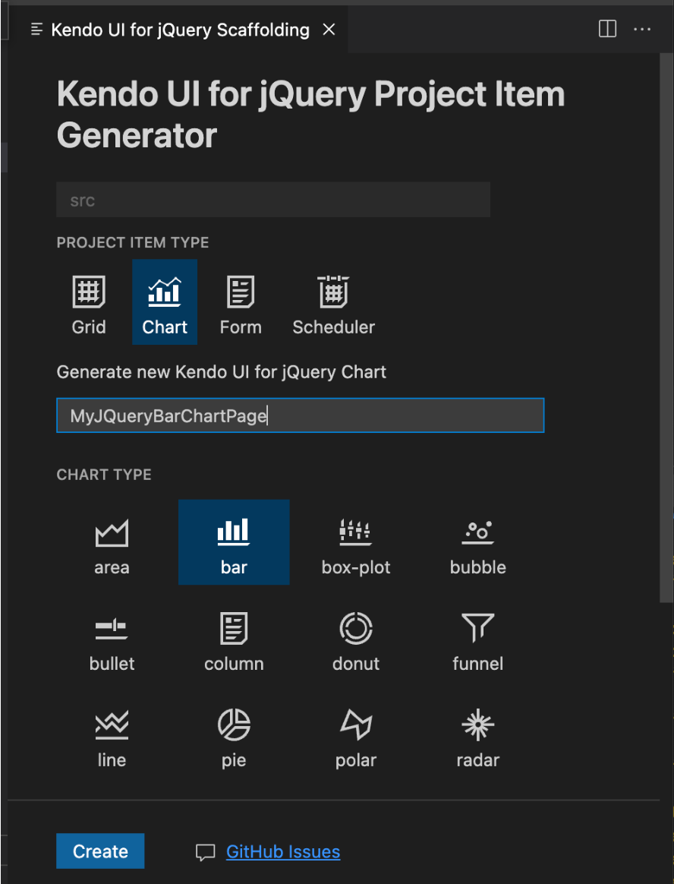

# Kendo UI Productivity Tools for Visual Studio Code

The Kendo UI Productivity Tools for Visual Studio Code is an extension for <a href="https://code.visualstudio.com/" target="_blank">Visual Studio Code</a> that enhances the application development experience with Kendo UI for jQuery. This extension facilitates the creation of projects through a wizard directly in Visual Studio Code.

The Kendo UI Productivity Tools deliver a Kendo UI Template Wizard that eases the development efforts by providing an interface for creating new projects that are pre-configured for Kendo UI components. The Template Wizard provides a **Blank** project template, which can be further enhanced by the addition of more pages with Grids, Charts, Forms, and others. The wizard lets configure the desired visual theme for your application by choosing between the Default, Bootstrap, and Material themes. The end result is a ready-to-run application with all required configurations and dependencies. This enables you to immediately start using the Kendo UI components.

## 1. Get the Extension

You can get the extension in either of the following ways:

* Go to the [Visual Studio Marketplace](https://marketplace.visualstudio.com/items?itemName=KendoUI.kendotemplatewizard).
* In VS Code, open the **Extensions** tab, search for **Kendo UI Productivity Tools**, and click **Install**.

## 2. Create the Kendo UI Project

To create a Kendo UI for jQuery project with the Kendo UI Template Wizard:

1. Press `Ctrl`+`Shift`+`P` (for Windows or Linux), or `Cmd`+`Shift`+`P` (on Mac) to open the VS Code extension launcher.
1. Type or select `Kendo UI Template Wizard: Launch` and press `Enter` to launch the extension.

    

1. Enter a project name and select the location.

    

1. Choose the desired template.

   The Kendo UI Template Wizard for Visual Studio Code comes with several built-in templates for some of the most popular components like Grid, Chart, and Form. These templates allow you to add pages by using the components with a single click. 
   
   Additionally, you can create a **Blank** project and the extensions will generate a page with all of the necessary stylesheets and a single heading element.
   
   

1. Apply the desired styling by selecting a theme.

   To style your application, select one of the built-in [Sass-based themes](https://docs.telerik.com/kendo-ui/styles-and-layout/sass-themes): Default, Bootstrap, or Material.
   
   

1. Click the **Create** button to finish the setup.

1. Run the project:

   1. Install the NPM dependencies by typing `npm install` in the terminal.
   1. Run the application by typing `npm start` in the terminal.

## 3. Check the Project Structure

* The HTML files are located in the `pages` folder of the project. 
* The script files are located in the `src` folder of the project.
* The stylesheets are included in the head element of each individual page.

>The scripts are automatically injected into the HTML pages only if the script name matches the page name. For example, if the page is called `MyPage.html`, then the script file in the `src` folder must be called `MyPage.js`.

## 4. Generate the Snippets

The Kendo UI Productivity Tools extension provides a handy feature that improves the daily development with the Kendo UI library—code snippets. Snippets simplify and speed up the implementation of Kendo UI components in your project. They help the development process by providing a quick way for adding the components directly in the source code, while also including predefined tab stops for the required options.

To add a code snippet for a Kendo UI component:

1. Open the source code in the IDE and click where you want to insert the Kendo UI for jQuery component.
1. To list the Kendo UI for jQuery snippets, type the `kj-` snippet prefix.
1. Continue by typing the name of the component that you want to insert. Some components are provided by multiple snippets which allow you to create them in various ways depending on the desired configuration, for example, `kj-grid` and `kj-grid-remote`.
1. Press `Enter` to insert the desired component in the source code.
1. (Optional) If the component provides placeholders for specific properties, you can iterate and provide them by pressing the `Tab` key

## Scaffolders

The Kendo UI Productivity Tools extension for Visual Studio Code includes a scaffolding feature, which enables you to generate complex KendoReact components from an interactive wizard-like user interface.

To use the `Scaffolders` functionality, follow the steps below:

1. In the VS Code explorer panel, right-click a folder in your jQuery app .

    

1. Select a component from the list. Currently, the Data Grid, Chart, Form, and Scheduler components support scaffolding.

    
    
1. Click the **Create** button.

## See Also

* [First Steps with Kendo UI for jQuery]()
* [Downloading the Bundles]()
* [Using Script License Code]()
