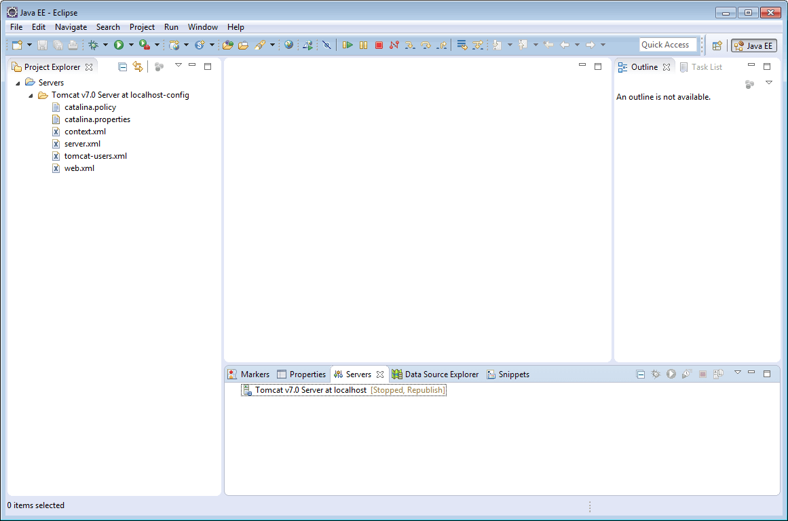
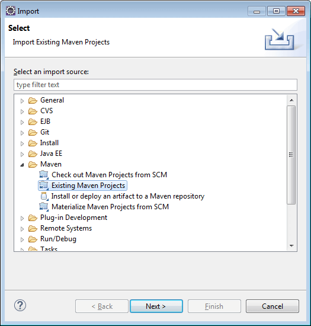
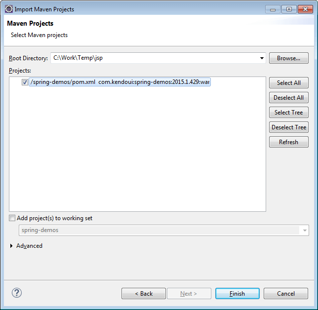
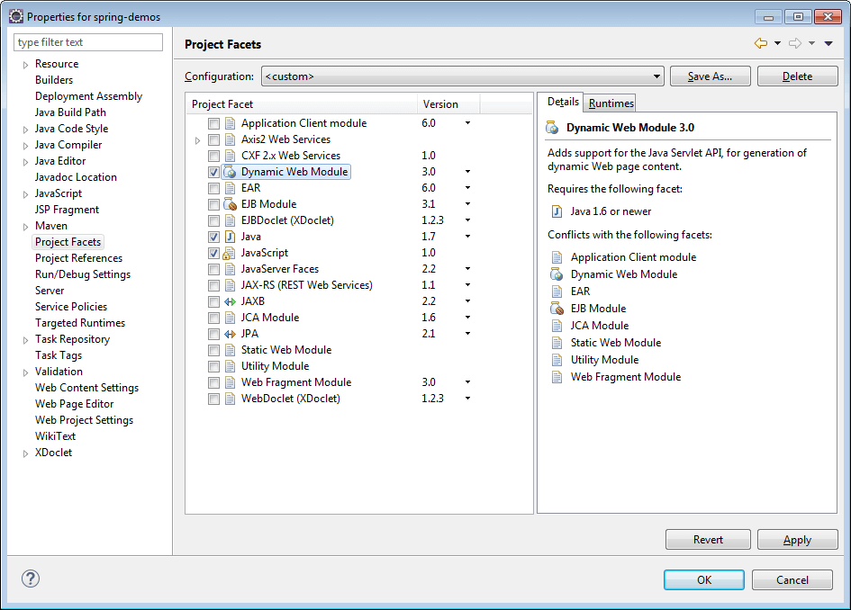
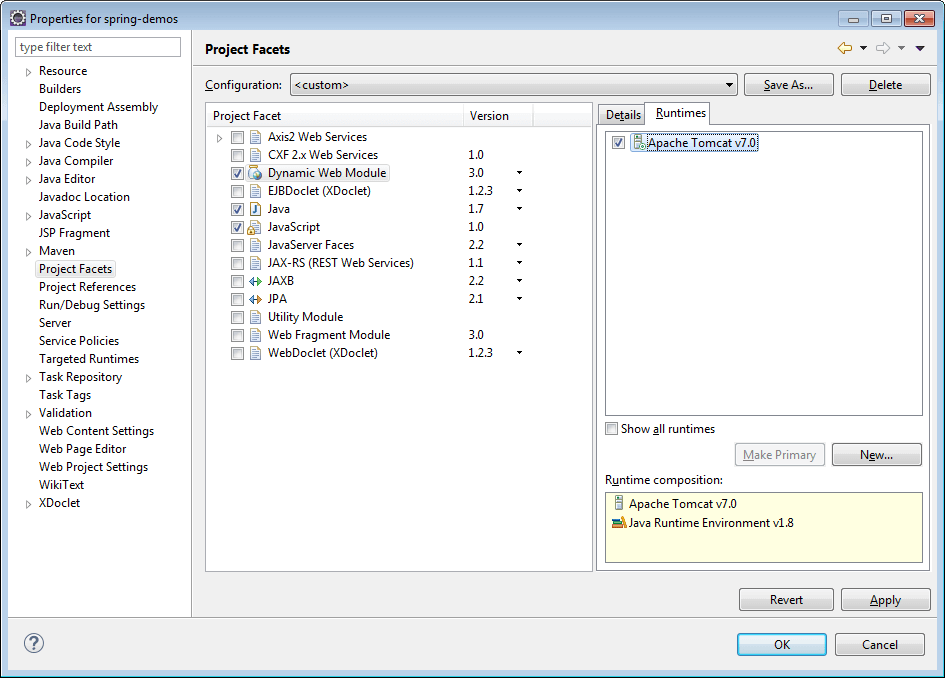

# Progress® Telerik® UI for JSP

This article demonstrates how to download and install Progress Telerik UI for JSP and run a sample application.

To read more about the benefits of using Progress Telerik UI for JSP, please visit the [product overview page](http://www.telerik.com/jsp-ui).





## Getting Started

### Download and Install

Start by [downloading the controls](https://www.telerik.com/download-trial-file/v2/ui-for-jsp). The distribution files contain the following:

* `\js`&mdash;These are the Kendo UI minified JavaScript files.
* `\styles`&mdash;The Kendo UI minified CSS files and background images used by the themes.
* `\wrappers\jsp\kendo-taglib`&mdash;The Progress Telerik UI for JSP jar files.
* `\wrappers\jsp\spring-demos`&mdash;A sample JSP Spring MVC application.

## Sample Application Setup

### Meet the Requirements

* [Java Development Kit (JDK)](http://www.oracle.com/technetwork/java/javase/downloads/index.html), latest recommended version
* [Eclipse for Enterprise Developers (J2EE support)&mdash;Luna, Kepler, or later](https://eclipse.org/downloads/packages/eclipse-ide-java-ee-developers/keplersr2)
* [Maven support for Eclipse (M2E)](http://www.eclipse.org/m2e/)
* Configured server, tested with [Tomcat 7](http://tomcat.apache.org/tomcat-7.0-doc/)

**Figure 1: Eclipse with Tomcat7 configured**

Find a sample a JSP Spring MVC application in the `\wrappers\jsp\spring-demos` folder.

### Run the Application

**Step 1** Extract the Progress Telerik UI for JSP package.

**Step 2** Start Eclipse.

**Step 3** Choose **File** > **Import**.

**Step 4** Choose **Maven** > **Existing Maven Projects**. Click **Next**. If you do not see that option, make sure your Eclipse has Maven support installed.

**Figure 2: Eclipse with Tomcat7 configured**

**Step 5** Browse to the location where you extracted Progress Telerik UI for JSP. Then pick "wrappers\jsp\spring-demos" for "Root Directory". Click "Finish".

**Figure 3: Import of the Kendo UI JSP demos**

**Step 6** Right-click **spring-demos** in the Eclipse Project Explorer. Pick **Properties**.

**Step 7** In the properties window pick **Project Facets**.

**Step 8** From the "Project Facets" menu select "Dynamic Web Module".

**Figure 4: Project facets**

**Step 9** Click the **Runtimes** tab. Pick a runtime&mdash;Tomcat7, for example.

**Figure 5: Project facets&mdash;Tomcat 7**

**Step 10** Click **OK** to close the **Properties** window.

**Step 11** Right-click **spring-demos** in the Eclipse Project Explorer. Pick **Run As** > **Run on server**.

### Add Kendo UI

Follow the steps below to add Kendo UI to your JSP application.

**Step 1** Create a new **Dynamic Web Project** from Eclipse or open an existing one.

**Step 2** Add `\wrappers\jsp\kendo-taglib\kendo-taglib-[version].jar` to project's `/WebContent/WEB-INF/lib folder`.

**Step 3** Copy the Kendo UI JavaScript files from the `\js` folder of the installation to the `WebContent/resources/js` folder of your application.

If you intend to use CDN services, skip steps 3, 4, and 5, and check the [section on CDN below](#use-cdn-services).

**Step 4** Copy the Kendo UI CSS files and folders from the `\styles` folder of the installation to the `WebContent/resources/styles` folder of your application. If you want to use only one theme, copy `kendo.common.min.css`, the theme file (e.g. `kendo.default.min.css`), the theme folder (e.g. `Default`) and the `textures` folder.

**Step 5** Add a JSP page.
1. Right-click the `WebContent` folder.
2. Select **New** > **JSP file**.
3. Enter a file name and click **Finish**.

**Step 6** Configure your page to include the Kendo UI web JavaScript and CSS files to the page, as shown in the example below.

        <link href="resources/styles/kendo.common.min.css" rel="stylesheet" type="text/css" />
        <link href="resources/styles/kendo.default.min.css" rel="stylesheet" type="text/css" />
        
        

**Step 6** Configure your page to include the Kendo UI DataViz JavaScript and CSS files.

> **Important**
>
> If you want to use Kendo UI web and data visualization widgets at the same time, include `kendo.all.min.js` instead of `kendo.web.min.js` and `kendo.dataviz.min.js`. You can also create a custom JavaScript file by using the [Custom Download Builder](https://www.telerik.com/login/v2/telerik?ReturnUrl=http%3a%2f%2fwww.telerik.com%2fdownload%2fcustom-download).

        <link href="resources/styles/kendo.common.min.css" rel="stylesheet" type="text/css" />
        <link href="resources/styles/kendo.dataviz.min.css" rel="stylesheet" type="text/css" />
        <link href="resources/styles/kendo.dataviz.default.min.css" rel="stylesheet" type="text/css" />

        
        

**Step 7** Add taglib mapping to the Kendo UI tags.

        <%@taglib prefix="kendo" uri="https://www.telerik.com/kendo-ui/jsp/tags"%>

**Step 8** Use any Kendo UI HtmlHelper extension.

        <kendo:datePicker name="datePicker"></kendo:datePicker>

### Use CDN Services

You are also able to include the JavaScript and CSS files from CDN. Do not forget to specify the version, e.g. 2012.2.710.

       <link href="https://kendo.cdn.telerik.com/<VERSION>/styles/kendo.common.min.css" rel="stylesheet" type="text/css" />
       <link href="https://kendo.cdn.telerik.com/<VERSION>/styles/kendo.default.min.css" rel="stylesheet" type="text/css" />

       
       

## Trial Version and Commercial License

This Progress Telerik UI for JSP library is a commercial UI library. You are welcome to explore its full functionality and get technical support from the team when you register for a free 30-day trial. To use it commercially, you need to [purchase a license](https://www.telerik.com/purchase/kendo-ui). Feel free to review the Progress Telerik UI for JSP [License Agreement](https://www.telerik.com/purchase/license-agreement/kendo-ui) to get acquainted with the full terms of use.

## Support Options

For any issues you might encounter while working with Progress Telerik UI for JSP, use any of the available support channels:

* Kendo UI Professional license holders and active trialists can take advantage of our outstanding customer support delivered by the developers building the library. To submit a support ticket, use the [Progress Telerik UI for JSP dedicated support](https://www.telerik.com/account/support-tickets/) system.
* [Progress Telerik UI for JSP forums](https://www.telerik.com/forums/jsp) are part of the free support you can get from the community and from the Progress Telerik UI for JSP team on all kinds of general issues.
* [Progress Telerik UI for JSP feedback portal](https://feedback.telerik.com/jsp-ui) and [Progress Telerik UI for JSP roadmap](https://www.telerik.com/support/whats-new/jsp-ui/roadmap) provide information on the features in discussion and also the planned ones for release.
* Progress Telerik UI for JSP uses GitHub Issues as its bug tracker and you can submit any related reports there.
* You may still need a tailor-made solution for your project. In such cases, go straight to [Progress Services](https://www.progress.com/services).

## Learning Resources

* [Progress Telerik UI for JSP forum](https://www.telerik.com/forums/jsp)
* [Progress Telerik UI for JSP feedback portal](https://feedback.telerik.com/jsp-ui)

## Next Steps

To gain more practice on Progress Telerik UI for JSP, watch the video tutorials on the [Kendo UI YouTube Channel](https://www.youtube.com/kendouitv):

1. [Get Started with Telerik UI for JSP: Episode 1](https://www.youtube.com/watch?v=3VH75XVhLCI)
1. [Get Started with Telerik UI for JSP: Episode 2](https://www.youtube.com/watch?v=LyGHeRMmq5I)
1. [Get Started with Telerik UI for JSP: Episode 3](https://www.youtube.com/watch?v=sCwqj_ZRGI8)
1. [Get Started with Telerik UI for JSP: Episode 4](https://www.youtube.com/watch?v=fcbw4YR4P2I)

For more examples on how to use Kendo UI with JSP wrappers, visit the [GitHub repository with the collected Kendo UI examples on using JSP](https://github.com/telerik/kendo-examples-java).

## See Also

* [Telerik UI for JSP API Reference Folder](/api/jsp/autocomplete/animation)
* [Telerik UI for JSP Tags Folder]()
