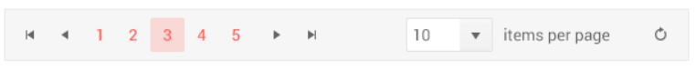
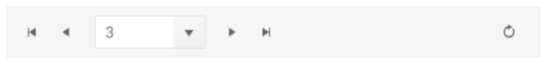

# Pager JSP Tag Overview

The Pager JSP tag is a server-side wrapper for the [Kendo UI Pager](/api/javascript/ui/pager) widget.

The Kendo UI Pager widget enables splitting a set of data into pages with flexible and intuitive UI. The user interface of the Pager is useful for paging data-bound components that have a data source and do not have a built-in UI for paging such as the ListView or scenarios that require  paging options&mdash;for example, Kendo Templates with a data source.

 You can customize the page number templates or use an input for navigation to a specific page, toggle the visibility of previous and next buttons, include a pagesize dropdown and alter the information messages. The pager API also offers the ability to localize its messages.

## Getting Started

### Configuration

Below are listed the steps for you to follow when configuring the Kendo UI Pager.

**Step 1** Make sure you followed all the steps from the [introductory article on Telerik UI for JSP]().

**Step 2** Create a new action method which renders the view.

        @RequestMapping(value = {"/", "/index"}, method = RequestMethod.GET)
        public String index() {
            return "pager/index";
        }

**Step 3** Add the Kendo UI `taglib` mapping to the page.

        <%@taglib prefix="kendo" uri="https://www.telerik.com/kendo-ui/jsp/tags"%>

**Step 4** Add a `Pager` tag.

    <kendo:pager name="pager1"></kendo:pager>

**Step 5** Set its data source.

        

## Pager Settings and Types

The Pager has two types:

- `numeric`
- `input`

The Pager is `numeric` by default. To configure the number of buttons that will be shown in a numeric pager, use the `buttonCount` property. To configure the pager to accept only use input, set the `numeric` property to `false` and the `input` property to `true`.

## Responsive

The Kendo UI Pager is responsive by default. To disable the responsive behavior and have all of its elements visible at all times set the `responsive` property to `false`. 

The Pager widget determines which internal elements to render based on its width. When the Pager width is greater than or equal to 600 pixels, all elements are visible:

When the Pager width is greater than or equal to 600 pixels, all elements are visible:

When the Pager width is greater than 480 and less than 600 pixels, the label showing the current paging information is hidden:

When the Pager width is greater than 360 and less than 480 pixels, the current page is represented by a native `<select/>` element. The `pageSizes` dropdown and the label showing the current paging information are hidden.

When the Pager width is less than 360 pixels, the current page is represented by a native `<select/>` element. The `pageSizes` dropdown and the label showing the current paging information are hidden.

## Templates

The Kendo UI Pager features templates for its page number links.

To change the look of the currently selected page number, use the `selectTemplate` property.

To change the look of the non-selected page number links, use the `linkTemplate` property.

## Messages

The Pager provides options for defining the tooltips for its page and navigation links, information text and labels.

To localize the messages, set the desired strings in the `messages` tags.

## Event Handling

### Subscribe to Events

You can subscribe to the [events exposed by Kendo UI Pager](/api/javascript/ui/pager#events) by the handler name.

    <kendo:pager-change>
			function (e) {
                console.log("pager change event");
            }
	</kendo:pager-change>

## Reference

### Existing Instances

You are able to reference an existing Pager instance via the [`jQuery.data()`](https://api.jquery.com/jQuery.data/). Once a reference is established, you are able to use the [Pager API](/api/javascript/ui/pager#methods) to control its behavior.

    //Put this after your Kendo Pager tag declaration
    

## See Also

* [Overview of the Kendo UI Pager Widget]()
* [Telerik UI for JSP API Reference Folder](/api/jsp/pager)
