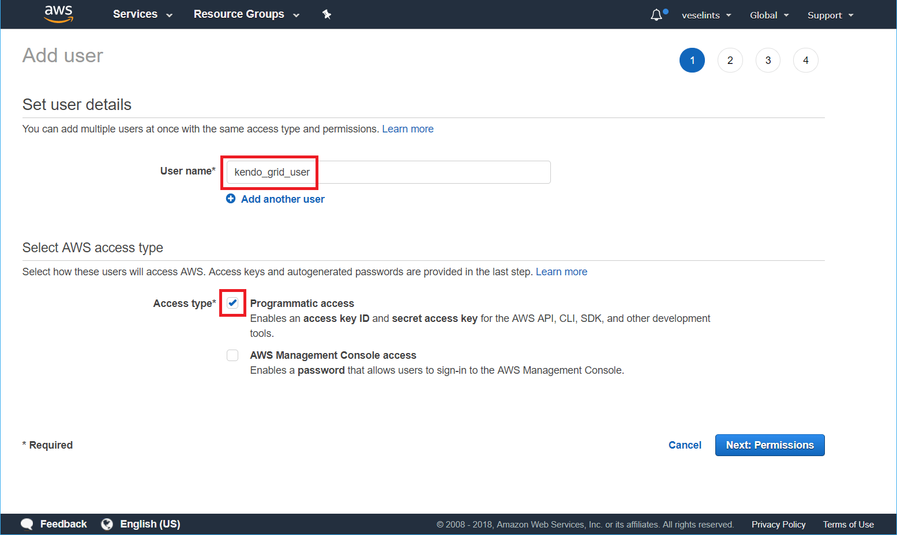
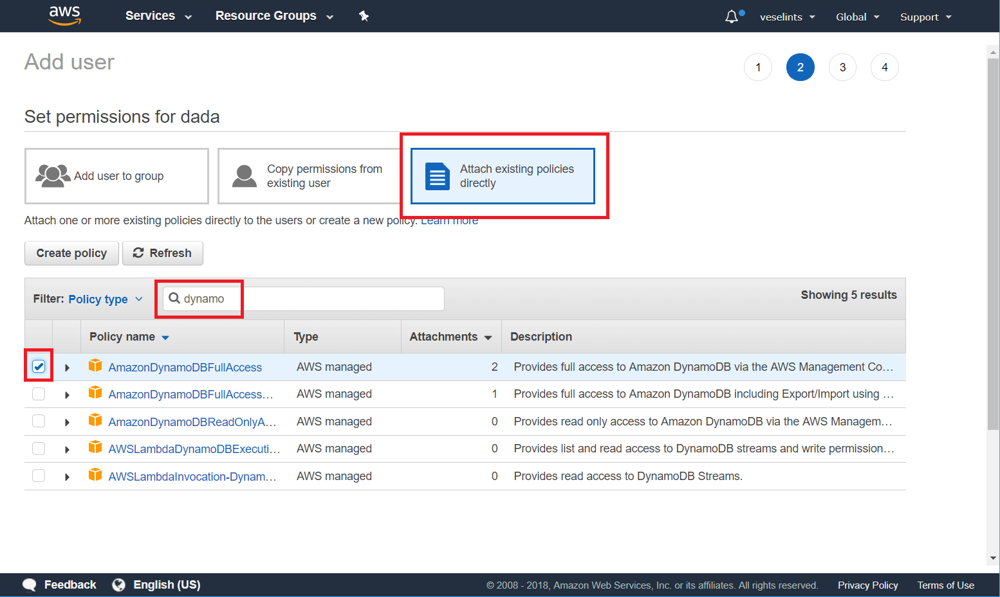
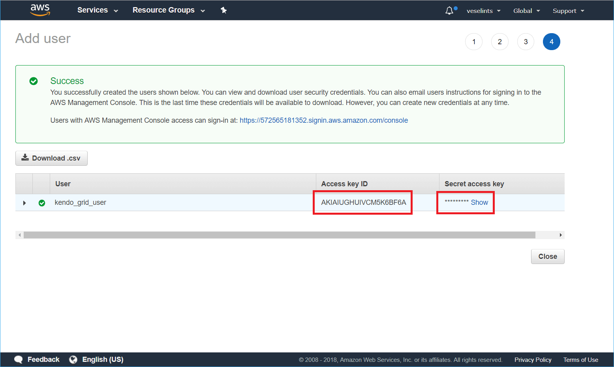

#  Amazon DynamoDB

This article provides a step-by-step tutorial on how to create a table in [Amazon DynamoDB](https://aws.amazon.com/dynamodb/) and configure the [Kendo UI Grid]() to retrieve, create, update, and destroy items in that table.

The complete implementation of the sample project is available in the [Kendo UI Cloud Integration](https://github.com/telerik/kendo-cloud-integration/tree/master/AWSDynamoDB) repository on GitHub.

## Prerequisites

* An [Amazon AWS account](https://aws.amazon.com/account/).
* Basic knowledge on using [AWS Console](https://console.aws.amazon.com).

## Creating Users to Access and Manipulate the Amazon DynamoDB Table

The following instructions demonstrate how to create a user identity and use that identity directly on the client to access a DynamoDB table.

> **Important**
>
> Even though the following instructions demonstrates how to create a user identity and use that identity directly on the client to access a DynamoDB table, exposing user credentials directly on the client is not recommended. That is why, before sharing the client implementation with third parties or users, switch to the [Amazon Cognito](https://aws.amazon.com/cognito/getting-started/) authentication.

1. In the [AWS Console](https://console.aws.amazon.com), search for `"iam"` (Identity and Access Management).
1. In the IAM console, select **Users** and then **Add User**.
1. Type a user name and check the **Programmatic access** option&mdash;for example, `kendo_grid_user`. Click **Next: Permissions**.

	**Figure 1: Adding a new user**

	

1. On the permissions step, select **Attach existing policies directly**. In the search field, type `dynamodb` and check the **AmazonDynamoDBFullAccess** option in the table. Click **Next: Review** > **Create user**.

	**Figure 2: Configuring the user permissions**

	

1. From the summary view of the newly created user, copy the `Access key ID` and the `Secret access key`.

	**Figure 3: Getting the user credentials**

	

## Configuring the Grid for Consuming and Manipulating Available DynamoDB Data

1. [Configure the page to load AWS SDK, jQuery, and Kendo UI, and authenticate the proper AWS user](#configuring-the-aws-sdk-jquery-and-kendo-ui-loading-and-user-authentication)
1. [Configure the Kendo UI Grid and the service](#configuring-the-grid-and-the-service)

### Configuring the AWS SDK, jQuery, and Kendo UI Loading and User Authentication

1. In the `<head>` of your HTML page, load the Kendo UI styles.
1. Load the Amazon AWS SDK, jQuery, and Kendo UI scripts.
1. Configure the AWS authentication by using the user that is already created.

```
<head>
  <meta charset="utf-8">
  <title>Kendo Grid DynamoDB Integration</title>

  <link rel="stylesheet" href="https://kendo.cdn.telerik.com/{{site.cdnVersion}}/styles/kendo.common.min.css">
  <link rel="stylesheet" href="https://kendo.cdn.telerik.com/{{site.cdnVersion}}/styles/kendo.default.min.css">

  <script src="https://sdk.amazonaws.com/js/aws-sdk-2.221.1.min.js"></script>
  <script src="https://code.jquery.com/jquery-1.12.3.min.js"></script>
  <script src="https://kendo.cdn.telerik.com/{{site.cdnVersion}}/js/kendo.all.min.js"></script>

  <script>
    AWS.config.update({
      region: "us-east-1",
      endpoint: 'dynamodb.us-east-1.amazonaws.com',
      accessKeyId: [the user access key ID],
      secretAccessKey: [the user secret access key]
    });
  </script>
</head>
```

### Configuring the Grid and the Service

1. In the `<body>` of the page, place a `<div>` element to initialize the Grid from. Add a `<button>` that will allow you to create a Table in DynamoDB on click.

	```
	<div id="grid"></div>
	<button class="k-button" id="btn">Click to create 'Movies' table</button>
	```

1. Initialize the AWS DynamoDB client.

	```JavaScript
	var dynamodb = new AWS.DynamoDB();
    var docClient = new AWS.DynamoDB.DocumentClient();
	```

1. Implement the handler for the **Create** movies button click.

	```JavaScript
	$('#btn').on('click', function() {
		var params = {
			// Set the name of the table to be created
			TableName : "Movies",
			// Configure the KeySchema. In this case the table uses a single key named "id"
			KeySchema: [
				{ AttributeName: "id", KeyType: "HASH" }
			],
			// The type of the key attribute is "string" ("S")
			AttributeDefinitions: [
				{ AttributeName: "id", AttributeType: "S" }
			],
			ProvisionedThroughput: {
				ReadCapacityUnits: 5,
				WriteCapacityUnits: 5
			}
		};

		// Send the request for creating new table
		dynamodb.createTable(params, function(err, data) {
			if (err) {
				alert(err.message);
			} else {
				alert(data.TableDescription.TableName + " table created!");
			}
		});
	});
	```

1. Implement the Grid that will consume the DynamoDB data.

	```
	$('#grid').kendoGrid({
	  editable: { mode: "popup" },
	  toolbar: ["create"],
	  height: 600,
	  columns: [
		{ field: "title", title: "Title", width: "15%" },
		{ field: "release_date", title: "Release", template: "#= kendo.toString(release_date, 'd') #", width: "8%"},
		{ field: "directors", title: "Directors", width: "10%"},
		{ field: "actors", title: "Actors", width: "17%"},
		{ field: "plot", title: "Plot", width: "34%"},
		{ command: [{ name: "edit" }, { name: "destroy" }] }
	  ],
	  dataSource: {
		schema: {
		  model: {
			id: "id",
			fields: {
			  release_date: { type: "date", validation: { required: true } },
			  title: { type: "string", validation: { required: true } },
			  directors: { type: "string", validation: { required: true } },
			  actors: { type: "string", validation: { required: true } },
			  plot: { type: "string", validation: { required: true } }
			}
		  }
		},
		transport: {
		  read: onRead,
		  create: onCreate,
		  update: onUpdate,
		  destroy: onDestroy
		}
	  }
	});
	```

1. Implement the `read` function to [`scan`](https://docs.aws.amazon.com/amazondynamodb/latest/APIReference/API_Scan.html) the DynamoDB table.

	```
	function onRead(options) {
	  var params = {
		TableName: "Movies"
	  };

	  docClient.scan(params, function(err, data) {
		if (err) {
		  options.error(err);
		} else {
		  options.success(data.Items);
		}
	  });
	};
	```

1. To add a new item to the table, use the `create` function and the [`put`](https://docs.aws.amazon.com/amazondynamodb/latest/APIReference/API_PutItem.html) action. On the client and before the newly created item is sent to the server, assign a new `id` for the item.

	```
	function onCreate(options) {
	  var model = options.data;
	  // Assigning an id to the new item
	  model.id = kendo.guid();
	  // Date should be saved as an ISO string
	  model.release_date = model.release_date.toISOString();

	  var params = {
		TableName: "Movies",
		Item: model
	  };

	  docClient.put(params, function(err, data) {
		if (err) {
		  options.error(err);
		} else {
		  options.success(model);
		}
	  });
	}
	```

1. The `update` function alters the properties of an item and uses the [`update`](https://docs.aws.amazon.com/amazondynamodb/latest/APIReference/API_UpdateItem.html) action with an `UpdateExpression` string.

	```
	function onUpdate(options) {
	  var model = options.data;
	  // The date should be saved as an ISO string
	  model.release_date = model.release_date.toISOString();

	  var updateArray = [];
	  var updateArrtibutes = {};

	  // Get all fields and field values in the item
	  for (var property in model) {
		// Skip the id field as it should be an immutable identifier
		if (model.hasOwnProperty(property) && property != "id") {
		  updateArray.push(property + " = :" + property);
		  updateArrtibutes[":" + property] = model[property];
		}
	  }

	  // Generate the UpdateExpression string
	  var updateExpression = "set " + updateArray.toString();

	  var params = {
		TableName: "Movies",
		Key:{
		  id: model.id
		},
		UpdateExpression: updateExpression,
		ExpressionAttributeValues: updateArrtibutes,
		// Return the modified item
		ReturnValues:"ALL_NEW"
	  };
	  docClient.update(params, function(err, data) {
		if (err) {
		  options.error(err);
		} else {
		  options.success(data.Attributes);
		}
	  });
	}
	```

1. The `destroy` function removes an item from the DynamoDB table against its `id` and uses the [`delete`](https://docs.aws.amazon.com/amazondynamodb/latest/APIReference/API_DeleteItem.html) action.

	```
	function onDestroy(options) {
	  var model = options.data;

	  var params = {
		TableName: "Movies",
		Key:{
		  id: model.id
		},
		ReturnValues:"ALL_OLD"
	  };

	  docClient.delete(params, function(err, data) {
		if (err) {
		  options.error(err);
		} else {
		  options.success(data.Attributes);
		}
	  });
	}
	```

Now, the Grid has its DataSource properly bound to the **Movies** DynamoDB table.

## See Also

* [Kendo UI Grid Overview]()
* [Binding to Azure Cosmos DB]()
* [Consuming Data from Azure Functions]()
* [Integrating Kendo UI with Azure Face API]()
