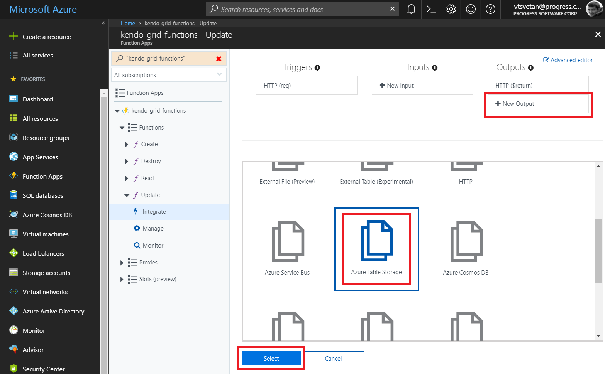
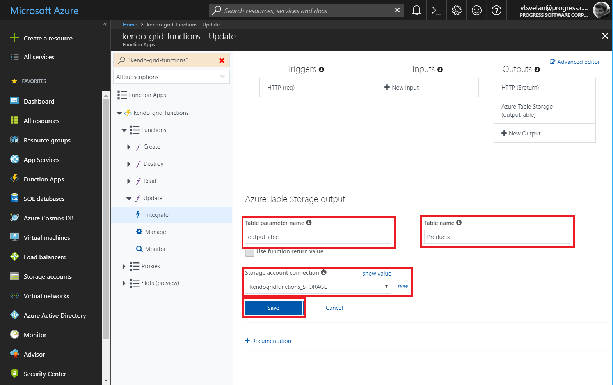

# Azure Functions

This article provides a step-by-step tutorial on how to configure [Azure Functions](https://docs.microsoft.com/en-us/azure/azure-functions/) to serve data for a [Kendo UI Grid]().

The complete implementation of the sample project is available in the [Kendo UI Cloud Integration](https://github.com/telerik/kendo-cloud-integration/tree/master/AzureFunctions) repository on GitHub.

## Prerequisites

Basic knowledge on the organization of [Azure Portal]( https://docs.microsoft.com/en-us/azure/azure-portal/).

## Creating Azure Functions Applications

1. Follow the steps from the [Create your first function in the Azure portal](https://docs.microsoft.com/en-us/azure/azure-functions/functions-create-first-azure-function) > [Create a function app]( https://docs.microsoft.com/en-us/azure/azure-functions/functions-create-first-azure-function#create-a-function-app) quickstart.
1. Provide the `kendo-grid-functions` name to the application and set the name of the storage account to `kendogridfunctions`.
1. In [Azure Portal](https://portal.azure.com/), go to the newly created **kendo-grid-functions** application.

## Creating HTTP-Triggered Functions for CRUD Operations

You have to apply the following steps individually to set each function (read, create, destroy, and update).

1. On the left-side panel and under the application name, click the **+** (plus) symbol which, when the **Functions** section is hovered, appears to the right.

	**Figure 1: Overview of the application functions**

	

1. If the **Get started quickly with a premade function** screen appears, click the **Custom function** link at the bottom.

	**Figure 2: The Get started quickly with a premade function window**

	

1. Click the **HTTP trigger** option. On the panel that appears to the right, select the language and fill in a meaningful name for each function. Later on, the tutorial will demonstrate how to implement the Azure Functions in C#—therefore, select that language—and will use `Read`, `Create`, `Update`, and `Destroy` as names for the four functions.

	**Figure 3: Configuring a new HTTP trigger function**

	

## Integrating Input for the Read Function

1. Expand the `Read` function and, under the function name on the left navigation panel, click the **Integrate** section.
1. In the **Inputs** section, click the **New Input** button.
1. Select **Azure Table Storage** as the input storage that will be integrated and click **Select**.

	**Figure 4: Integrating the new input for the function**

	

1. Type **Product** for the partition key of the table.
1. Chose the maximum number of records to read. In this case, the default value of 50 will be preserved.
1. In **Storage account connection** to the right of the field, click the **new** link.
1. Select the **kendogridfunctions** connection that was created during the initial setup of the application.
1. Change **Table name** to **Products**.
1. Click **Save** to save the newly integrated input table.

	**Figure 5: Configuring the new input**

	

## Integrating Output for the Create, Destroy, and Update Functions

Configure an output integration for each of the other three functions (create, destroy, and update):

1. Click **New Output**.
1. Select **Azure Table Storage** and click **Select**.

	**Figure 6: Integrating the new output for the function**

	

1. Select **kendogridfunctions_STORAGE** for the storage account connection.
1. Change **Table name** to **Products**.
1. Click **Save** to save the newly integrated output table.

	**Figure 7: Configuring the new output**

	

## Implementing the Model

The actual implementation requires you to first create a definition for the `Product` class:

1. Select the `Read` function.
1. On the right side, click **View files**.

	**Figure 8: Opening the function files**

	

1. Click the **Add** button and provide the `product.csx` name to the new file.

	**Figure 9: Creating a new function file**

	

1. Place the following class definition in the file:

	```C#
	using Microsoft.WindowsAzure.Storage.Table;

	public class Product :TableEntity
	{
		public string ProductName { get; set; }

		public double UnitPrice { get; set; }

		public int UnitsInStock { get; set; }

		public bool Discontinued { get; set; }

		public Product ToEntity()
		{
			return new Product
			{
				PartitionKey = "Product",
				RowKey = this?.RowKey,
				ProductName = this?.ProductName,
				UnitPrice = this.UnitPrice,
				UnitsInStock = this.UnitsInStock,
				Discontinued = this.Discontinued,
				ETag = "*"
			};
		}
	}
	```

## Implementing the Read Function

1. Under the `Read` function, open the `run.csx` file.
1. Before the initial use, include the following `load` directive that allows you to use the `Model` class definition in the actual function.

	```C#
	#load "product.csx"
	```

1. Include a reference to the `Microsoft.WindowsAzure.Storage` and a `using` configuration for the `Table` library.

	```C#
	#r "Microsoft.WindowsAzure.Storage"
	…
	using Microsoft.WindowsAzure.Storage.Table;
	```

1. Modify the definition of the `Run` function method. The newly added `inputTable` parameter allows you to get and return the products that are stored in the integrated table storage.

	```C#
	public static async Task<HttpResponseMessage> Run(HttpRequestMessage req, IQueryable<Product> inputTable, TraceWriter log)
	{
		if (req.Method == HttpMethod.Get)
		{
			// Return the Products table as list
			return req.CreateResponse(HttpStatusCode.OK, inputTable.ToList(), "application/json");
		}
		else
		{
			return req.CreateResponse(HttpStatusCode.BadRequest, "This route accepts only GET requests.");
		}
	}
	```

## Implementing the Create, Destroy, and Update Functions

Now you can proceed with the implementation of the other three functions. Make all three of them load the `Product` class and refer the `Microsoft.WindowsAzure.Storage` and `Newtonsoft.Json` assemblies. Add the respective `using` configurations.

```C#
#r "Newtonsoft.Json"
#r "Microsoft.WindowsAzure.Storage"
#load "..\Read\product.csx"

using System.Net;
using Microsoft.WindowsAzure.Storage.Table;
using Newtonsoft.Json;
```

As a result, the `Run` methods for each function differ.

The following example demonstrates the `Run` method for the `Create` function.

```C#
public static async Task<HttpResponseMessage> Run(HttpRequestMessage req, CloudTable outputTable, TraceWriter log)
{
	dynamic body = await req.Content.ReadAsStringAsync();
	Product data = JsonConvert.DeserializeObject<Product>(body as string);
	Product entity = data.ToEntity();
	string newKey = Guid.NewGuid().ToString();

	entity.RowKey = newKey;
	var operation = TableOperation.Insert(entity);
	await outputTable.ExecuteAsync(operation);

	return req.CreateResponse(HttpStatusCode.OK, entity, "application/json");
}
```

The following example demonstrates the `Run` method for the `Destroy` function.

```C#
public static async Task<HttpResponseMessage> Run(HttpRequestMessage req, CloudTable outputTable, TraceWriter log)
{
	dynamic body = await req.Content.ReadAsStringAsync();
	Product data = JsonConvert.DeserializeObject<Product>(body as string);
	Product entity = data.ToEntity();

	var operation = TableOperation.Delete(entity);
	await outputTable.ExecuteAsync(operation);

	return req.CreateResponse(HttpStatusCode.OK, entity, "application/json");
}
```

The following example demonstrates the `Run` method for the `Update` function.

```C#
public static async Task<HttpResponseMessage> Run(HttpRequestMessage req, CloudTable outputTable, TraceWriter log)
{
	dynamic body = await req.Content.ReadAsStringAsync();
	Product data = JsonConvert.DeserializeObject<Product>(body as string);
	Product entity = data.ToEntity();

	var operation = TableOperation.Replace(entity);
	await outputTable.ExecuteAsync(operation);

	return req.CreateResponse(HttpStatusCode.OK, entity, "application/json");
}
```

## Configuring the Application

As the implementation is already in place, now you need to add specific configurations to the application and for each of the four functions.

1. Click the application name and select **Platform features**.
1. Under the **API** section, click **CORS**.

	**Figure 10: The platform features of the application**

	

1. Add the domain origin of the client-side application that will consume the functions data and click **Save**. In this case, the client-side application will be located in the kendo UI Dojo. Therefore, the `https://runner.telerik.io` origin is available.

	**Figure 11: Configuration of the CORS options**

	

1. Go to the `Read` function and open the `function.json` file.
1. In the **bindings / methods** section, remove **post** as an option.
1. Open the same file for the other three functions but remove the `get` method.

## Consuming the Implemented CRUD Endpoints on the Client

Get the unique URL for each of the functions by clicking the **Get Function URL** link that is available for each of them. Now you need to implement the client that will consume the data from the functions application. The following example demonstrates how to implement the Kendo UI Grid and place the proper endpoints of the CRUD operations in the transport configuration of the data source. As a result, the Grid will be able to consume and edit the data from the Azure Functions application.

```HTML
<div id="grid"></div>
<script>
  $(document).ready(function () {
    $("#grid").kendoGrid({
      toolbar: ["create"],
      columns: [
        { field:"ProductName", title: "Product Name", width: "150px" },
        { field: "UnitPrice", title:"Unit Price", format: "{0:c}", width: "110px" },
        { field: "UnitsInStock", title:"Units In Stock", width: "110px" },
        { field: "Discontinued", width: "110px" },
        { command: ["edit", "destroy"], title: "&nbsp;", width: "190px" }],
      editable: "popup",
      dataSource: {
        batch: false,
        transport: {
          read: {
            url: "[Read Function URL]",
            method: "GET"
          },
          update: {
            url: "[Update Function URL]",
            method: "POST"
          },
          destroy: {
            url: "[Destroy Function URL]",
            method: "POST"
          },
          create: {
            url: "[Create Function URL]",
            method: "POST"
          },
          parameterMap: function(options, operation) {
            if (operation !== "read" && options) {
              return kendo.stringify(options);
            }
          }
        },
        schema: {
          model: {
            id: "RowKey",
            fields: {
              RowKey: { editable: false, nullable: true },
              ProductName: { validation: { required: true } },
              UnitPrice: { type: "number", validation: { required: true, min: 1} },
              Discontinued: { type: "boolean" },
              UnitsInStock: { type: "number", validation: { min: 0, required: true } }
            }
          }
        }
      }
    });
  });
</script>
```

## See Also

* [Kendo UI Grid Overview]()
* [Binding to Azure Cosmos DB]()
* [Integrating Kendo UI with Azure Face API]()
* [Consuming Data from Amazon DynamoDB]()
