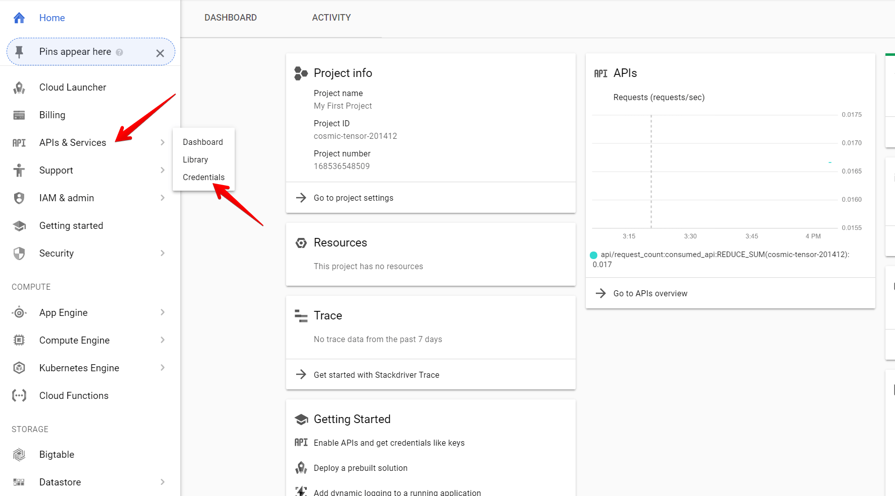
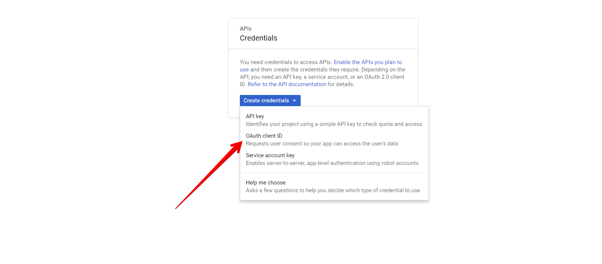
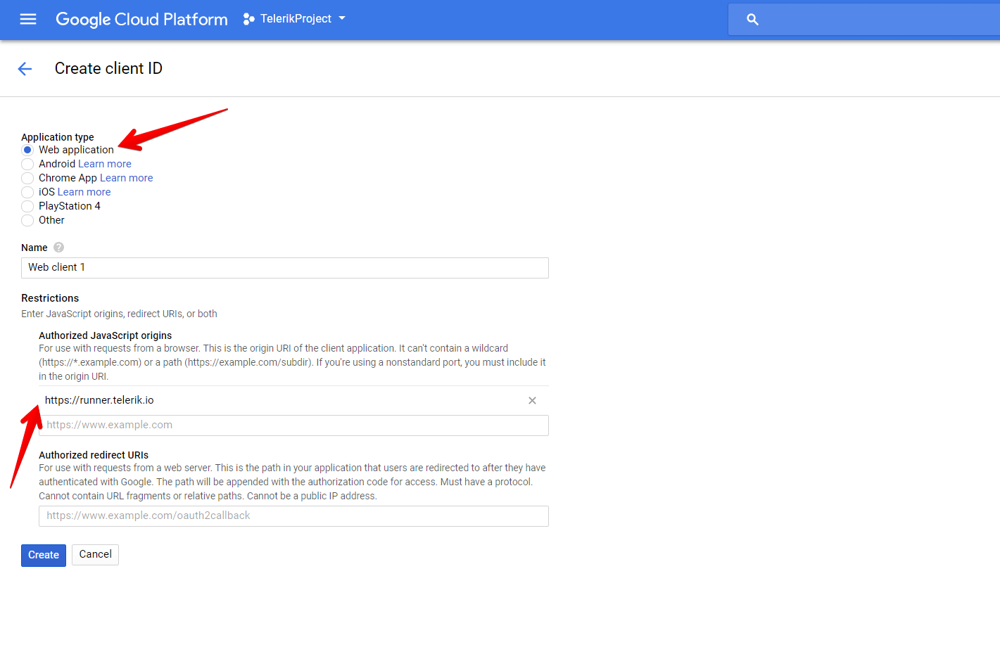
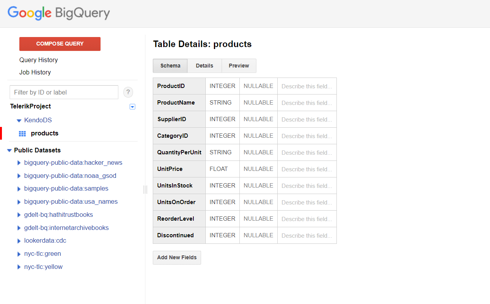
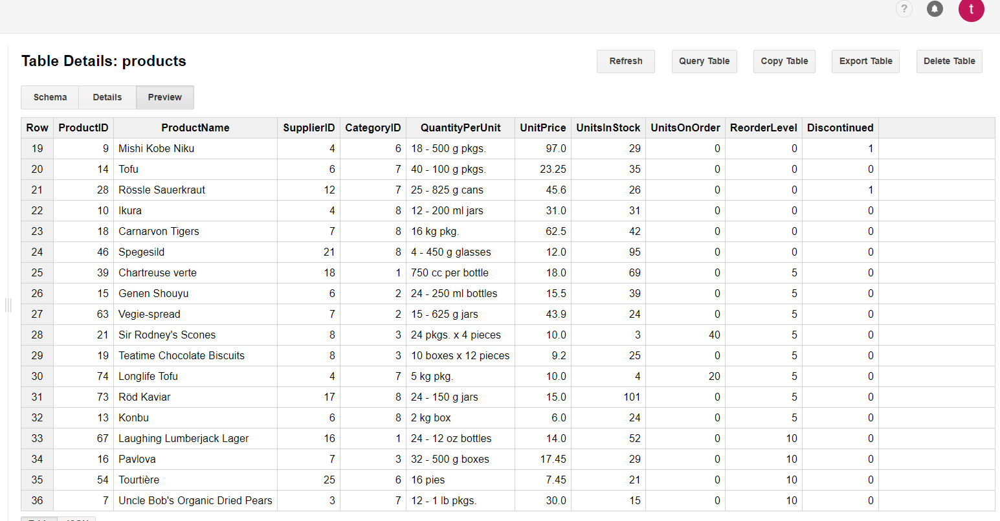

# Google Cloud Big Query

This article provides a step-by-step tutorial on how to create a table in [Google Cloud Big Query](https://aws.amazon.com/dynamodb/) and configure the [Kendo UI Grid]() to retrieve, create, update, and destroy items in that table.

The complete implementation of this tutorial is available in the [Kendo UI Cloud Integration repository on GitHub](https://github.com/telerik/kendo-cloud-integration/tree/master/GoogleCloudBigQuery).

* A [Google Cloud account](https://cloud.google.com/).
* Basic knowledge on using the [Cloud Console](https://cloud.google.com/cloud-console/).

## Client-Side Authorization and Access through OAuth 2.0

The Google APIs Client library for JavaScript handles the client-side authorization flow for storing and using OAuth 2.0 access and refresh tokens. When you authorize access to a Google API, you are receive an access token for making calls to the API. The Google API OAuth 2.0 access tokens last for one hour. You can request and store a refresh token which will allow you to request a new access token when the previous access token expires. For more information on how to set up the authorization, refer to the article about [authorizing API requests](https://cloud.google.com/bigquery/docs/authorization).

To create AOth 2.0 credentials and add authorized JavaScript origin:

1. On the left-hand side pane in the Console, hover over the **APIs and Services** item and select **Credentials**.

    **Figure 1: Navigating to the Credentials section**

    

1. Click the **Create Credentials** button and select **OAuth client ID**.

    **Figure 2: Creating OAuth client ID**

    

1. Select **Web Application** and add **Authorized JavaScript origins**. For the purposes of this sample project, add `runner.telerik.io` as authorized origin. `runner.telerik.io` is the domain of https://dojo.telerik.com/.

    **Figure 3: Adding runner.telerik.io as authorized origin**

    

## Creating New DataSet and Table in BigQuery

For more information on how to create new DataSets and tables, refer to the articles about [creating and using DataSets](https://cloud.google.com/bigquery/docs/tables) and [creating and using tables](https://cloud.google.com/bigquery/docs/tables) from the official BigQuery documentation. For the purposes of this sample project, create a products table with the following Schema and Data.

**Figure 4: Schema of the Products Table in the KendoDS DataSet**

    

**Figure 5: Data of the Products Table in the KendoDS DataSet**

    

## Configuring the Grid to Consume and Manipulate Available BigQuery Data

1. [Configure the page to load Google APIs, jQuery, and Kendo UI, and set OAuthorization](#configuring-the-google-apis-jquery-and-kendo-ui-loading-and-setting-oauthorization)
1. [Configure the Kendo UI Grid and its data operations with BigQuery](#configuring-the-grid-and-its-data-operations-with-bigquery)

### Configuring the Google APIs, jQuery, and Kendo UI Loading and Setting OAuthorization

1. In the `<head>` of your HTML page, load the Kendo UI styles.
1. Load the Google APIs, jQuery, and Kendo UI scripts.
1. Add a button on your page to trigger the authentication and to load the Google API.

For more information on how to create the `client_id`, refer to the section on [client-side authorization and access through OAuth 2.0](#client-side-authorization-and-access-through-aouth-2.0)

```javascript
<head>
    <meta charset="utf-8">
    <title>Kendo Grid BigQuery Integration</title>
    <link rel="stylesheet" href="https://kendo.cdn.telerik.com/{{ site.cdnVersion }}/styles/kendo.common.min.css">
    <link rel="stylesheet" href="https://kendo.cdn.telerik.com/{{ site.cdnVersion }}/styles/kendo.default.min.css">
    <script src="https://apis.google.com/js/api.js"></script>
    <script src="https://code.jquery.com/jquery-3.1.1.min.js"></script>
    <script src="https://kendo.cdn.telerik.com/{{ site.cdnVersion }}/js/kendo.all.min.js"></script>
</head>
<script>

    var client_id = 'XXXXXXXXXXXXXXXXXXXXXXXXXXXXXXXXXXX.apps.googleusercontent.com';
    var project_id = 'XXXXXXXXXXXXXXXXXX';


function authenticate() {
    return gapi.auth2.getAuthInstance()
        .signIn({scope: "https://www.googleapis.com/auth/bigquery https://www.googleapis.com/auth/cloud-platform https://www.googleapis.com/auth/cloud-platform.read-only"})
        .then(function() { console.log("Sign-in successful"); },
              function(err) { console.error("Error signing in", err); });
  }
  function loadClient() {
    return gapi.client.load("https://content.googleapis.com/discovery/v1/apis/bigquery/v2/rest")
        .then(function() { console.log("GAPI client loaded for API"); },
              function(err) { console.error("Error loading GAPI client for API", err); });
  }
  gapi.load("client:auth2", function() {
    gapi.auth2.init({client_id: client_id});
  });
</script>

<button class="k-button" onclick="authenticate().then(loadClient)">authorize and load</button>

</script>
```

### Configuring the Grid and Its Data Operations with BigQuery

1. In the `<body>` of the page, place a `<div>` element to initialize the Grid from. Add a button which will create and populate the Grid with data on click.

    ```
    <div id="grid"></div>
    <button class="k-button" onclick="execute()">execute</button>
    ```

1. In the `click` handler of the **Execute** button, initialize the Grid.

    ```javascript
    function execute() {
    $("#grid").kendoGrid({
        toolbar: ["create"],
        columns: [

            { field: "productid", title: "ProductID",  width: "100px", editable: function (dataItem) {
            return dataItem.isNew();
        }  },
        { field: "productname", title: "ProductName",  width: "200px" },
        { field: "unitsinstock", title: "UnitsInStock",  width: "120px" },
        { field: "unitprice", title: "UnitPrice", format: "{0:c}",  width: "120px" },
        { command: ["edit", "destroy"], title: "&nbsp;", width: "250px" }],
        editable: "inline",
        dataSource: {
            sort: {field: "productid", dir: "asc"},
            transport: {
                read: function(options) {
                    ...
                },
                update: function(options){
                    ...
                },
                create: function(options){
                    ...
                },
                destroy: function(options){
                    ...
                }
                },
            schema: {
                    model: {
                    id: "productid",
                    fields: {
                        productid: { editable: true, type: "number", nullable: true, defaultValue: -1 },
                        ProductName: { validation: { required: true } },
                        UnitPrice: { type: "number", validation: { required: true, min: 1} },
                        UnitsInStock: { type: "number", validation: { min: 0, required: true } }
                    }
                    }
                }


            }
        })
    ```

    > To manage the BigQuery data, you have to handle the `read`, `create`, `update`, and `destroy` functions of the Grid Data Source. For that purpose, the example uses the [BigQuery Jobs](https://cloud.google.com/bigquery/docs/reference/rest/v2/jobs) objects which manage asynchronous tasks such as running queries, loading data, and exporting data. To directly implement the query for the BigQuery data in the functions of the Grid DataSource, use the [Query Job](https://cloud.google.com/bigquery/docs/reference/rest/v2/jobs/query) objects.

1. To trigger a `SELECT` query to the BigQuery table, implement the `read` function. Once the response is received, the data is returned in the response. You can manipulate it in a preferable manner and provide it to the Grid.

	```
    read: function(options) {
        return gapi.client.bigquery.jobs.query({
            'projectId': project_id,
            'query': 'SELECT * FROM KendoDS.products'
        })
            .then(function(response) {
            var gridData = [];
            $.each(response.result.rows, function(i, item) {
            var productid = item.f[0].v;
            var productname = item.f[1].v;
            var unitsinstock = item.f[6].v;
            var unitprice = item.f[5].v;
            gridData.push({
                productid: productid,
                productname: productname,
                unitsinstock: unitsinstock,
                unitprice: unitprice
            });
            });
            options.success(gridData) // provides the data to the Grid
    },
            function(err) {
        console.error("Execute error", err);
    });
    }
	```

1. With the `create` function you can add a new item to the table. For that purpose, construct an `INSERT` query to inject it in the table. Make sure that the `useLegacySql` is set to `false`. Otherwise an `insert` will not be authorized.

	```
    create: function(options) {
        var grid = $("#grid").data("kendoGrid");
        var content = grid.element.find("tbody");
        var row = $(content).find('tr').last();
        var dataItem = grid.dataItem(row);

        var productid = dataItem.productid;
        var productname = '"' + options.data.productname + '"';
        var unitsinstock = options.data.unitsinstock;
        var unitprice = options.data.unitprice;

        return gapi.client.bigquery.jobs.query({
                'projectId': project_id,
                "useLegacySql": false,
                "query": "INSERT KendoDS.products (ProductID, ProductName, UnitsInStock, UnitPrice) VALUES(" + productid + ", " + productname + ", " + unitsinstock + ", " + unitprice + ");"
            })
            .then(function(response) {
                    options.success(options.data);
                },
                function(err) {
                    console.error("Execute error", err);
                });
    }
	```

1. With the `update` function you can manage the altering of data for a specific record. For that purpose, construct an `UPDATE` query to alter the certain record. Make sure that the `useLegacySql` is set to `false`. Otherwise, the operation will not be authorized.

    ```
    update: function(options) {

        var productid = options.data.productid;
        var productname = '"' + options.data.productname + '"';
        var unitsinstock = options.data.unitsinstock;
        var unitprice = options.data.unitprice;

        return gapi.client.bigquery.jobs.query({
                "projectId": project_id,
                "useLegacySql": false,
                "query": "UPDATE KendoDS.products SET ProductName = " + productname + " , UnitsInStock = " + unitsinstock + ", UnitPrice = " + unitprice + " WHERE ProductID = " + productid + ";"
            })
            .then(function(response) {
                    options.success(options.data);
                },
                function(err) {
                    console.error("Execute error", err);
                });
    }
    ```

1. In the `destroy` function, implement the `delete` record operation. For that purpose, construct a `DELETE` query to remove the certain record. Make sure that the `useLegacySql` is set to `false`. Otherwise, the operation will not be authorized.

    ```
    destroy: function(options) {
        var productid = options.data.productid;
        return gapi.client.bigquery.jobs.query({
                'projectId': project_id,
                "useLegacySql": false,
                'query': "DELETE KendoDS.products WHERE ProductID = " + productid + ";"
            })
            .then(function(response) {
                    alert("item deleted")
                    options.success(response)
                },
                function(err) {
                    console.error("Execute error", err);
                });
    }
    ```

Now, you have a runnable example which uses the Grid, is capable of `read` and `edit` operations on a BigQuery table, and is entirely implemented on the client side.

## See Also

* [Kendo UI Grid Overview]()
* [Consuming Data from Azure Functions]()
* [Binding to Azure Cosmos DB]()
* [Integrating Kendo UI with Azure Face API]()
* [Consuming Data from Amazon DynamoDB]()
