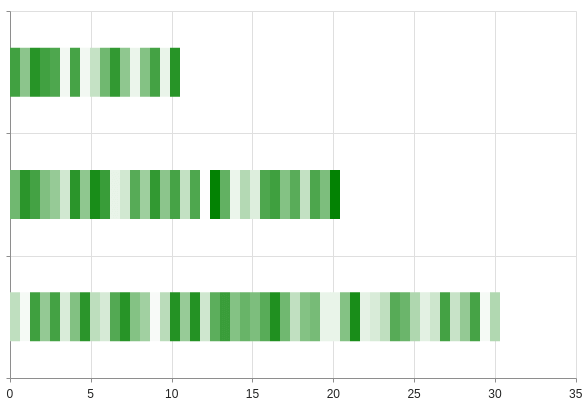

## Environment

<table>
 <tr>
  <td>Product</td>
  <td>Progress® Kendo UI® Chart for jQuery</td>
 </tr>
 <tr>
  <td>Operating System</td>
  <td>Windows 10 64bit</td>
 </tr>
 <tr>
  <td>Visual Studio version</td>
  <td>Visual Studio 2017</td>
 </tr>
 <tr>
  <td>Preferred Language</td>
  <td>JavaScript</td>
 </tr>
</table>

## Description

How can I implement color-coded ranges in the bars of the Chart?

## Solution

You can use color ranges for conveying additional information, for example, value composition.

To achieve this behavior, you can normally use the stacked bar series. However, if you need to convey more flexibility, consider the following Chart.



To implement the functionality as shown in the image, define a [`series.visual`](/api/javascript/dataviz/ui/chart/configuration/series.visual) that draws the ranges dynamically. Note that the visual remains in use until the next [`render` event](/api/javascript/dataviz/ui/chart/events/render). This allows you to update it asynchronously or in real-time.

The following example demonstrates how to implement color-coded ranges (stripes) in bars when working with Kendo UI Charts.

```dojo
    <div id="chart" />
    <script>
      var WIDTH = 5;
      var draw = kendo.drawing;
      var geom = kendo.geometry;

      $("#chart").kendoChart({
        series: [{
          type: "bar",
          data: [10, 20, 30],
          // https://docs.telerik.com/kendo-ui/api/javascript/dataviz/ui/chart/configuration/series.visual
          visual: function(e) {
            // https://docs.telerik.com/kendo-ui/api/javascript/geometry/rect
            var left = e.rect.topLeft();
            var right = e.rect.topRight();
            var bottom = e.rect.bottomLeft();

            // https://docs.telerik.com/kendo-ui/api/javascript/drawing/group
            var group = new draw.Group();

            for (var x = left.x; x < right.x; x += WIDTH) {
              var rect = new geom.Rect([x, left.y], [WIDTH, e.rect.height()])

              // https://docs.telerik.com/kendo-ui/api/javascript/drawing/path
              var value = Math.random();
              var path = draw.Path.fromRect(rect, {
                fill: {
                  color: value > 0.5 ? "green" : "lightgreen"
                },
                stroke: null,

                // Custom field
                value: value
              });

              group.append(path);
            }

            return group;
          }
        }]
      });
    </script>
```

## See Also

* [Chart JavaScript API Reference](/api/javascript/dataviz/ui/chart)
* [Drawing API]()
* [How to Aggregate Data in Pie Charts]()
* [How to Draw on Scatter Plots Surface]()
* [How to Expand Clickable Area of Points]()
