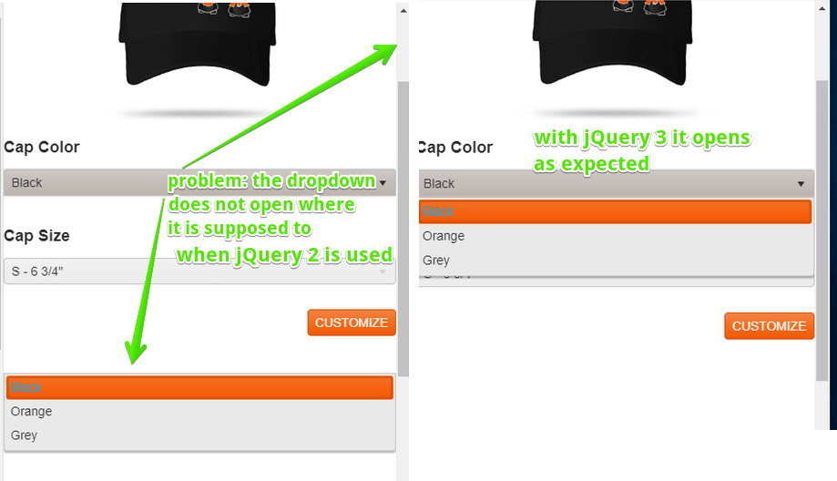

## Environment

<table>
	<tr>
		<td>Product</td>
		<td>Progress® Kendo UI®, UI for ASP.NET MVC, UI for ASP.NET Core</td>
	</tr>
</table>

## Description

When the page is scrolled down, the drop-down position is incorrect&mdash;it does not consider the page scroll position and is detached from its element by roughly the scroll distance. This issue affects widgets that contain dropdowns such as the Kendo UI ComboBox, DatePicker, DropDownList, Multiselect, and so on.

**Table 1: A demonstration of the issue**

## Cause

The cause of the issue is jQuery version 2 which has a positioning bug in this scenario. While it was logged initially for IE, it seems to also affect Chrome. For more information, refer to the following GitHub issues:
* [https://github.com/jquery/jquery/issues/2897](https://github.com/jquery/jquery/issues/2897)
* [https://github.com/KidSysco/jquery-ui-month-picker/issues/40](https://github.com/jquery/jquery/issues/2897)

## Solution

Upgrade to jQuery 3.3.1 where the bug is fixed.
