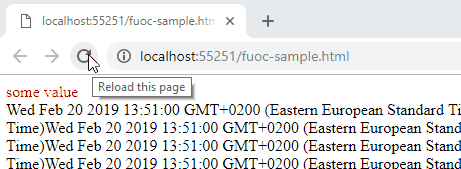
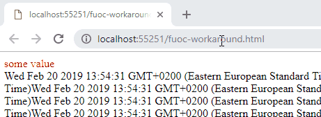

## Environment

<table>
 <tr>
  <td>Product</td>
  <td>Progress Kendo UI for jQuery, UI for ASP.NET MVC, UI for ASP.NET Core</td>
 </tr>
  <tr>
  <td>Version</td>
  <td>All versions</td>
 </tr>
</table>


## Description

Flash of unstyled content (FUOC) is the effect where the user can see parts of the page in their non-styled or partially styled state before all styles and/or scripts that cater to the desired appearance are loaded and/or run.

**Figure 1: A simulation of Flash of Unstyled Content (FUOC)**



A [code snippet that simulates the FUOC effect](#fuoc-simulation) is available at the end of the article.

The following list provides the most common reasons for FUOC to occur:
* Network latency in loading stylesheets.
* A large DOM that slows down the initialization of jQuery widgets.
* A slow user machine.
* Asynchronous or deferred scripts that also apply styling.

With Kendo UI, you are more likely to experience such issues with widgets such as a DropDownList or ComboBox which hide the user input altogether. This behavior also applies to the ASP.NET MVC and ASP.NET Core suites because they also [create jQuery widgets](https://docs.telerik.com/aspnet-mvc/getting-started/kendo-ui-vs-mvc-wrappers) behind the scenes.

Kendo UI widgets are [instantiated only after the document has been loaded and parsed](https://docs.telerik.com/kendo-ui/controls/navigation/panelbar/overview#initialization). At that point, the necessary classes are added and the browser can style them according to the stylesheets that are present&mdash;in this case, the Kendo UI stylesheets are most relevant as they are the targeted appearance.

The following examples are of symptoms which pertain to Kendo UI widgets:
* I have a ComboBox that shows as a normal text box and displays the model data until the DataSource is loaded.
* I am using a DropDownList and when the page first loads, if that DropDownList has a value, it briefly shows the value of the selected option instead of text.
* Using a PanelBar causes FUOCs.

## Workaround

Minor flickers are inevitable when a web page loads because the browser has to always process a lot of content and the wire delays also affect the loading of available assets. Deferred and async scripts can also produce similar effects as they wait for the rest of the page to load before loading and executing.

To speed up initialization, reduce the initial DOM size and the speeding up of asset loading by, for example, using bunding and/or CDN services which work better for the intended audience.

You can also add CSS rules that facilitate or fix the issue as early as possible so that the initial content is rendered in an acceptable manner. For example, add Kendo UI classes to the markup if you instantiate the widgets from markup so they can be styled before the widgets are instantiated. This approach can work better for containers such as the PanelBar or the Menu.

For inputs, make the text transparent and unselectable, for example, so that users cannot actually see it and interact with it.

**Figure 2: A workaround for the FUOC issue**



For example, use the following settings:

```
input.myHiddenText {
    color: transparent;
    user-select:none;
}
```

When working with inputs which exhibit such issues, add the following code. For example, to drop-downs which do not need to keep displaying the value as textboxes have.

```
<input value="some value" class="myHiddenText" />
```

For HTML helpers in MVC, add the class through the `HtmlAttributes`: `.HtmlAttributes(new { @class="myHiddenText"})`. The `myHiddenText` class will be rendered on both the input and the Kendo UI widget wrapper. Therefore, ensure it does not break the appearance of the widget.

## FUOC Simulation

The following example simulates the FUOC effect.

````
<!DOCTYPE html>
<html>
<head>
    <meta charset="utf-8" />
    <title></title>
	<script src="https://code.jquery.com/jquery-3.3.1.min.js"></script>
	<style>
		.testDiv span {
			color: red;
		}

		.testDiv.dynamicClass input {
			display: none;
		}

		/* uncomment for workaround */
		/*
		input.myHiddenText {
			color: transparent;
			user-select: none;
		}
		*/
	</style>
</head>
<body>
	<div class="testDiv">
		<input value="some value" class="myHiddenText" />
	</div>
	<div id="complexWork"></div>
	<script>
		$(document).ready(function () {
			// A very crude FUOC simulation - a lot of heavy DOM operations that mimic
			// a heavy page with many widgets and a lot of reflows happening before
			// the "widget" below instantiates and hides the input.
			// If you don't see the input flash briefly, increase the number of iterations.
			for (var i = 0; i < 1000; i++) {
				$("#complexWork").html($("#complexWork").html() + new Date());
			}
			//sample jQuery widget that hides the input and uses its value to change the DOM around it
			$(".testDiv").append("<span>" + $(".testDiv").find("input").first().val() + "</span>").addClass("dynamicClass");
		});
	</script>
</body>
</html>
````
