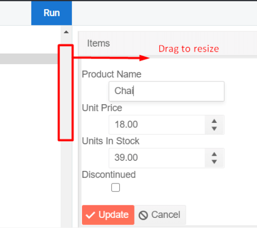

## Environment

<table>
 <tr>
  <td>Product</td>
  <td>Progress Kendo UI Grid</td>
 </tr>
 <tr>
  <td>Created with Kendo UI version</td>
  <td>2020.2.617</td>
 </tr>
</table>

## Description

My current grid is editable, but how can I use editing in a smaller screen when only the template is shown that combines all the other columns values as seen in your [Responsive Columns Demo](https://demos.telerik.com/kendo-ui/grid/responsive-columns)? 

## Solution

The functionality that the responsive columns provide is in essence the ability to hide some or all of the available columns and show a template column that contains the values of all column fields.

To implement the desired outcome, you will need to replace the read template with an edit template programmatically if the grid bound columns are not visible (two templates like we have in the ListView but using the `k-grid-edit` class on the button so the built-in events can get triggered). You can do that easily by getting hold of the `beforeEdit` event:

```
    beforeEdit: function(e){
        var template = kendo.template($("#editTemplate").html())
        e.sender.element.find("tr[data-uid='" + e.model.uid + "'] td:last-child").html(template(e.model));
    }
```

To see the following demo in action, click **Open in Dojo**. You should resize the panel to as small as it can get, so that you can see the template column in action:



```dojo
    <script type="text/x-kendo-tmpl" id="editTemplate">
        <div class="product-view k-widget">
            <dl>
                <dt>Product Name</dt>
                <dd>
                    <input type="text" class="k-textbox" data-bind="value:ProductName" name="ProductName" required="required" validationMessage="required" />
                    <span data-for="ProductName" class="k-invalid-msg"></span>
                </dd>
                <dt>Unit Price</dt>
                <dd>
                    <input type="text" data-bind="value:UnitPrice" data-role="numerictextbox" data-type="number" name="UnitPrice" required="required" min="1" validationMessage="required" />
                    <span data-for="UnitPrice" class="k-invalid-msg"></span>
                </dd>
                <dt>Units In Stock</dt>
                <dd>
                    <input type="text" data-bind="value:UnitsInStock" data-role="numerictextbox" name="UnitsInStock" required="required" data-type="number" min="0" validationMessage="required" />
                    <span data-for="UnitsInStock" class="k-invalid-msg"></span>
                </dd>
                <dt>Discontinued</dt>
                <dd><input type="checkbox" name="Discontinued" data-bind="checked:Discontinued"></dd>
            </dl>
            <div class="edit-buttons">
                <a role="button" class="k-button k-button-icontext k-primary k-grid-update" href=""><span class="k-icon k-i-check"></span>Update</a><a role="button" class="k-button k-button-icontext k-grid-cancel" href=""><span class="k-icon k-i-cancel"></span>Cancel</a>
            </div>
        </div>
    </script>

<div id="example">
    <div id="grid"></div>
    <script>
        $(document).ready(function () {
           var crudServiceBaseUrl = "https://demos.telerik.com/kendo-ui/service",
                dataSource = new kendo.data.DataSource({
                    transport: {
                        read:  {
                            url: crudServiceBaseUrl + "/Products",
                            dataType: "jsonp"
                        },
                        update: {
                            url: crudServiceBaseUrl + "/Products/Update",
                            dataType: "jsonp"
                        },
                        create: {
                            url: crudServiceBaseUrl + "/Products/Create",
                            dataType: "jsonp"
                        },
                        parameterMap: function(options, operation) {
                            if (operation !== "read" && options.models) {
                                return {models: kendo.stringify(options.models)};
                            }
                        }
                    },
                    batch: true,
                    pageSize: 20,
                    schema: {
                        model: {
                            id: "ProductID",
                            fields: {
                                ProductID: { editable: false, nullable: true },
                                ProductName: { validation: { required: true } },
                                UnitPrice: { type: "number", validation: { required: true, min: 1} },
                                Discontinued: { type: "boolean" },
                                UnitsInStock: { type: "number", validation: { min: 0, required: true } }
                            }
                        }
                    }
                });

                $("#grid").kendoGrid({
                    dataSource: dataSource,
                    height: 550,
                    editable: "inline",
                    sortable: true,
                    pageable: {
                        refresh: true,
                        pageSizes: true,
                        buttonCount: 5
                    },
                    columns: [{
                        field: "ProductName",
                        title: "Product Name",
                        media: "(min-width: 500px)"
                    }, {
                        field: "UnitPrice",
                        title: "UnitPrice",
                        width: 250,
                        media: "(min-width: 850px)"
                    }, {
                        field: "UnitsInStock",
                        title: "Units In Stock",
                        width: 250,
                        media: "(min-width: 850px)"
                    }, {
                        field: "Discontinued",
                        media: "(min-width: 500px)"
                    },{ command: ["edit"], media: "(min-width: 500px)"}, {
                        title: "Items",
                        template: kendo.template($("#responsive-column-template").html()),
                        media: "(max-width: 500px)"
                    }],
                  beforeEdit: function(e){
                    var template = kendo.template($("#editTemplate").html())
                  	e.sender.element.find("tr[data-uid='" + e.model.uid + "'] td:last-child").html(template(e.model));
                  }
                });
            });
        </script>
    </div>

    <script id="responsive-column-template" type="text/x-kendo-template">
        <strong>Product Name</strong>
        <p class="col-template-val">#=data.ProductName#</p>

        <strong>UnitPrice</strong>
        <p class="col-template-val">#=data.UnitPrice#</p>

        <strong>UnitsInStock</strong>
        <p class="col-template-val">#=data.UnitsInStock#</p>

        <strong>Discontinued</strong>
        <p class="col-template-val">#=data.Discontinued#</p>
       <a role="button" class="k-button k-button-icontext k-grid-edit" href=""><span class="k-icon k-i-edit"></span>Edit</a>
    </script>

    <style>
        .col-template-val {
            margin: 0 0 1em .5em;
        }
    </style>
```
