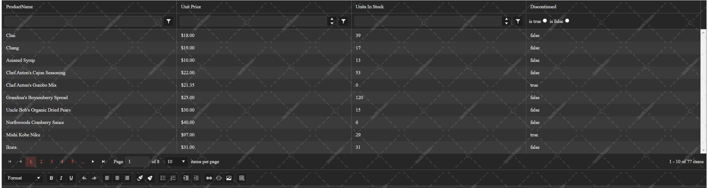

## Environment

<table>
 <tr>
  <td>Product</td>
  <td>Progress® Kendo UI® for jQuery</td>
 </tr>
 <tr>
  <td>Kendo Version</td>
  <td>2022.2.510 (R2 2022) and later</td>
 </tr>
</table>

## Description

An invalid or missing Kendo UI for jQuery license triggers the following behavior on pages that contain any incorrectly licensed Kendo UI components:

* A watermark will appear over select components.

    * Example of a watermark in the `Light Theme`:
            
    * Example of a watermark in the `Dark Theme`:
       

* A banner will appear on pages that use unlicensed Kendo UI for jQuery components.
    
    

    * Clicking the ? button of the banner will take you to the Kendo UI for jQuery licensing documentation.
    * Clicking the X button of the banner will close the banner until the page is reloaded or a license is activated.

* A warning message similar to the one below will be logged in the browser's console.
    

## Cause

An invalid license can be caused by any of the following:

* Using an invalid or expired commercial license.
* Using an expired trial license.
* Not adding your Kendo UI for jQuery [license file]() into the application.

## Solution

* Verify that you use Kendo UI for jQuery versions that have been [released](https://www.telerik.com/support/whats-new/kendo-ui/release-history) during the validity period of your license.
* Generate and [add your personal license file]() to the application.
* Make sure that the [script license is present in your project](#2-add-the-license-file).
* Make sure that the [references to the license file are correct](#3-add-a-reference-or-import-the-license-file).

If you still experience issues related to the license key, contact us through the [available support channels](#support-options).

## See Also

* [Generating and Using a License File]()
* [License File Frequently Asked Questions]()
