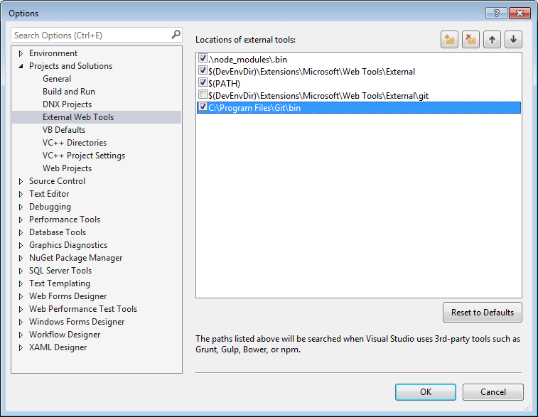

## Environment

<table>
 <tr>
  <td>Product</td>
  <td>Progress® Kendo UI® for jQuery Bower Installation</td>
 </tr>
 <tr>
  <td>Operating System</td>
  <td>Windows 10 64bit</td>
 </tr>
</table>

## Description

A Git client that is bundled in Visual Studio is unable to authenticate with the Kendo UI Bower repository.

## Error Message

`ECMDERR Failed to execute "git ls-remote --tags --heads https://bower.telerik.com/bower-kendo-ui.git", exit code of #-532462766`.

## Solution

Use a Windows port of Git and your stored credentials instead of the built-in client:

1. Store your [credentials](#store-on-windows).
1. Install [Git for Windows](https://gitforwindows.org/).
1. Right-click the **Bower** folder under **Dependencies**.
1. Select **Configure external tools**.
1. Uncheck `$(DevEnvDir)\Extensions\Microsoft\Web Tools\External\git` and/or `$(VSINSTALLDIR)\Web\External\git`.
1. Add a new entry `C:\Program Files\Git\bin` or your installation location.

**Add a new entry**

