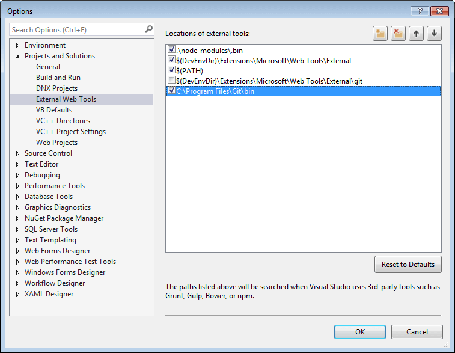

## Environment

<table>
 <tr>
  <td>Product</td>
  <td>Progress® Kendo UI® for jQuery Bower Installation</td>
 </tr>
 <tr>
  <td>Operating System</td>
  <td>Windows 10 64bit</td>
 </tr>
</table>

## Description

Bower on Windows has troubles installing the repository.

## Error Message

`fatal: unable to access 'https://bower.telerik.com/bower-kendo-ui.git/': SSL certificate problem: unable to get local issuer certificate`.

## Cause

The underlying Git installation is missing the certificate bundle.

## Solution

To fix the issue, follow the steps in [this article](https://docs.microsoft.com/en-us/archive/blogs/phkelley/adding-a-corporate-or-self-signed-certificate-authority-to-git-exes-store).

> * The 1.9.5 Git build does not work with the Bower package.
> * To use the `@` symbol in the URL for accessing the Kendo UI Bower repository (because of network restrictions or admin rules, for example), encode it as `https://firstname.lasname%40domain.com@bower.telerik.com/bower-kendo-ui.git`.

### Restore fails in ASP.NET Core MVC RC projects in Visual Studio 2015

**Description** A Git client that is bundled in Visual Studio is unable to authenticate with the Kendo UI Bower repository and throws an error messages similar to `ECMDERR Failed to execute "git ls-remote --tags --heads https://bower.telerik.com/bower-kendo-ui.git", exit code of #-532462766`.

**Solution** Use a Windows port of Git and your stored credentials instead of the built-in client:

1. Store your [credentials](#store-on-windows).
1. Install [Git for Windows](https://gitforwindows.org/).
1. Right-click the **Bower** folder under **Dependencies**.
1. Select **Configure external tools**.
1. Uncheck `$(DevEnvDir)\Extensions\Microsoft\Web Tools\External\git` and/or `$(VSINSTALLDIR)\Web\External\git`.
1. Add a new entry `C:\Program Files\Git\bin` or your installation location.

**Figure 1: Adding a new entry**

## See Also

* [Installing with Bower](https://docs.telerik.com/kendo-ui/intro/installation/bower-install)
* [Storing Your Credentials When Installing with Bower]()
