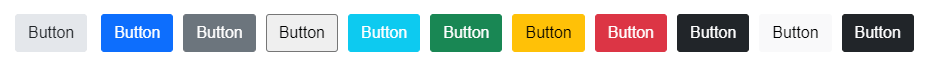
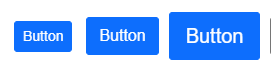
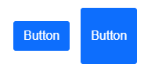
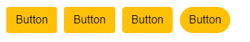
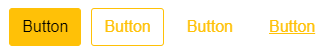

# Components Rendering Overview

Kendo UI R1 2022 introduces new rendering for several components. As this is an ongoing effort, there may be slight changes and touch-ups after the release. The new rendering will cover the entire list of web UI components.

> Larger visual updates like these can have implications in the form of visual regressions which could appear when upgrading from an older version to R1 2022. While we believe that we have caught and resolved many visual regression issues while getting ready for R1 2022, there may be additional issues discovered after the release. We are firmly committed to address these issues as quickly as possible and will continue to push out updates with fixes to our themes and components after the R1 2022 release.

- [What is the Reason Behind These Changes?](#what-is-the-reason-behind-these-changes)
- [Styling Options](#styling-options)
- [Overriding Default Widget Options](#overriding-default-widget-options)
- [State Classes](#state-classes)
- [List of Updated Components](#updated-components)
- [Migrating from LESS Themes](#less-themes-migration)
- [CSS Classes Migration](#css-classes-migration)
- [JQuery Selectors Migration](#jquery-selectors-migration)


## What is the Reason Behind These Changes?

The new rendering provides developers with the ability to change a particular styling option of a component. This helps to avoid the need of manually overriding the CSS styles of a component.

One of the main reasons behind these changes is the feedback provided by the customers. Many of the users of Kendo UI express that currently the themes are difficult to customize and take more effort than they should.

The emergence of design languages over the past few years is also an important factor. Many of our customers prefer to customize the default themes to better suit their business requirements, instead of using them straight out-of-the-box.

Ultimately, the new rendering aims to ease the customization of components and allow developers to implement any design requirements with less work.

## Styling Options

The styling options under the hood represent a set of CSS classes applied in the rendering to change the appearance of a component. Each different component may or may not support a particular option. For example a `textarea` element can have a configurable `overflow`, however this option doesn't make sense in the context of a `button` element.

The old rendering contained all of the styling options in a single class with a `k-` prefix. The new rendering has a separate CSS class for each styling property.

The new rendering of the components supports several common options on a component level:

- [`themeColor`](#theme-color)
- [`size`](#size)
- [`shape`](#shape)
- [`rounded`](#rounded)
- [`fillMode`](#fill-mode)

Each component has its own appearance documentation with information about all of the supported options and their values. 

For a list of all updated components and their respective articles, check the [Updated Components](#updated-components) section.

### Theme Color

The `themeColor` property controls which color is used to style the specific component. The property is dependant on the [`fillMode`](#fill-mode) and cannot be used separately. The structure of the CSS class is `k-{component}-{fillMode}-{themeColor}`.

The following values are available for the `themeColor` option:

- `base`
- `primary` 
- `secondary` 
- `tertiary` 
- `info` 
- `success` 
- `warning` 
- `error` 
- `dark`
- `light` 
- `inverse`

The following example shows a Kendo UI Button with `solid` fill mode and `base` theme color:

```html
<button type="button" class="k-button k-button-solid k-button-solid-base">
    <span class="k-button-text">Text</span>
</button>
```

The following image showcases the result of applying the different `themeColor` values to a button:



### Size

The `size` property controls the overall size of the component. The structure of the CSS class is `k-{component}-{size}`.

The `size` values follow the already established concept of class names:

- `sm`—small size
- `md`—medium size
- `lg`—large size

The default size of the components is `medium`.

The following example shows a Kendo UI Button with large size (`lg`):

```html
<button type="button" class="k-button k-button-lg">
    <span class="k-button-text">Text</span>
</button>
```

The following image showcases the result of applying the different `size` values to a button:



For more information regarding the available `size` values, visit the [appearance documentation](#updated-components) of the corresponding component.

### Shape

The `shape` property controls the shape of the component. The structure of the CSS class is `k-{component}-{shape}`. 

The following example shows a Kendo UI Button with a `square` shape:

```html
<button type="button" class="k-button k-button-square">
    <span class="k-button-text">Text</span>
</button>
```

The following image showcases the result of applying the different `shape` values to a button:



For more information regarding the available `shape` values, visit the [appearance documentation](#updated-components) of the corresponding component.

### Rounded

The `rounded` property controls the border radius of the component. The structure of the CSS class is `k-rounded-{rounded}`.

The `rounded` values follow the already established concept of class names:

- `sm`—small border radius
- `md`—medium border radius
- `lg`—large border radius
- `full`—largest border radius

The default border radius of the components is `medium`.

The following example shows a Kendo UI Button with large border radius (`lg`):

```html
<button type="button" class="k-button k-rounded-lg">
    <span class="k-button-text">Text</span>
</button>
```

The following image showcases the result of applying the different `rounded` values to a button:



For more information regarding the available `rounded` values, visit the [appearance documentation](#updated-components) of the corresponding component.

### Fill Mode

The `fillMode` property controls how the color is applied to the component. The structure of the CSS class is `k-{component}-{fillMode}`. 

The following example shows a Kendo UI Button with a `solid` fill mode:

```html
<button type="button" class="k-button k-button-solid">
    <span class="k-button-text">Text</span>
</button>
```

The following image showcases the result of applying the different `fillMode` values to a button:



For more information regarding the available `fillMode` values, visit the [appearance documentation](#updated-components) of the corresponding component.

## Overriding Default Widget Options

The new rendering implementations also enable you to globally change the default styling options of the widgets.

The following example showcases how to overwrite the default size of the Button widget. Note that if the code is placed at the root of the project right after the `kendo.all.min.js` script, all Kendo UI Button widgets will have a `large` size by default. If the code is placed at the beginning of a particular page, all Kendo UI Button widgets on that page will have a `large` size by default.

```html
<script>
    kendo.ui['Button'].fn.options['size'] = "large";
</script>
```

The overriding mechanism follows the `kendo.ui[WidgetName].fn.options[OptionName] = [value];` structure.

The following example showcases a full implementation of the override:

```dojo
<script>
    kendo.ui['Button'].fn.options['size'] = "large";
    kendo.ui['Button'].fn.options['rounded'] = "full";
</script>

<button id="button1">Button 1</button>
<button id="button2">Button 2</button>
<button id="button3">Button 3</button>
<button id="button4">Button 4</button>

<script>
    $("#button1").kendoButton({
        themeColor: "primary"
    });

    $("#button2").kendoButton({
        themeColor: "warning"
    });

    $("#button3").kendoButton({
        shape: "secondary"
    });

    $("#button4").kendoButton({
        themeColor: "dark"
    });
</script>
```

## State Classes

Apart from the new styling options, the state classes have also been changed. The `k-state-default` class has been completely removed from the entire Kendo suite, except for the PivotGrid, where logic relies on it.

The following table showcases the old and updated versions of the Kendo state classes:

| Old Class          | New Class    |
|:-------------------|:-------------|
| `k-state-default`  | N/A          |
| `k-state-active`   | `k-active`   |
| `k-state-selected` | `k-selected` |
| `k-state-disabled` | `k-disabled` |
| `k-state-focus`    | `k-focus`    |
| `k-state-hover`    | `k-hover`    |

## Updated Components

| Component              | Appearance Documentation                                                                                 |
|:-----------------------|:---------------------------------------------------------------------------------------------------------|
| `AutoComplete`         | [AutoComplete Appearance Documentation]()                  |
| `Button`               | [Button Appearance Documentation]()                                             |
| `ColorPicker`          | [ColorPicker Appearance Documentation]()                 |
| `ComboBox`             | [ComboBox Appearance Documentation]()                              |
| `DateInput`            | [DateInput Appearance Documentation]()                     |
| `DatePicker`           | [DatePicker Appearance Documentation]()                   |
| `DateRangePicker`      | [DateRangePicker Appearance Documentation]()         |
| `DateTimePicker`       | [DateTimePicker Appearance Documentation]()           |
| `DropDownList`         | [DropDownList Appearance Documentation]()               |
| `DropDownTree`         | [DropDownTree Appearance Documentation]()                      |
| `FloatingActionButton` | [FloatingActionButton Appearance Documentation]()       |
| `MaskedTextBox`        | [MaskedTextBox Appearance Documentation]()                            |
| `Menu`                 | [Menu Appearance Documentation]()                                      |
| `MultiColumnComboBox`  | [MultiColumnComboBox Appearance Documentation]() |
| `MultiSelect`          | [MultiSelect Appearance Documentation]()                 |
| `NumericTextBox`       | [NumericTextBox Appearance Documentation]()           |
| `Slider`               | [Slider Appearance Documentation]()                           |
| `Switch`               | [Switch Appearance Documentation]()                           |
| `TextArea`             | [TextArea Appearance Documentation]()                                      |
| `TextBox`              | [TextBox Appearance Documentation]()                         |
| `TimePicker`           | [TimePicker Appearance Documentation]()                   |
| `TreeView`             | [TreeView Appearance Documentation]()                       |

## LESS Themes Migration

> The LESS themes will be deprecated with Kendo UI R1 2023.

This section concerns developers who use the original LESS based themes and have not migrated to the SASS based theme over the years.

### Why Must I Migrate to a SASS Theme?

There are technical limitations in the LESS themes that prevent us from bringing the desired level of customization to the components. In order to keep evolving the UI of the components, the LESS themes need to be left behind.

The new rendering for already existing components is available for the LESS themes, however it supports only the default values of the component [`options`](#styling-options). Any new component or updated design of a feature added to our components will be available only in the SASS themes.

Visit the [LESS Migration]() help article for additonal information regarding the steps that you need to follow in order to migrate to a SASS theme.

### How Do I Know If I Am Using a LESS Theme?

The easiest way to know if you are using the LESS themes is if you are including multiple CSS files, specifically files that follow the following naming pattern: 

- kendo.common.min.css
- kendo.[theme-name].min.css
- kendo.mobile.min.css
- kendo.rtl.min.css

If you aren’t using this combination and instead use a single CSS file like `kendo.default.min.css` then you are using the SASS themes and this section can safely be skipped.

## CSS Classes Migration

This section concerns developers who have modified components appearance through the `k-{classname}` CSS classes. If you haven't made any customizations using the Kendo classes as selectors, you can safely skip this section.

### Why Must I Migrate to Different Class Names?

The old look of the components has been preserved as much as possible. The new set of classes is more of a granular representation of the old CSS stylings. As demonstrated in the [Styling Options](#styling-options) section, the major difference is that each visual configuration has its own class now.

Nevertheless, the new rendering of the components requires the existing CSS classes and HTML structure to be changed to some extent. If you have overridden or used any of the Kendo UI classes to apply custom styling to the components, you may have to update some of the class selectors that are no longer available.

### How Do I Know If I Have Overridden a Class Name?

The easiest way to know if you have overridden a particular class is to check if you have any custom CSS code which contains a `k-{classname}` structure.

Example of the old Kendo UI Button rendering:

```html
<button class="k-button k-button-icontext">
    <span class=" k-icon k-i-folder"></span>
    Button
</button>
```

Example of the new Kendo UI Button rendering:

```html
<button class="k-button k-button-solid k-button-md k-button-rectangle k-rounded-md k-button-solid-base">
    <span class="k-button-icon k-icon k-i-folder"></span>
    <span class="k-button-text">Button</span>
</button>
```

As demonstrated in the examples above, the `k-button-icontext` class is no longer present on the button element. Any custom styling that has been applied through the specified class will be gone. In order to update the custom styling, you need to find the CSS rule in your code which uses a non-existing class and replace it with one of the new classes.

### How Can I Update the Reference to Target the Element In the New Rendering? 

The easiest way to solve the [issue with missing classes](#how-do-i-know-if-i-have-overriden-a-class-name) is to change the name of the class selector that is targeting the specific element.

The following example demonstrates an old class selector `k-button-icontext` which does not exist in the new rendering:

```css
.k-button-icontext {
    background-color: red; /* Won't work. */
}
```

The following example demonstrates an existing class selector `k-button` which is available in the new rendering:

```css
.k-button {
    background-color: red; /* Will work */
}
```

An example of the old rendering, old classes, new rendering, and new classes is available in the [appearance documentation](#updated-components) of each component.

## JQuery Selectors Migration

This section concerns developers who use the `k-{classname}` class selectors for custom logic.

### Why Must I Migrate to Different Selectors?

As mentioned earlier in the [CSS migration](#css-classes-migration) section, the new rendering requires the existing html and class structure to be updated. If you have used any of the Kendo classes to execute custom logic, you may have to update the [`jQuery selectors`](https://api.jquery.com/category/selectors/) if they are no longer available.

### How Do I Find And Update the Selectors?

The easiest way to know if you have custom logic that is dependant on the Kendo classes is to look for the following code structure in your application:

```javascript
$(".k-kendoClassName")
```

You can check the [appearance documentation](#updated-components) of the specific component and verify if the class that is used as a selector is still available or not.
