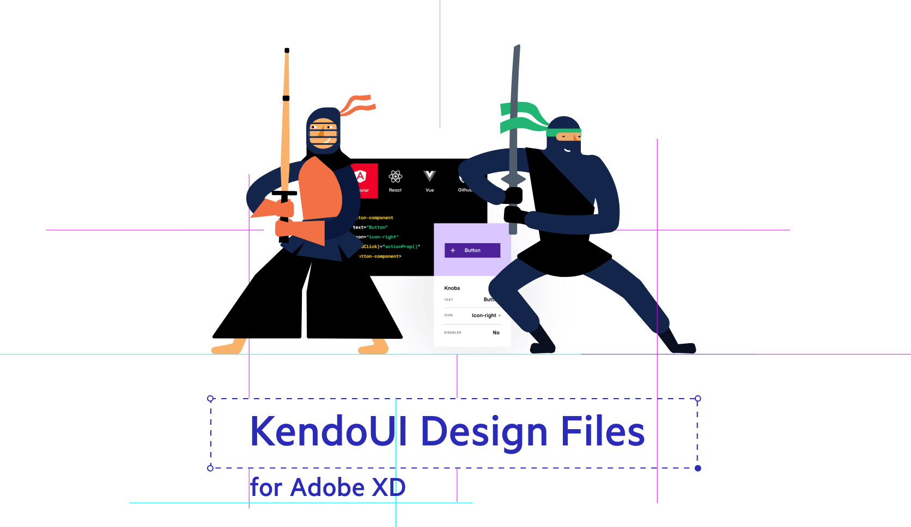
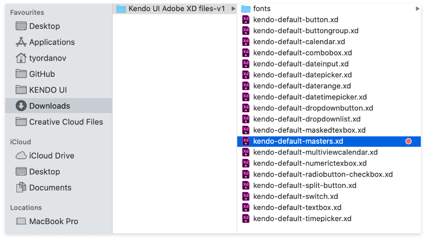
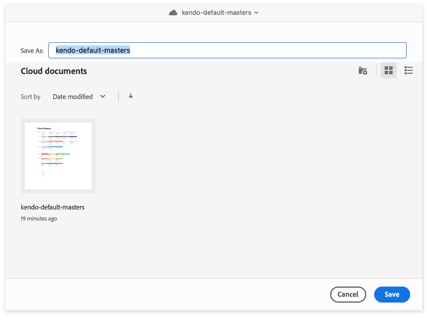
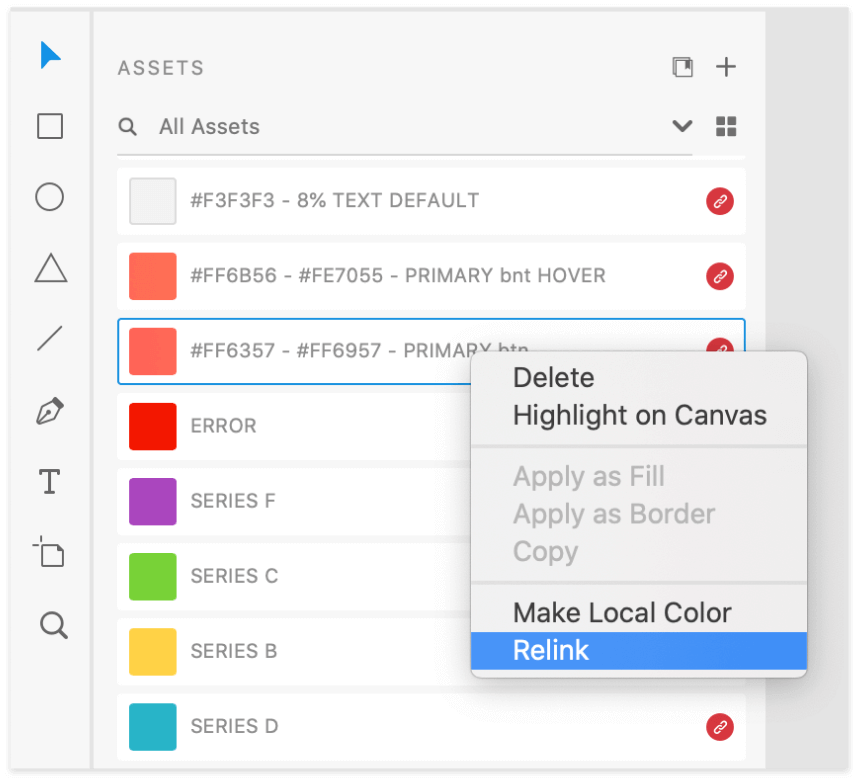
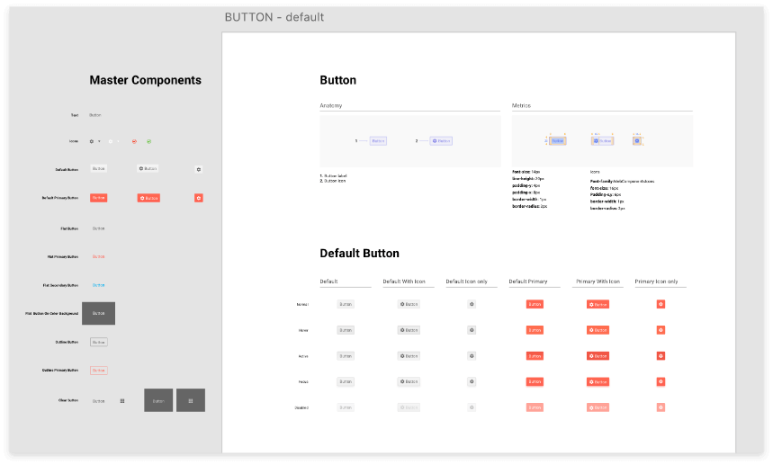
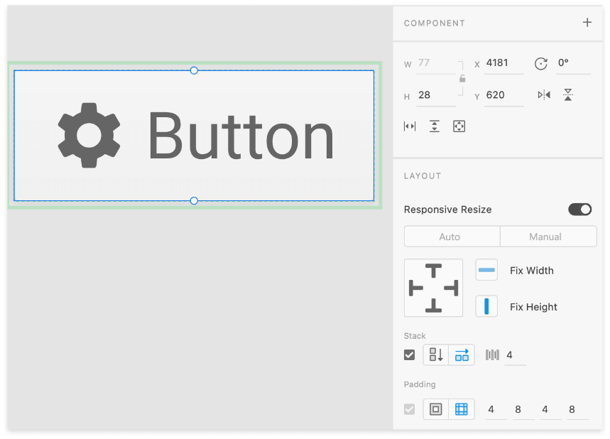
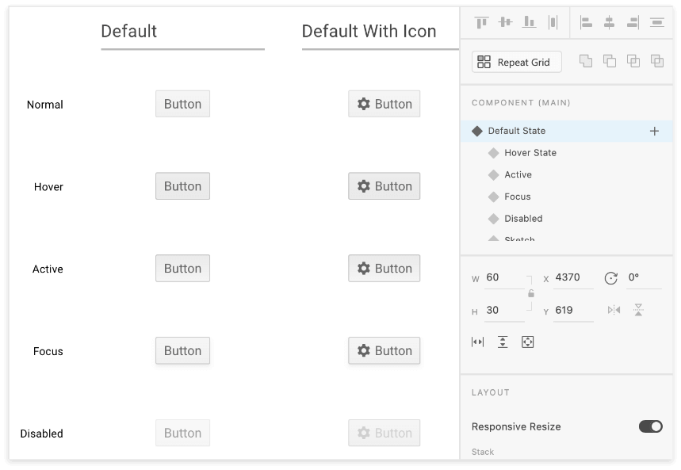
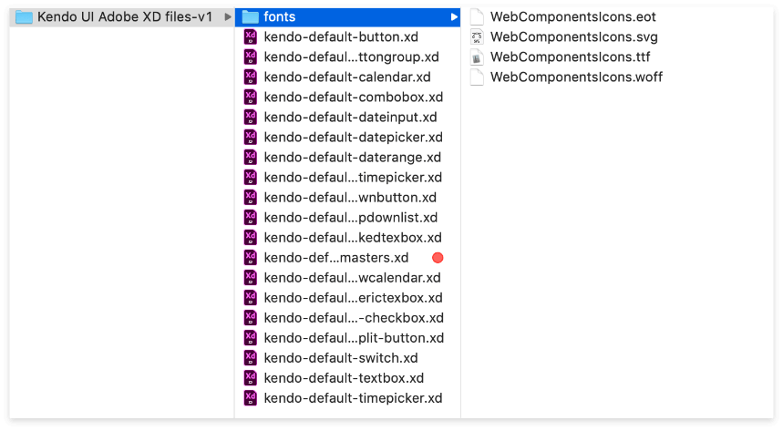

# Kendo UI Design files for Adobe XD

UX guidelines and components library working together to craft exceptional experiences.

**We provide Kendo UI components design building blocks for Adobe XD, to help designers, front-ends and developers collaborate efficiently.**

Kendo UI design files cover all Kendo flavours - Angular, React, Vue, jQuery.
The detailed anatomy, metrics and theming of the components will help you design better apps, be more productive and enable seamless handover to developers. To ensure perfect design implementation we provide Kendo UI default theme in the design resources, with ready-to-use components - all with typography, color swatches and metrics.

We’ve made the Adobe XD files to be intuitive to use and require no additional XD knowledge - just use the components in their corresponding states in your design and the developers will get the the exact same appearance out of the box from the Kendo UI framework.

## Adobe XD Design Files Download

Download the resources to help you design faster and implement with precision.

 [Download Kendo UI Design Files for Adobe XD](https://github.com/telerik/kendo-ux/tree/master/Kendo%20UI%20Design%20Filer%20for%20Adobe%20XD)

Download and navigate to **kendo-default-masters.xd** file.
This master file contains KendoUI colors, typography and the most used icons.

Open it and save it as a cloud document to your Adobe Creative Cloud account. Now the file is in your account and it’s ready to be used as a linked master file for all design files.

## Relink assets to master

Open a component file and relink the missing links to master file from your Adobe Creative Cloud account.

## File Layout

Each Kendo UI design file for Adobe XD, has an artboard containing the following elements:

 - **Component Anatomy**
 - **Component Metrics**
 - **Component Interaction States**

All master components are located outside the artboard area - in Adobe XD pasteboard.

## Component Architecture

Most of the components shares common structure:

 - **Component (parent)**
 - **Content**
 - **Component background**

The content folder is based on “stack” functionality of Adobe XD, and contains all nested child elements, like texts and icons.
Each of the elements could be toggled as shown/hidden from the layer panel.
The content group is also responsible for common padding metrics, creating the component size.

Content group is also responsible for main padding metrics.

## Component Interaction States

Component states are one of the most powerful feature of Kendo UI design files for Adobe XD.
You can just copy a component to your design layout and then change to the desired state (e.g. Hover, Active, etc.)

## Icon Font

In all components with icons, the “WebComponentsIcons” font is used. It is provided in the downloadable archive with Kendo UI design files for Adobe XD.

 [Download Kendo UI Design Files for Adobe XD](https://github.com/telerik/kendo-ux/tree/master/Kendo%20UI%20Design%20Filer%20for%20Adobe%20XD)

We’ll continue to release Adobe XD resources to fully cover the Kendo UI framework.
Please, use the form below, if you chose to leave your feedback and comments.
