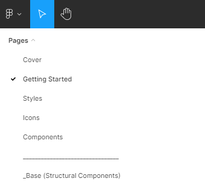
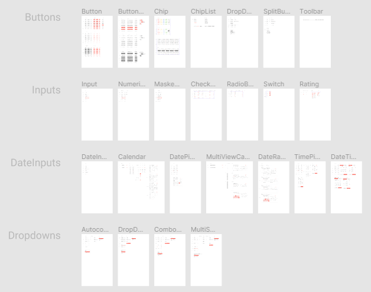

# Kendo UI Design Kits for Figma

Design files for Figma&mdash;building blocks for designers that match the Kendo UI jQuery components.

To enable efficient collaboration between designers and developers, we created three Kendo UI Kits for Figma: Material, Bootstrap, and Kendo Default. Each kit corresponds to one of the themes that ship with the Kendo UI jQuery components.

<a href="https://www.figma.com/@progress" class="track--download-kendoui" style="text-decoration:none; display: inline-flex;" title="Download Kendo UI Kits">
<button importance="ghost" style="display: flex;
                                -webkit-box-align: center;
                                align-items: center;
                                -webkit-box-pack: center;
                                justify-content: center;
                                outline: none;
                                cursor: pointer;
                                user-select: none;
                                border-radius: 2px;
                                font-weight: 500;
                                font-size: 18px;
                                line-height: 29px;
                                padding: 0.5rem 1rem;
                                background-color: transparent;
                                border: 2px solid rgba(148, 216, 255, 0.533);
                                color: rgb(101, 101, 101);">

Download Kendo UI Kits
</button>
</a>

These polished UI kits include pre-made, reusable design components that follow the [atomic design principles](https://atomicdesign.bradfrost.com/chapter-2/).

The design files represent more than 30 of the most used Kendo UI jQuery components in every possible state, their detailed anatomy, colors, metrics, and icons. All these elements enable the seamless handover of the design to the developers.

You are free to decide if or how much to customize the UI kits:

- You can use them as they are to create application designs.
- You can customize the colors in a way that matches your brand guidelines.
- You can use them as a starting point for your own unique design system.

## Why Use the Kendo UI Design Kits for Figma?

When you use the UI kits, you enjoy the following advantages:

- You don't need to research the Kendo UI jQuery components in advance: you don't need to know what components are available, how they are connected, what states they have. The UI kits include all this information.
- You can be sure that the developers will be able to match the Kendo UI jQuery components with your design requirements.
- You can quickly turn a template into a [shared Figma library](https://www.figma.com/best-practices/components-styles-and-shared-libraries/).

## Downloading the Kendo UI Design Kits

To download a Kendo UI Design Kit for Figma, navigate to the desired kit and follow the instructions on [duplicating a file from the Figma Community](https://help.figma.com/hc/en-us/articles/360038510873-Use-files-from-the-Community#Duplicate).

- [Kendo UI Kit for Material](https://www.figma.com/community/file/971704350762479492)
- [Kendo UI Kit for Bootstrap](https://www.figma.com/community/file/971704996235717509)
- [Kendo UI Kit Default](https://www.figma.com/community/file/971702824494731137)

## Exploring the UI Kits' Structure

The Kendo UI kits for Figma utilize [nested instances and base components](https://www.figma.com/best-practices/creating-and-organizing-variants/using-variants-effectively/) to provide better manageability of the components. To make them more intuitive to use, we added support for [variants](https://help.figma.com/hc/en-us/articles/360055471353-Prepare-for-variants) to some of the components, like the chip.

Each UI kit contains the following pages:

- **Cover**&mdash;The cover page of the UI kit.
- **Getting Started**&mdash;Briefly explains what you need to know to start using the UI kits.
- **Styles**&mdash;Contains all styles applied to the components: typography, colors, and effects. The changes that you apply to the frames in the **Styles** page will affect the components and their variants that use the specific style.
- **Icons**&mdash;Contains all icons in the form of convenient components.
- **Components**&mdash;Contains all components with all their variants.
- **\_Base (Structural Components)**&mdash;Contains the base components (building blocks). Most of the component states (normal, hover, active, etc.) and component types (e.g. solid, flat, etc.) share a common base component. Changes to a base component affect all individual components that use the same base components. For example, if you change the radius of `_Base Button`, you will change all button components that nest `_Base Button`.

Most pages contain multiple frames that group similar design assets.

## Customizing a Kendo UI Design Kit

The Kendo UI kits for Figma are flexible and fully customizable to your vision and needs. Furthermore, the UI Kits enable the scalability of the changes that you apply to the design. To propagate your changes to multiple component variants, you can:

- Customize the base components.
- Customize the typography, colors, and effects on the **Styles** page.

Changes that you apply to a single component variant on the **Components** page affect only the individual variant.

> Once you achieve the desired look, you can [publish the modified template as a library](https://help.figma.com/hc/en-us/articles/360041051154#h_b9cf5ead-791e-4ae2-9dd8-aded2fe54fe6).

## Choosing How to Use the UI Kits

Depending on your requirements, you can take advantage of three distinct levels of component customization:

1. Out-of-the-box components&mdash;You can use the UI kits as they are and start creating your application design by selecting [one of the available kits](#downloading-the-kendo-ui-design-kits). This is the fastest solution. Designers enjoy matching building blocks with the developers, seamless handover and implementation of the design.
1. Components with customized colors&mdash;You can modify the UI kits and apply colors that match your brand guidelines. The developers can use the [Theme Builder]() application to transfer the colors from the design to the Kendo UI jQuery components.
1. Unique design system&mdash;This is the highest possible customization level that has virtually no limits, and you can entirely change the look and feel of the components. You can use the UI kits as a base for your own unique design system. In case you need consultation or help with the implementation, [contact](https://www.telerik.com/services/ui-ux-design) with our solution experts who will help you plan, prototype, and build your design system.

## See Also

* [Getting Started with Kendo UI for jQuery]()
* [Sass ThemeBuilder Overview]()
* [Web Font Icons]()
* [Responsive Web Design]()
* [Web Font Icons]()
* [How to Change Themes on the Client]()
* [Rendering Modes for Data Visualization]()
* [Browse the Components](https://demos.telerik.com/kendo-ui/) 
