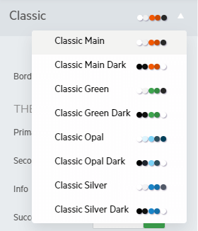

# Less to Sass Theme Migration

> R1 2023 is the last official release of Kendo jQuery, where Less Themes are supported and shipped with the product.

In this article you will learn how to migrate your project from a Less theme to its Sass counterpart. To find out if you are using a Less theme, check the Less section of the [How Do I Know If I Am Using a Less Theme](#how-do-i-know-if-i-am-using-a-less-theme) section.

For additional information about the Sass themes, visit the [Sass-Based Themes]() article.

## Why Do I Need to Migrate to a Sass Theme?

> The Less-based themes support only the default values of the new [Components Styling Options](#styling-options).

The Less-based themes will receive the new [styling options](#styling-options) like the Sass themes. However, in 2023 the Less themes will be officially deprecated. Customers who continue to use Less themes after their deprecation will not be able to take advantage of the latest visual updates, features, and bug fixes. Also, the 2023 and later Kendo UI versions will be incompatible with the Less themes and you won't be able to upgrade the product version either.

The reason behind the deprecation of the Less-based themes is that they take a tremendous amount of time and resources to be kept updated.

The Sass-based themes provide unique swatches that are based on the main theme and can be updated at once. This enables the timely design and color scheme changes of the components which, in turn, leaves more time for new themes and swatches to be developed.

With the Less-based themes, each individual theme has its own code base. Any time a component is updated or introduced, you must recreate each Less theme to ensure that the new addition is rendered without problems.

Ultimately, the goal behind these changes is to allow the team to focus on updating existing themes and creating new themes that have been requested by our clients.

## How Do I Know If I Am Using a Less Theme?

The easiest way to know if you are using the Less themes is if you are including multiple CSS files, specifically files that follow the following naming pattern:

- `kendo.common.min.css`
- `kendo.[theme-name].min.css`
- `kendo.mobile.min.css`
- `kendo.rtl.min.css`

If you aren’t using this combination and instead use a single CSS file like `kendo.default.min.css`, then you are using the Sass themes and you can skip the following section.

## How Do I Migrate to a Sass Theme?

The migration to a Sass theme is a straightforward process:

1. Remove the old Less theme references, for example:

   ```html
        <!-- The following styles are required for the Less Classic theme. -->
        <link rel="stylesheet" href="https://kendo.cdn.telerik.com/2022.1.119/styles/kendo.common.min.css" />
        <link rel="stylesheet" href="https://kendo.cdn.telerik.com/2022.1.119/styles/kendo.default.min.css" />
        <link rel="stylesheet" href="https://kendo.cdn.telerik.com/2022.1.119/styles/kendo.default.mobile.min.css" />
   ```

1. Add a reference to the Sass theme that you want to use, for example:

   ```html
        <!-- The following styles are required for the Sass Classic theme. -->
        <link rel="stylesheet" href="https://kendo.cdn.telerik.com/themes/{{ site.themesCdnVersion }}/default/default-main.css" />
   ```

With the new rendering of the components, some CSS classes will be deleted. If you use any of those classes to customize a component, you will have to update their references. Otherwise, the customizations will be lost.

## How Do I Know Which Sass Theme Corresponds to My Current Less Theme?

The Less themes have Sass swatch counterparts.



The following table contains the name of the Less theme and its Sass counterpart:

> The Bootstrap and Material Less themes will not have their own Sass swatches. Instead, use the dedicated Bootstrap and Material Sass themes.

> These are alternative variants to the LESS themes and they do not provide a one-to-one conversion, but a similar and improved look-and-feel.

| Less Theme   | Sass Theme Swatch | Status | Sass Theme CDN
|:---         |:---        |:---        |:---
| `Default` | `Classic - Main` | Available | https://kendo.cdn.telerik.com/themes/{{ site.themesCdnVersion }}/classic/classic-main.css |
| `Default Dark` | `Classic - Main Dark` | Available | https://kendo.cdn.telerik.com/themes/{{ site.themesCdnVersion }}/classic/classic-main-dark.css |
| `Black` | `Classic - Opal Dark` | Available | https://kendo.cdn.telerik.com/themes/{{ site.themesCdnVersion }}/classic/classic-opal-dark.css |
| `Blue Opal` | `Classic - Opal` | Available | https://kendo.cdn.telerik.com/themes/{{ site.themesCdnVersion }}/classic/classic-opal.css |
| `Silver` | `Classic - Silver` | Available | https://kendo.cdn.telerik.com/themes/{{ site.themesCdnVersion }}/classic/classic-silver.css |
| `Metro` | `Classic - Metro` | Available | https://kendo.cdn.telerik.com/themes/{{ site.themesCdnVersion }}/classic/classic-metro.css |
| `Metro Black` | `Classic - Metro Dark` | Available | https://kendo.cdn.telerik.com/themes/{{ site.themesCdnVersion }}/classic/classic-metro-dark.css |
| `Moonlight` | `Classic - Moonlight` | Available | https://kendo.cdn.telerik.com/themes/{{ site.themesCdnVersion }}/classic/classic-moonlight.css |
| `Uniform` | `Classic - Uniform` | Available | https://kendo.cdn.telerik.com/themes/{{ site.themesCdnVersion }}/classic/classic-uniform.css |
| `Bootstrap 3` | `Bootstrap - Bootstrap 3` | Available | https://kendo.cdn.telerik.com/themes/{{ site.themesCdnVersion }}/bootstrap/bootstrap-3-dark.css |
| `Bootstrap 3 Dark` | `Bootstrap - Bootstrap 3 Dark` | Available | https://kendo.cdn.telerik.com/themes/{{ site.themesCdnVersion }}/bootstrap/bootstrap-3-dark.css |
| `Flat` | `Bootstrap - Turquoise` | Available | https://kendo.cdn.telerik.com/themes/{{ site.themesCdnVersion }}/bootstrap/bootstrap-turquoise.css |
| `Flat Dark` | `Bootstrap - Turquoise Dark` | Available | https://kendo.cdn.telerik.com/themes/{{ site.themesCdnVersion }}/bootstrap/bootstrap-turquoise-dark.css |
| `Material` | `Material - Main` | Available | https://kendo.cdn.telerik.com/themes/{{ site.themesCdnVersion }}/material/material-main.css |
| `Material Black` | `Material - Main Dark` | Available | https://kendo.cdn.telerik.com/themes/{{ site.themesCdnVersion }}/material/material-main-dark.css |
| `Nova` | `Material - Nova` | Available | https://kendo.cdn.telerik.com/themes/{{ site.themesCdnVersion }}/material/material-nova.css |
| `Office 365` | `Fluent - Main` | Available | https://kendo.cdn.telerik.com/themes/{{ site.themesCdnVersion }}/fluent/fluent-main.css |
| `High Contrast` | N/A | In Research | TBA |
| `Fiori` | N/A | Needs Validation | N/A |

The following example demonstrates how to add a theme to your project. Note that you have to add the snippet to the `head` element of the page.

```html
<link rel="stylesheet" href="https://kendo.cdn.telerik.com/themes/{{ site.themesCdnVersion }}/classic/classic-main.css" />
```

## Which Styling Options Are Available for the Less Themes?

The Less-based themes support only the default values of the new [Components Styling Options](#styling-options). To utilize the full potential of the new rendering of the components, you must use a Sass-based theme or a swatch.

## See More

* [Styling Overview Article]()
* [Sass-Based Themes Article]()
