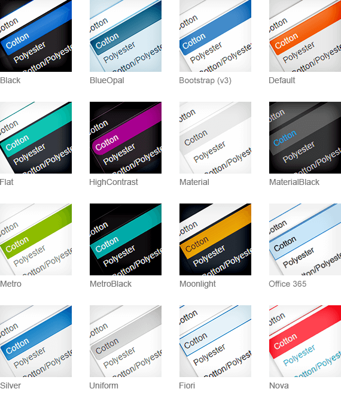
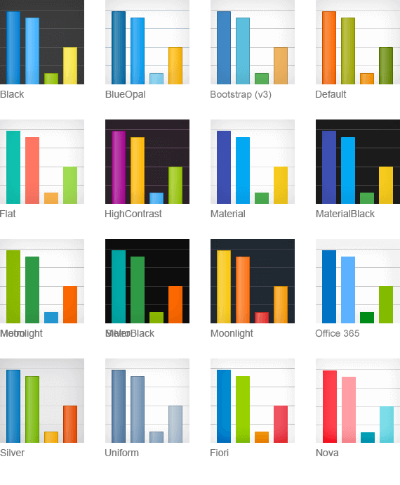

# Overview

> * R1 2023 is the last official release of Kendo jQuery, where Less Themes are supported and shipped with the product.
> * The Less-based themes support only the default value of the [Size styling option](#size).
> * As of 2022 R1, components receive the default value for the [Rounded styling option](#rounded) through the `k-rounded-md` class. Check the [Backwards Compatibility section](#backwards-compatibility) for more details.

The appearance of the Kendo UI widgets entirely depends on styles defined by the applied CSS classes. The controls use no inline styles except for some very specific cases where you must set these styles with JavaScript and depending on the browser or configuration.



## Adding a Theme to Your Project

Setting a Kendo UI theme for any of the Kendo UI widgets, such as the [Kendo UI Grid](https://demos.telerik.com/kendo-ui/grid/index) or [Kendo UI Bar Chart](https://demos.telerik.com/kendo-ui/bar-charts/index), requires you to include the following two stylesheets to your project:

* `kendo.common.css`&mdash;This is a common (base) stylesheet. It applies styles related to element positioning and widget dimensions. It is a must for the widgets to look and function in a proper way.
* `kendo.[theme].css`&mdash;This stylesheet applies theme-specific styles such color palette, background gradients and patterns, etc.

The following example demonstrates how to include the stylesheets to your project:

```html
    <html>
    <head>
        <link rel="stylesheet" href="[file path]/kendo.common.min.css" />
        <link rel="stylesheet" href="[file path]/kendo.default.min.css" />
    </head>
```

> * You must register the common CSS file before the theme CSS file because the theme CSS file may need to override common styles through selectors with the same CSS specifics.
> * On the page and at any given time, you need to register only one pair of common and theme CSS files.

The following example demonstrates how to include the default Less theme by using the Kendo CDN:

```html
    <link rel="stylesheet" href="https://kendo.cdn.telerik.com/2022.2.510/styles/kendo.common.min.css">
    <link rel="stylesheet" href="https://kendo.cdn.telerik.com/2022.2.510/styles/kendo.rtl.min.css">
    <link rel="stylesheet" href="https://kendo.cdn.telerik.com/2022.2.510/styles/kendo.default.min.css">
    <link rel="stylesheet" href="https://kendo.cdn.telerik.com/2022.2.510/styles/kendo.mobile.all.min.css">
```

## Widgets for Data Visualization

The Kendo UI Gauges, Charts, Barcodes, Diagrams, and Maps use a mix of browser technologies to attain the required precision and responsiveness. Visualization is rendered as vector graphics with computed layout. In contrast, interactive features are built by using traditional HTML elements. As a result, the appearance settings of these widgets are split between declarative options and traditional CSS.

The following example demonstrates how to define a theme for a Kendo UI Chart.

    $("#chart").kendoChart({
        theme: "material"
        ...
    });



## Common CSS Files

Some themes require a different common (base) stylesheet that applies different dimensions. Kendo UI ships the following `common` stylesheets:

| CSS Files   | Contents and Application |
|:---         |:---                     |
| `kendo.common.css`                | The default base stylesheet. Required by the majority of the Kendo UI themes. |
| `kendo.common-bootstrap.css`      | The base stylesheet for the Bootstrap (v3) theme. Use this file instead of `kendo.common.css` and only with `kendo.bootstrap.css` theme file to achieve Bootstrap-like widget dimensions. |
| `kendo.common-material.css`       | The base stylesheet for the Material and MaterialBlack themes. Use this file instead of `kendo.common.css` and only with `kendo.material.css` or `kendo.materialblack.css` theme files. |
| `kendo.common-nova.css`           | The base stylesheet for the Nova theme. Use this file instead of `kendo.common.css` and only with `kendo.nova.css`. |
| `kendo.common-fiori.css`          | The base stylesheet for the Fiori theme available in the enterprise bundles of Kendo UI. Use this file instead of `kendo.common.css` and only with `kendo.fiori.css`. |
| `kendo.common-office365.css`      | The base stylesheet for the Office365 theme available in the enterprise bundles of Kendo UI. Use this file instead of `kendo.common.css` and only with `kendo.office365.css`. |

## Theme-Related Folders

Apart from the common stylesheet and theme stylesheet, you must make the following folders available in your application.

* `/ThemeName/`&mdash;This is the folder, which contains all images required by the used Kendo UI theme. The folder name matches the theme name, e.g. `Default`, `Bootstrap`, `Silver`, etc. The theme image folders for unused themes can be removed.
* `/fonts/`&mdash;This is where the `KendoUIGlyphs` and `DejaVu` font files reside. The `KendoUIGlyphs` font describes the Kendo UI font icons used by the web widgets. The `DejaVu` font is used by default during [PDF export]().
* `/images/`&mdash;This where the Kendo UI font icons for the mobile widgets reside.
* `/textures/`&mdash;This is where some fallback theme images are stored for browsers that do not support the CSS3 linear gradients.

## Browser-Specific CSS

While most of the CSS code is cross-browser compatible, some layouts require different styles for different browsers. Kendo UI targets specific browsers by adding browser-specific classes to the document root element instead of relying on CSS parsing hacks.

The example below demonstrates how to take advantage of these classes.

    .k-ie { /* styles to be applied to all versions of Internet Explorer */ }
    .k-ie9 { /* styles to be applied to IE9 only */ }
    .k-ff { /* styles to be applied to all versions of Firefox */ }

The syntax of the generated classes is `k-[browser] k-[browser][majorVersion]`.

## Primitives

The Kendo UI widgets use primitives, meaning that different HTML elements in different widgets use the same CSS classes to provide a level of abstraction and allow common styling. To learn how to modify the primitives, check the [Overriding Primitives](#overriding-primitives) section in the customization documentation.

You can use some CSS classes to apply borders and background colors to containers&mdash;for example, `k-info-colored`, `k-success-colored`, and `k-error-colored`. For more examples, refer to the [StylingPanels demo](https://demos.telerik.com/kendo-ui/styling/panels).

### Common CSS Classes

| CSS Class   | Behavior  |
|:---         |:---       |
| `k-widget`  | The class is applied to the widget wrapper to set a border, text and background color. In addition to `k-widget`, every widget has its own specific CSS class, such as `k-menu`, `k-panelbar`, `k-tabstrip`, etc.|
| `k-header`  | Applied to Grid headers, Menu top level items, PanelBar top level items, TabStrip items, and DropDownLists to set a background image and a background color. |
| `k-link`    | Applied to hyperlinks and clickable text items to set a text color.|
| `k-button`  | Applied to elements that are expected to look like push buttons. The class sets a text color, background color, background image, and hover styling. This is the recommended class for styling form buttons.|
| `k-input`   | Applied to textboxes inside input widgets like ComboBox and AutoComplete to set border, text and background color.|
| `k-textbox` | Same as `k-input`, but used for standalone (generic) `input` elements that are not part of a widget. This is the recommended class for styling form `input` elements as it provides the same look, height, and vertical alignment as the Kendo UI input widgets.|
| `k-checkbox`| Applied to checkboxes inside the TreeView widget, when checkboxes are enabled for it.|
| `k-group` and `k-content`| Applied to various containers to set a background and border color. |
| `k-popup`   | Applied to popup containers that are detached from their opener component and are placed in the `body` element. |
| `k-icon` and `k-sprite`| Applied to elements that display part of a sprite image as background to initialize their dimensions. |
| `k-image`   | Applied to inline images to set their dimensions. |
| `k-item`    | Applied to various repeating widget items, for example, Menu, TabStrip, TreeView, PanelBar, ComboBox, DropDownList, etc. This CSS class does not apply any particular global styles and sports `display: block`.|
| `k-first` and `k-last` | Set on the first and the last `k-item` respectively, where a special type of styling is needed, for example, rounded corners and removing borders. |

### The k-state Classes

The appearance of a component may well depend on its state, which is also tied to CSS classes.

| `k-state` Class   | Behavior  |
|:---               |:---       |
| `k-state-default` | This class is applied on items to set their default appearance background and colors. |
| `k-state-hover`   | Set to items when they are hovered to apply their hovered look. |
| `k-state-focused` | Applied on focused, mostly `input` elements and the DropDownList. |
| `k-state-active`  | Set on activated `k-link` elements. |
| `k-state-selected`| Set to selected items to apply their selected look like in the PanelBar and TabStrip. |
| `k-state-disabled` | Applied to disabled items. |
| `k-state-error`   | Can be used with form fields that have an invalid value. |

## Backwards Compatibility

This section includes issues related to the Kendo UI backwards compatibility. 

### Rounded Components with the High Contrast Theme

As of 2022 R1, the [default rounded value](#styling-options) of the components is set to `medium`.

To revert back to the previous border-radius (9999px) value, use any of the following approaches:

* Set the `rounded` option of the component to `full`:

```html
    <button type="button" class="k-button k-rounded-full">
        <span class="k-button-text">Text</span>
    </button>
```
   
* If you are using widget initialization:

```dojo
    <button id="roundedButton"></button>

    <script>
        $("#roundedButton").kendoButton({
            rounded: "full"
        });
    </script>
```

* Override the `.k-rounded-md` class:

```css
    .k-rounded-md { /* Global rule */
        border-radius: 9999px !important!
    }
    
    .k-button.k-rounded-md { /* Scoped rule */
        border-radius: 9999px !important!
    }
```

## See Also

* [Sass Themes Overview]()
* [Web Font Icons]()