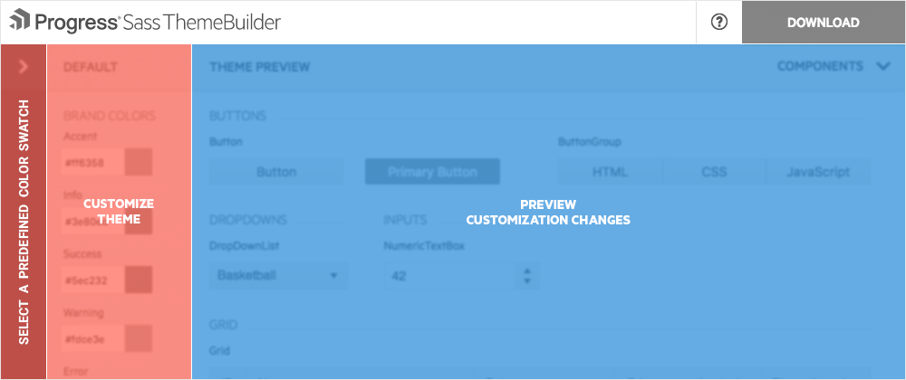
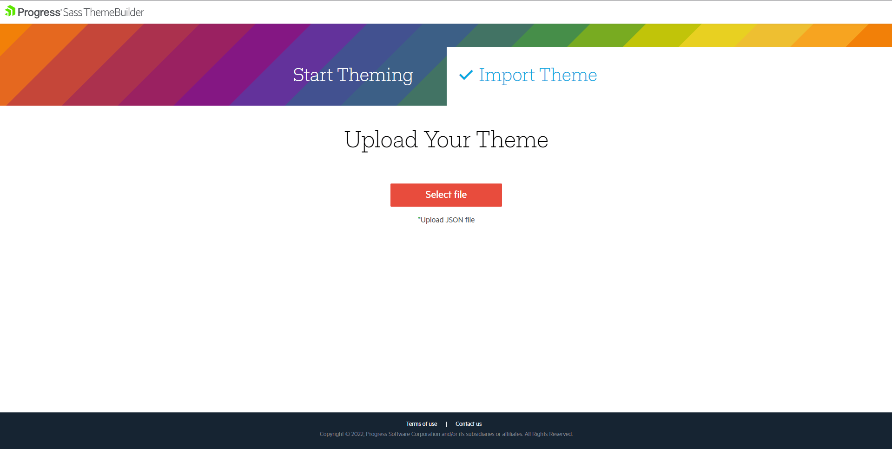

# SASS-Based Themes

As of the R1 2017 release, the Kendo UI distribution includes SASS-based themes.

Currently, Kendo UI delivers a single SASS theme. This is the **Default v2** theme which is a modern update of the Kendo UI Default theme. The work on revamping the Kendo UI Bootstrap theme has also started and the new theme is soon expected to be available.

## Overview

Apart from being written in a different language, the SASS-based themes are slightly different from the LESS-based ones. This article outlines those differences and shows how you can use the SASS-based themes.

> **Important**  
>
> Sass based themes utilize some CSS features that are not supported by Internet Explorer 10 and earlier:
>
> * flexbox layout (not supported in IE 10 and earlier)
> * CSS gradients (not supported in IE 9 and earlier)
> * Web Open Font Format (not supported in IE 8 and earlier)
> * Border radius (not supported in IE 8 and earlier)
> * Alpha transparency colors (not supported in IE 8 and earlier)

## Differences

In Kendo UI, the SASS-based themes demonstrate the following differences from the LESS-based ones:

- Each SASS-based theme is represented by a single CSS file that combines the layout and the themes of the components. As a result, you do not need to match a theme with its common file.
- Based on the widget you work with, the SASS-based themes can build a part of the widget theme in a similar way the Download Builder trims unused scripts.
- The SASS-based themes are available on NPM. Each theme is stored as an NPM package and can be easily upgraded.
- Each SASS-based theme is compatible with the [Kendo UI components for Angular 2](http://www.telerik.com/kendo-angular-ui/). This enables you to port parts of your application to Angular 2 while maintaining their styling.

## Getting the Themes

To get the SASS-based Kendo UI themes, you can:

* Use the pre-build CSS files.
* Use the NPM packages.

### Using Pre-Built CSS

To get a complete theme by using its pre-built CSS files, apply either of the following approaches:

- Use the CSS files that are shipped with the Kendo UI distribution. For example, the **Default v2** theme is distributed as `styles/kendo.default-v2.min.css`.
- Use the NPM package which contains a pre-built `dist/all.css` CSS file for the theme. For more information on how to obtain the NPM package, refer to the following section on using NPM packages.

### Using NPM Packages

The Kendo UI SASS-based themes are located on the Progress NPM registry:

* **Kendo UI Default Theme**&mdash;Available as @progress/kendo-theme-default.
* **Kendo UI Bootstrap Theme**&mdash;Available as @progress/kendo-theme-bootstrap.

To access the Progress NPM registry, you need an active Telerik account with an active commercial license. For more information on how to access the NPM registry, refer to the [installation instructions for Kendo UI Professional](#kendo-ui-professional).

## Customizing the Themes

To customize a SASS-based theme, create a `.scss` file and consume the theme package in the following way:

1. Obtain the theme source through the NPM package.

        npm install @progress/kendo-theme-default

2. Create a `.scss` file that will consume the theme. For the purposes of the this example, this is `styles.scss`.

3. To build the theme files, import them into the file.

        @import "node_modules/@progress/kendo-theme-default/scss/all";

   To include the styles of specific widgets, use their names in the path.

        @import "node_modules/@progress/kendo-theme-default/scss/grid";
        @import "node_modules/@progress/kendo-theme-default/scss/treeview";

4. To customize the variables that are used in the theme, change the theme before you import the theme files.

        $accent: #E82C0C; // brand color

        @import "node_modules/@progress/kendo-theme-default/scss/all";

5. Build the `styles.scss` file through a SASS compiler. For example, use `node-sass`.

        node-sass styles.scss styles.css

### Variables

The following list describes the theme variables available for adjustment in the Kendo UI Default theme.

#### Common

<table class="theme-variables">
<colgroup>
<col style="white-space:nowrap; width: 200px" />
<col style="width: 250px" />
<col />
</colgroup>
<tr>
<th>Name</th>
<th>Default value</th>
<th>Description</th>
</tr>
<tr>
<td>$font-size</td>
<td>

    14px
</td>
<td>Base font size across all components.
</td>
</tr>
<tr>
<td>$font-family</td>
<td>

    inherit
</td>
<td>Font family across all components.
</td>
</tr>
<tr>
<td>$font-family-monospace</td>
<td>

    Consolas, "Ubuntu Mono", "Lucida Console", "Courier New", monospace
</td>
<td>Font family for monospaced text. Used for styling the code.
</td>
</tr>
<tr>
<td>$line-height</td>
<td>

    (20 / 14)
</td>
<td>Line height used along with $font-size.
</td>
</tr>
<tr>
<td>$border-radius</td>
<td>

    2px
</td>
<td>Border radius for all components.
</td>
</tr>
<tr>
<td>$accent</td>
<td>
    
    #ff6358
</td>
<td>The color that focuses the user attention. 
Used for primary buttons and for elements of primary importance across the theme.
</td>
</tr>
<tr>
<td>$accent-contrast</td>
<td>
    
    #ffffff
</td>
<td>The color used along with the accent color denoted by $accent. 
Used to provide contrast between the background and foreground colors.
</td>
</tr>
<tr>
<td>$base-text</td>
<td>
    
    #656565
</td>
<td>The text color of the components' chrome area.
</td>
</tr>
<tr>
<td>$base-bg</td>
<td>
    
    #f6f6f6
</td>
<td>The background of the components' chrome area.
</td>
</tr>
<tr>
<td>$base-border</td>
<td>

    rgba( black, .08 )
</td>
<td>The border color of the components' chrome area.
</td>
</tr>
<tr>
<td>$base-gradient</td>
<td>

    $base-bg, darken( $base-bg, 2% )
</td>
<td>The gradient background of the components' chrome area.
</td>
</tr>
<tr>
<td>$hovered-text</td>
<td>
    
    #656565
</td>
<td>The text color of hovered items.
</td>
</tr>
<tr>
<td>$hovered-bg</td>
<td>
    
    #ededed
</td>
<td>The background of hovered items.
</td>
</tr>
<tr>
<td>$hovered-border</td>
<td>

    rgba( black, .15 )
</td>
<td>The border color of hovered items.
</td>
</tr>
<tr>
<td>$hovered-gradient</td>
<td>

    $hovered-bg, darken( $hovered-bg, 2% )
</td>
<td>The gradient background of hovered items.
</td>
</tr>
<tr>
<td>$selected-text</td>
<td>

    $accent-contrast
</td>
<td>The text color of selected items.
</td>
</tr>
<tr>
<td>$selected-bg</td>
<td>

    $accent
</td>
<td>The background of selected items.
</td>
</tr>
<tr>
<td>$selected-border</td>
<td>

    rgba( black, .1 )
</td>
<td>The border color of selected items.
</td>
</tr>
<tr>
<td>$selected-gradient</td>
<td>

    none
</td>
<td>The gradient background of selected items.
</td>
</tr>
<tr>
<td>$error</td>
<td>
    
    #f5503e
</td>
<td>The color for error messages and states.
</td>
</tr>
<tr>
<td>$warning</td>
<td>
    
    #fdce3e
</td>
<td>The color for warning messages and states.
</td>
</tr>
<tr>
<td>$success</td>
<td>
    
    #5ec232
</td>
<td>The color for success messages and states.
</td>
</tr>
<tr>
<td>$info</td>
<td>
    
    #3e80ed
</td>
<td>The color for informational messages and states.
</td>
</tr>
</table>

#### Buttons

<table class="theme-variables">
<colgroup>
<col style="white-space:nowrap; width: 200px" />
<col style="width: 250px" />
<col />
</colgroup>
<tr>
<th>Name</th>
<th>Default value</th>
<th>Description</th>
</tr>
<tr>
<td>$button-text</td>
<td>

    $base-text
</td>
<td>The text color of the buttons.
</td>
</tr>
<tr>
<td>$button-bg</td>
<td>

    $base-bg
</td>
<td>The background of the buttons.
</td>
</tr>
<tr>
<td>$button-border</td>
<td>

    $base-border
</td>
<td>The border color of the buttons.
</td>
</tr>
<tr>
<td>$button-gradient</td>
<td>

    $base-gradient
</td>
<td>The background gradient of the buttons.
</td>
</tr>
<tr>
<td>$button-hovered-text</td>
<td>

    $hovered-text
</td>
<td>The text color of hovered buttons.
</td>
</tr>
<tr>
<td>$button-hovered-bg</td>
<td>

    $hovered-bg
</td>
<td>The background of hovered buttons.
</td>
</tr>
<tr>
<td>$button-hovered-border</td>
<td>

    $hovered-border
</td>
<td>The border color of hovered buttons.
</td>
</tr>
<tr>
<td>$button-hovered-gradient</td>
<td>

    $hovered-gradient
</td>
<td>The background gradient of hovered buttons.
</td>
</tr>
<tr>
<td>$button-pressed-text</td>
<td>

    $selected-text
</td>
<td>The text color of pressed buttons.
</td>
</tr>
<tr>
<td>$button-pressed-bg</td>
<td>

    $selected-bg
</td>
<td>The background color of pressed buttons.
</td>
</tr>
<tr>
<td>$button-pressed-border</td>
<td>

    $selected-border
</td>
<td>The border color of pressed buttons.
</td>
</tr>
<tr>
<td>$button-pressed-gradient</td>
<td>

    none
</td>
<td>The background gradient of pressed buttons.
</td>
</tr>
<tr>
<td>$button-focused-shadow</td>
<td>

    0 3px 4px 0 rgba(0, 0, 0, .06)
</td>
<td>The shadow of focused buttons.
</td>
</tr>
</table>

#### Charts

<table class="theme-variables">
<colgroup>
<col style="white-space:nowrap; width: 200px" />
<col style="width: 250px" />
<col />
</colgroup>
<tr>
<th>Name</th>
<th>Default value</th>
<th>Description</th>
</tr>
<tr>
<td>$series-a</td>
<td>
    
    #ff6358
</td>
<td>The color of the first series.
</td>
</tr>
<tr>
<td>$series-b</td>
<td>
    
    #ffd246
</td>
<td>The color of the second series.
</td>
</tr>
<tr>
<td>$series-c</td>
<td>
    
    #78d237
</td>
<td>The color of the third series.
</td>
</tr>
<tr>
<td>$series-d</td>
<td>
    
    #28b4c8
</td>
<td>The color of the fourth series.
</td>
</tr>
<tr>
<td>$series-e</td>
<td>
    
    #2d73f5
</td>
<td>The color of the fifth series.
</td>
</tr>
<tr>
<td>$series-f</td>
<td>
    
    #aa46be
</td>
<td>The color of the sixth series.
</td>
</tr>
<tr>
<td>$chart-major-lines</td>
<td>

    rgba(0, 0, 0, .08)
</td>
<td>The color of the Chart grid lines (major).
</td>
</tr>
<tr>
<td>$chart-minor-lines</td>
<td>

    rgba(0, 0, 0, .04)
</td>
<td>The color of the Chart grid lines (minor).
</td>
</tr>
</table>

#### Toolbar

<table class="theme-variables">
<colgroup>
<col style="white-space:nowrap; width: 200px" />
<col style="width: 250px" />
<col />
</colgroup>
<tr>
<th>Name</th>
<th>Default value</th>
<th>Description</th>
</tr>
<tr>
<td>$toolbar-padding-x</td>
<td>

    $padding-x
</td>
<td>The horizontal padding of the container.
</td>
</tr>
<tr>
<td>$toolbar-padding-y</td>
<td>

    $padding-x
</td>
<td>The vertical padding of the container.
</td>
</tr>
</table>

### Mixins

#### `exports`

Outputs a module once, no matter how many times it is included.

##### Parameters
- `name: String`&mdash;The name of the exported module.

### Contribution

To contribute to the development of the Kendo UI Default Theme, refer to the [telerik/kendo-theme-default](https://github.com/telerik/kendo-theme-default) GitHub repository it is stored in.

## Sass Theme Builder

[**Progress Sass Theme Builder**](http://themebuilder.telerik.com/aspnet-mvc) for Kendo UI is an Angular web application that enables you to create new or customize existing themes.

The tool renders the same look and feel as the look and feel of all other components in the suite. It also delivers full control over the skin elements of each component and automatically updates its composite units. After you create the skin and achieve the desired look of the theme, the Sass Theme Builder enables you to download and integrate it in your project.  

**Figure 1: A preview of the Sass Theme Builder**

### Creating New Themes

To create a new theme:

1. On the initial Sass Theme Builder pane, select the **Start Theming** option.
1. Choose one of the existing skins to use as a base. The currently available built-in skins are **Default** and **Bootsrap**.

    **Figure 2: Selecting a base theme**

    

### Customizing Existing Themes

The Sass Theme Builder supports the following options for customization:

* Color pickers which customize the appearance of the components.
* The **Apply changes instantly** option which enables you to observe the changes on the fly.
* Manual updates of each component element.
* Utilization of predefined color swatches.

#### Functionalities for Customization

To customize an existing theme, use the following Sass Theme Builder functionalities:

1. **Color Swatches**&mdash;Contains predefined color palettes that you can apply to all components in your application.
1. **Default**&mdash;Provides the applicable color customization options.
1. **Preview Components**&mdash;Keeps the main view of the components. It reflects the customization changes you make each time you add or remove theme elements.
1. **Download**&mdash;Downloads the archive that holds the generated style files after the customization completes. When you click the button, a dialog appears and prompts you to name your theme.

**Figure 3: Available options for customization**

#### Importing the Themes

To upload an existing theme you have previously created:

1. On the initial Sass Theme Builder pane, select **Import Theme**.
1. Upload the `variables.scss` file which contains your current modifications of the customized theme. As a result, the selected components and styling elements load.
1. Start [customizing your theme](#customizing-existing-themes).

**Figure 4: Importing themes for customization**

### Adding the Themes to Your Project

When you complete the modifications and the theme is ready to be used:

1. Download the theme as a compact archive by clicking the **Download** button.
1. Add the newly created `Theme` folder to your application.
1. Include the `all.css` file in the `head` tag of your HTML document.

> **Important**  
>
> Avoid referencing the `kendo.common.min.css` and `kendo.rtl.min.css` files because the exported CSS file contains all styles you need.

## See Also

Other articles on styling, appearance, and rendering of Kendo UI widgets:

* [Less ThemeBuilder Overview](#less-theme-builder)
* [Responsive Web Design]()
* [Web Font Icons]()
* [How to Change Themes on the Client]()
* [Less ThemeBuilder Overview](#theme-builder)
* [Rendering Modes for Data Visualization]()
* [Troubleshooting]()
* [Themes and Appearance of the Kendo UI Hybrid Widgets](/controls/hybrid/styling)
