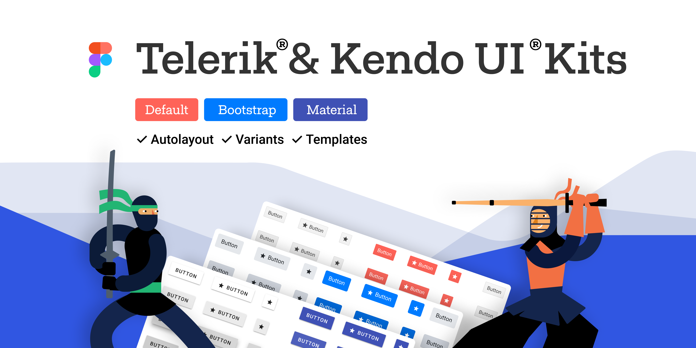
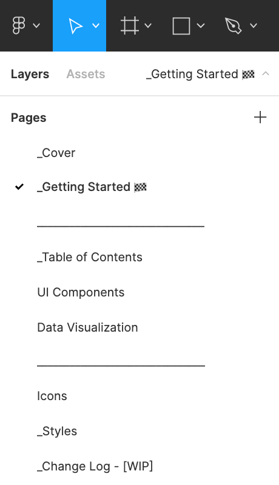
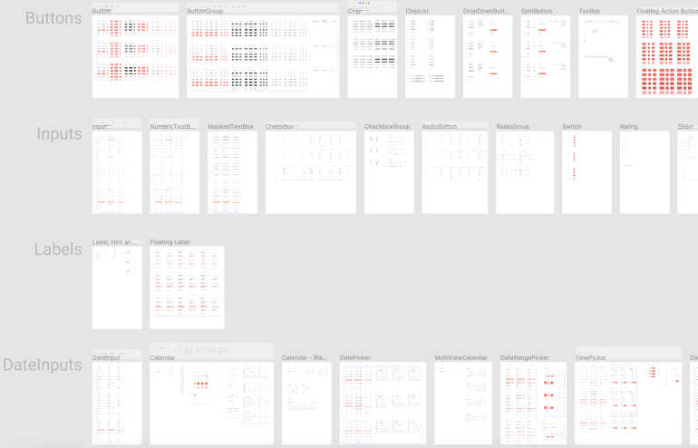

# Kendo UI Design Kits for Figma

The design files for Figma are the building blocks for designers that match the Kendo UI jQuery components.

To support the efficient collaboration between designers and developers, Progress provides four Kendo UI Kits for Figma: Material, Bootstrap, Fluent, and Kendo Default. Each UI kit corresponds to one of the themes that ship with the Kendo UI jQuery components.

<a href="https://www.figma.com/@progress" class="track--download-kendoui" style="text-decoration:none; display: inline-flex;" title="Download Kendo UI Kits">
<button importance="ghost" style="display: flex;
                                max-height: 50px;
                                -webkit-box-align: center;
                                align-items: center;
                                -webkit-box-pack: center;
                                justify-content: center;
                                outline: none;
                                cursor: pointer;
                                user-select: none;
                                border-radius: 2px;
                                font-weight: 500;
                                font-size: 18px;
                                line-height: 29px;
                                padding: 0.5rem 1rem;
                                background-color: transparent;
                                border: 2px solid rgba(148, 216, 255, 0.533);
                                color: rgb(101, 101, 101);">

Download Kendo UI Kits
</button>
</a>

These polished UI kits include pre-made, reusable design components that follow the [atomic design principles](https://atomicdesign.bradfrost.com/chapter-2/).

The design files represent the Kendo UI jQuery components in every possible state, their detailed anatomy, colors, metrics, and icons. All these elements enable the seamless hand-over of the design to the developers.

You are free to decide if or how much to customize the UI kits:

- You can use them as they are to create application designs.
- You can customize the colors in a way that matches your brand guidelines.
- You can use them as a starting point for your own unique design system.

## Why Use the UI Kits?

When you use the UI kits, you enjoy the following advantages:

- You don't need to research the Kendo UI jQuery components in advance: you don't need to know what components are available, how they are connected, what states they have. The UI kits include all this information.
- You can be sure that the developers will be able to match the Kendo UI jQuery components with your design requirements.
- You can quickly turn a template into a [shared Figma library](https://www.figma.com/best-practices/components-styles-and-shared-libraries/).

## Downloading the UI Kits

To download the Kendo UI Kits for Figma, navigate to the desired kit and follow the instructions on [duplicating a file from the Figma Community](https://help.figma.com/hc/en-us/articles/360038510873-Use-files-from-the-Community#Duplicate).

- [Telerik & Kendo UI Kit for Material](https://www.figma.com/community/file/971704350762479492)
- [Telerik & Kendo UI Kit for Bootstrap](https://www.figma.com/community/file/971704996235717509)
- [Telerik & Kendo UI Kit Default](https://www.figma.com/community/file/971702824494731137)
- [Telerik & Kendo UI Kit for MS Fluent](https://www.figma.com/community/file/1174728993763737426)

## Exploring the UI Kits' Structure

The Telerik & Kendo UI kits for Figma utilize [nested instances and base components](https://www.figma.com/best-practices/creating-and-organizing-variants/using-variants-effectively/) to provide better manageability of the components. To make them more intuitive to use, we added support for [variants](https://help.figma.com/hc/en-us/articles/360055471353-Prepare-for-variants) to some of the components, like the chip.

Each UI Kit for Figma contains the following pages, most of which provide multiple frames that group similar design assets:

* **_Cover**&mdash;The cover page of the UI kit.
* **_Getting Started**&mdash;Briefly explains what you need to know to start using the UI kits.
* **_Table of Contents**&mdash;An index with hyperlinks that you can use to quickly navigate within the UI kits.
* **UI Components**&mdash;Contains all components and their variants.
* **Data Visualization**&mdash;Contains visual equivalents of all charts supported by the Kendo UI web component libraries.
* **Icons**&mdash;Contains all icons in the form of convenient components.
* **_Styles**&mdash;An informational page with all styles that are applied to the components, such as typography, colors, and effects.
* **_Change Log**&mdash;A list with the changes in the UI kit.

Most pages contain multiple frames that group similar design assets.

## Customizing the UI Kits

The Kendo UI Kits for Figma are flexible and fully customizable to your vision and needs. Also, the UI kits enable the scalability of the changes that you apply to the design.

To achieve the highest impact and to propagate your changes to multiple components and variants, customize the components on the **_Base** frames of the **UI Components** page.

> Once you achieve the desired look, you can [publish the modified template as a library](https://help.figma.com/hc/en-us/articles/360041051154#h_b9cf5ead-791e-4ae2-9dd8-aded2fe54fe6).

## Upgrading to Newer Versions

To upgrade to newer versions of the UI kits while keeping your styles, download the free <a href="https://www.figma.com/community/plugin/1047874318864404919/InstaRelinker" target="_blank">InstaRelinker tool</a> that is available as a plugin in the Figma community. With this tool, you won’t have to manually swap instances and replace remote with local styles.

The InstaRelinker plugin enables you to re-link nested remote instances and styles within selected local main components to their local equivalents. When the plugin runs, it scans the current Figma file for local main components and automatically re-links any remote instances with names that match a local main component. If the plugin doesn't find a match, it allows you to manually select the local main component for each remote instance and re-link it. The InstaRelinker applies the same process for remote styles.

## Choosing How to Use the UI Kits

Depending on your requirements, you can take advantage of three distinct levels of component customization:

1. Out-of-the-box components&mdash;You can use the UI kits as they are and start creating your application design by selecting [one of the available kits](#downloading-the-ui-kits). This is the fastest solution. Designers enjoy matching building blocks with the developers, seamless handover and implementation of the design.
1. Components with customized colors&mdash;You can modify the UI kits and apply colors that match your brand guidelines. The developers can use the [Theme Builder]() application to transfer the colors from the design to the Kendo UI jQuery components.
1. Unique design system&mdash;This is the highest possible customization level that has virtually no limits, and you can entirely change the look and feel of the components. You can use the UI kits as a base for your own unique design system. In case you need consultation or help with the implementation, [contact](https://www.telerik.com/services/ui-ux-design) with our solution experts who will help you plan, prototype, and build your design system.

## See Also

* [Getting Started with Kendo UI for jQuery]()
* [Sass ThemeBuilder Overview]()
* [SVG Icons]()
* [Web Font Icons]()
* [Browse the Components](https://demos.telerik.com/kendo-ui/) 
* [Figma for Developers (blog)](https://www.telerik.com/blogs/figma-developers)
* [Design Systems for Developers (blog)](https://www.telerik.com/blogs/design-systems-developers)
