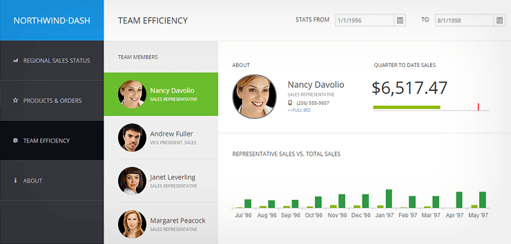

# Electron

[Electron](https://electronjs.org/) is a framework for creating native desktop applications with web technologies like JavaScript, HTML, and CSS.

To use Kendo UI in your Electron projects, include the required JavaScript and CSS files.

## Using Local Files

Due to the Node.js integration of Electron, some extra symbols were inserted into the DOM&mdash;`module`, `exports`, and `require`. To include the scripts, use the `require` symbol.

    <link href="lib/css/kendo.common.min.css" rel="stylesheet">
    <link href="lib/css/kendo.rtl.min.css" rel="stylesheet">
    <link href="lib/css/kendo.default.min.css" rel="stylesheet">
    <link href="lib/css/kendo.mobile.all.min.css" rel="stylesheet">

    
    

## Using CDN Services

Before you include the jQuery library, unset `module`.

    <link rel="stylesheet" href="https://kendo.cdn.telerik.com/{{ site.cdnVersion }}/styles/kendo.common.min.css">
    <link rel="stylesheet" href="https://kendo.cdn.telerik.com/{{ site.cdnVersion }}/styles/kendo.rtl.min.css">
    <link rel="stylesheet" href="https://kendo.cdn.telerik.com/{{ site.cdnVersion }}/styles/kendo.default.min.css">
    <link rel="stylesheet" href="https://kendo.cdn.telerik.com/{{ site.cdnVersion }}/styles/kendo.mobile.all.min.css">

    
    
    </head>
    

## Basic Usage

The following example assumes that the Kendo UI scripts and stylesheets were added to the document.

    

    

## Application Distribution

For more information on how to distribute your application with Electron, refer to the official Electron documentation on [application distribution](https://electronjs.org/docs/tutorial/application-distribution).

Alternatively, you can use a third-party packaging tool such as:

* [electron-forge](https://github.com/electron-userland/electron-forge)
* [electron-builder](https://github.com/electron-userland/electron-builder)
* [electron-packager](https://github.com/electron-userland/electron-packager)

## Sample Application

The sample application is aimed at executives, analysts, or sales representatives. It helps them establish targets based on insights into historical data as well as track sales and product performance in real time. The sample application showcases some of the most popular Kendo UI widgets, such as the Scheduler, Grid, TabStrip, Charts, and Map in a real world scenario. It has a simple and responsive UI based on Bootstrap and works on a wide range of devices.

## See Also

* [Electron Documentation](https://electronjs.org/docs)
* [Electron Application Documentation](https://electronjs.org/docs/tutorial/application-distribution)
* [Electron FAQ](https://electronjs.org/docs/faq)
