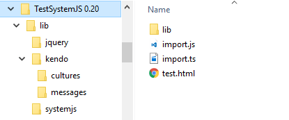

# SystemJS

The Kendo UI packaged scripts are in an AMD-compatible format, which means that they can be used by [SystemJS](https://github.com/systemjs/systemjs).

This article illustrates the necessary SystemJS configuration for this setup.

## Obtaining Packaged Kendo UI Script Files

(For holders of the commercial Kendo UI Complete license) The commercial Kendo UI distribution `zip` file, available for download for the active customer subscriptions, has the packaged scripts stored in the `js` directory.

## Building AMD-Formatted Scripts

(For users of the Kendo UI Core open-source distribution) The instructions for obtaining and building the Kendo UI Core scripts are listed in the [README](https://github.com/telerik/kendo-ui-core#how-to-build-kendo-ui-core) article.

Once the scripts are available and present in your project directory, the SystemJS configuration demonstrated in the sections below will pick and bundle them in your project.

> As of its 0.20.* version, SystemJS [has dropped the wildcard support](https://github.com/systemjs/systemjs/issues/1575) and entirely changed the script loading mechanism. As a result, the script loading differs.

The following example demonstrates the configuration for SystemJS up to 0.20 version.

```tab-index.html
    <!DOCTYPE html>
    <html>
    <head>
      <link rel="stylesheet" href="http://kendo.cdn.telerik.com/2016.1.112/styles/kendo.common.min.css">
      <link rel="stylesheet" href="http://kendo.cdn.telerik.com/2016.1.112/styles/kendo.rtl.min.css">
      <link rel="stylesheet" href="http://kendo.cdn.telerik.com/2016.1.112/styles/kendo.default.min.css">
      <script src="https://cdnjs.cloudflare.com/ajax/libs/systemjs/0.19.16/system.js" type="text/javascript" charset="utf-8"></script>
    </head>
    <body>
      <input id="ddl" />

      <script type="text/javascript" charset="utf-8">
        System.config({
          map: {
            traceur: "https://google.github.io/traceur-compiler/bin/traceur.js",
            jquery: '//code.jquery.com/jquery-2.1.4.min.js'
          },

          paths: {
            'kendo.*': "../kendo/dist/js/kendo.*.js"
          }
        })

        System.import('./main.js');
      </script>
    </body>
    </html>
```
```tab-main.js
    import $ from 'jquery'
    import 'kendo.dropdownlist'

    $("#ddl").kendoDropDownList({
        dataTextField: "text",
        dataValueField: "value",
        dataSource: [
          { text: "Item1", value: "1" },
          { text: "Item2", value: "2" }
        ]
    });
```

The following example demonstrates the configuration for SystemJS 0.20.x.



```tab-index.html
    <body>
      <div class="grid">
      </div>

      <script src="lib/systemjs/system.js"></script>
      <script type="text/javascript">
         //<![CDATA[

       System.config({
        map: {
      		"import": "import.js",
      		"import2": "modules/import2.js",
      		"jquery": "lib/jquery/jquery.min.js",
      		"kendo.culture.en-GB.min": "lib/kendo/cultures/kendo.culture.en-GB.min.js",
      		"kendo.messages.en-GB.min": "lib/kendo/messages/kendo.messages.en-GB.min.js",
      		"kendo.autocomplete.min": "lib/kendo/kendo.autocomplete.min.js",
      		"kendo.binder.min": "lib/kendo/kendo.binder.min.js",
      		"kendo.button.min": "lib/kendo/kendo.button.min.js",
      		"kendo.calendar.min": "lib/kendo/kendo.calendar.min.js",
      		"kendo.color.min": "lib/kendo/kendo.color.min.js",
      		"kendo.colorpicker.min": "lib/kendo/kendo.colorpicker.min.js",
      		"kendo.columnmenu.min": "lib/kendo/kendo.columnmenu.min.js",
      		"kendo.columnsorter.min": "lib/kendo/kendo.columnsorter.min.js",
      		"kendo.combobox.min": "lib/kendo/kendo.combobox.min.js",
      		"kendo.core.min": "lib/kendo/kendo.core.min.js",
      		"kendo.data.min": "lib/kendo/kendo.data.min.js",
      		"kendo.data.odata.min": "lib/kendo/kendo.data.odata.min.js",
      		"kendo.data.signalr.min": "lib/kendo/kendo.data.signalr.min.js",
      		"kendo.data.xml.min": "lib/kendo/kendo.data.xml.min.js",
      		"kendo.datepicker.min": "lib/kendo/kendo.datepicker.min.js",
      		"kendo.datetimepicker.min": "lib/kendo/kendo.datetimepicker.min.js",
      		"kendo.dialog.min": "lib/kendo/kendo.dialog.min.js",
      		"kendo.dom.min": "lib/kendo/kendo.dom.min.js",
      		"kendo.draganddrop.min": "lib/kendo/kendo.draganddrop.min.js",
      		"kendo.dropdownlist.min": "lib/kendo/kendo.dropdownlist.min.js",
      		"kendo.editable.min": "lib/kendo/kendo.editable.min.js",
      		"kendo.excel.min": "lib/kendo/kendo.excel.min.js",
      		"kendo.filebrowser.min": "lib/kendo/kendo.filebrowser.min.js",
      		"kendo.filtercell.min": "lib/kendo/kendo.filtercell.min.js",
      		"kendo.filtermenu.min": "lib/kendo/kendo.filtermenu.min.js",
      		"kendo.fx.min": "lib/kendo/kendo.fx.min.js",
      		"kendo.gantt.list.min": "lib/kendo/kendo.gantt.list.min.js",
      		"kendo.gantt.timeline.min": "lib/kendo/kendo.gantt.timeline.min.js",
      		"kendo.groupable.min": "lib/kendo/kendo.groupable.min.js",
      		"kendo.imagebrowser.min": "lib/kendo/kendo.imagebrowser.min.js",
      		"kendo.list.min": "lib/kendo/kendo.list.min.js",
      		"kendo.listview.min": "lib/kendo/kendo.listview.min.js",
      		"kendo.maskedtextbox.min": "lib/kendo/kendo.maskedtextbox.min.js",
      		"kendo.mediaplayer.min": "lib/kendo/kendo.mediaplayer.min.js",
      		"kendo.menu.min": "lib/kendo/kendo.menu.min.js",
      		"kendo.mobile.actionsheet.min": "lib/kendo/kendo.mobile.actionsheet.min.js",
      		"kendo.mobile.application.min": "lib/kendo/kendo.mobile.application.min.js",
      		"kendo.mobile.button.min": "lib/kendo/kendo.mobile.button.min.js",
      		"kendo.mobile.buttongroup.min": "lib/kendo/kendo.mobile.buttongroup.min.js",
      		"kendo.mobile.collapsible.min": "lib/kendo/kendo.mobile.collapsible.min.js",
      		"kendo.mobile.drawer.min": "lib/kendo/kendo.mobile.drawer.min.js",
      		"kendo.mobile.listview.min": "lib/kendo/kendo.mobile.listview.min.js",
      		"kendo.mobile.loader.min": "lib/kendo/kendo.mobile.loader.min.js",
      		"kendo.mobile.modalview.min": "lib/kendo/kendo.mobile.modalview.min.js",
      		"kendo.mobile.navbar.min": "lib/kendo/kendo.mobile.navbar.min.js",
      		"kendo.mobile.pane.min": "lib/kendo/kendo.mobile.pane.min.js",
      		"kendo.mobile.popover.min": "lib/kendo/kendo.mobile.popover.min.js",
      		"kendo.mobile.scroller.min": "lib/kendo/kendo.mobile.scroller.min.js",
      		"kendo.mobile.scrollview.min": "lib/kendo/kendo.mobile.scrollview.min.js",
      		"kendo.mobile.shim.min": "lib/kendo/kendo.mobile.shim.min.js",
      		"kendo.mobile.splitview.min": "lib/kendo/kendo.mobile.splitview.min.js",
      		"kendo.mobile.switch.min": "lib/kendo/kendo.mobile.switch.min.js",
      		"kendo.mobile.tabstrip.min": "lib/kendo/kendo.mobile.tabstrip.min.js",
      		"kendo.mobile.view.min": "lib/kendo/kendo.mobile.view.min.js",
      		"kendo.multiselect.min": "lib/kendo/kendo.multiselect.min.js",
      		"kendo.notification.min": "lib/kendo/kendo.notification.min.js",
      		"kendo.numerictextbox.min": "lib/kendo/kendo.numerictextbox.min.js",
      		"kendo.ooxml.min": "lib/kendo/kendo.ooxml.min.js",
      		"kendo.pager.min": "lib/kendo/kendo.pager.min.js",
      		"kendo.panelbar.min": "lib/kendo/kendo.panelbar.min.js",
      		"kendo.pivot.configurator.min": "lib/kendo/kendo.pivot.configurator.min.js",
      		"kendo.pivot.fieldmenu.min": "lib/kendo/kendo.pivot.fieldmenu.min.js",
      		"kendo.pivotgrid.min": "lib/kendo/kendo.pivotgrid.min.js",
      		"kendo.popup.min": "lib/kendo/kendo.popup.min.js",
      		"kendo.progressbar.min": "lib/kendo/kendo.progressbar.min.js",
      		"kendo.reorderable.min": "lib/kendo/kendo.reorderable.min.js",
      		"kendo.resizable.min": "lib/kendo/kendo.resizable.min.js",
      		"kendo.responsivepanel.min": "lib/kendo/kendo.responsivepanel.min.js",
      		"kendo.router.min": "lib/kendo/kendo.router.min.js",
      		"kendo.scheduler.agendaview.min": "lib/kendo/kendo.scheduler.agendaview.min.js",
      		"kendo.scheduler.dayview.min": "lib/kendo/kendo.scheduler.dayview.min.js",
      		"kendo.scheduler.monthview.min": "lib/kendo/kendo.scheduler.monthview.min.js",
      		"kendo.scheduler.recurrence.min": "lib/kendo/kendo.scheduler.recurrence.min.js",
      		"kendo.scheduler.timelineview.min": "lib/kendo/kendo.scheduler.timelineview.min.js",
      		"kendo.scheduler.view.min": "lib/kendo/kendo.scheduler.view.min.js",
      		"kendo.selectable.min": "lib/kendo/kendo.selectable.min.js",
      		"kendo.slider.min": "lib/kendo/kendo.slider.min.js",
      		"kendo.sortable.min": "lib/kendo/kendo.sortable.min.js",
      		"kendo.splitter.min": "lib/kendo/kendo.splitter.min.js",
      		"kendo.tabstrip.min": "lib/kendo/kendo.tabstrip.min.js",
      		"kendo.timepicker.min": "lib/kendo/kendo.timepicker.min.js",
      		"kendo.timezones.min": "lib/kendo/kendo.timezones.min.js",
      		"kendo.toolbar.min": "lib/kendo/kendo.toolbar.min.js",
      		"kendo.tooltip.min": "lib/kendo/kendo.tooltip.min.js",
      		"kendo.touch.min": "lib/kendo/kendo.touch.min.js",
      		"kendo.treelist.min": "lib/kendo/kendo.treelist.min.js",
      		"kendo.treeview.draganddrop.min": "lib/kendo/kendo.treeview.draganddrop.min.js",
      		"kendo.treeview.min": "lib/kendo/kendo.treeview.min.js",
      		"kendo.upload.min": "lib/kendo/kendo.upload.min.js",
      		"kendo.userevents.min": "lib/kendo/kendo.userevents.min.js",
      		"kendo.validator.min": "lib/kendo/kendo.validator.min.js",
      		"kendo.view.min": "lib/kendo/kendo.view.min.js",
      		"kendo.virtuallist.min": "lib/kendo/kendo.virtuallist.min.js",
      		"kendo.window.min": "lib/kendo/kendo.window.min.js",
      		"pako_deflate.min": "lib/kendo/pako_deflate.min.js",
      		"kendoaspnetmvc": "lib/kendo/kendo.aspnetmvc.min.js",
      		"kendodatavizbarcode": "lib/kendo/kendo.dataviz.barcode.min.js",
      		"kendodatavizchart": "lib/kendo/kendo.dataviz.chart.min.js",
      		"kendodatavizcore": "lib/kendo/kendo.dataviz.core.min.js",
      		"kendodatavizdiagram": "lib/kendo/kendo.dataviz.diagram.min.js",
      		"kendodatavizgauge": "lib/kendo/kendo.dataviz.gauge.min.js",
      		"kendodatavizmap": "lib/kendo/kendo.dataviz.map.min.js",
      		"kendodatavizqrcode": "lib/kendo/kendo.dataviz.qrcode.min.js",
      		"kendodatavizsparkline": "lib/kendo/kendo.dataviz.sparkline.min.js",
      		"kendodatavizstock": "lib/kendo/kendo.dataviz.stock.min.js",
      		"kendodatavizthemes": "lib/kendo/kendo.dataviz.themes.min.js",
      		"kendodataviztreemap": "lib/kendo/kendo.dataviz.treemap.min.js",
      		"kendodrawing": "lib/kendo/kendo.drawing.min.js",
      		"kendoeditor": "lib/kendo/kendo.editor.min.js",
      		"kendogantt": "lib/kendo/kendo.gantt.min.js",
      		"kendogrid": "lib/kendo/kendo.grid.min.js",
      		"kendopdf": "lib/kendo/kendo.pdf.min.js",
      		"kendoscheduler": "lib/kendo/kendo.scheduler.min.js"
      	},
      	bundles: {
      		"kendogrid": ["kendo.grid.min"],
      		"kendoaspnetmvc": ["kendo.aspnetmvc.min"],
      		"kendodatavizbarcode": ["kendo.dataviz.barcode.min"],
      		"kendodatavizchart": ["kendo.dataviz.chart.min"],
      		"kendodatavizcore": ["kendo.dataviz.core.min"],
      		"kendodatavizdiagram": ["kendo.dataviz.diagram.min"],
      		"kendodatavizgauge": ["kendo.dataviz.gauge.min"],
      		"kendodatavizmap": ["kendo.dataviz.map.min"],
      		"kendodatavizqrcode": ["kendo.dataviz.qrcode.min"],
      		"kendodatavizsparkline": ["kendo.dataviz.sparkline.min"],
      		"kendodatavizstock": ["kendo.dataviz.stock.min"],
      		"kendodatavizthemes": ["kendo.dataviz.themes.min"],
      		"kendodataviztreemap": ["kendo.dataviz.treemap.min"],
      		"kendodrawing": ["kendo.drawing.min"],
      		"kendoeditor": ["kendo.editor.min"],
      		"kendogantt": ["kendo.gantt.min"],
      		"kendopdf": ["kendo.pdf.min"],
      		"kendoscheduler": ["kendo.scheduler.min"]
      		}
       });

      System.import("import");

    //]]>
    </script>
    </body>
```
```tab-import.ts
    import $ from "jquery"
    import "kendo.grid.min"

    $(".grid").kendoGrid({
        dataSource: {
            type: "odata",
            transport: {
                read: "https://demos.telerik.com/kendo-ui/service/Northwind.svc/Customers"
            },
            pageSize: 20
        },
        height: 550,
        groupable: true,
        sortable: true,
        pageable: {
            refresh: true,
            pageSizes: true,
            buttonCount: 5
        },
        columns: [{
            field: "ContactName",
            title: "Contact Name",
            width: 240
        }, {
            field: "ContactTitle",
            title: "Contact Title"
        }, {
            field: "CompanyName",
            title: "Company Name"
        }, {
            field: "Country",
            width: 150
        }]
    });
```

## See Also

* [SharePoint Add-Ins]()
* [Twitter Bootstrap]()
* [Angular 2.0]()
* [RequireJS]()
* [TypeScript]()
* [Visual Studio IntelliSense]()
* [Telerik Data Access]()
* [Webpack Support]()
* [Aurelia]()
